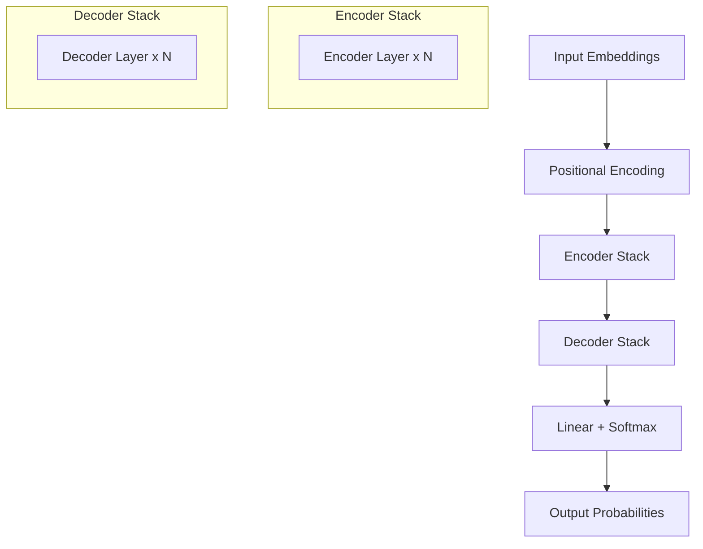

# AI — 1-LLM-base-Transformer

# AI — 1-LLM-base-Transformer

## Purpose

This module provides a foundational implementation of the Transformer architecture, the core neural network design underlying modern large language models (LLMs). It serves as the base building block for sequence-to-sequence tasks, such as machine translation, text summarization, and generative text modeling. The module is designed to be a self-contained, reusable component that other modules in the AI system can build upon to create more specialized models.

## Architecture Overview

The implementation follows the original "Attention Is All You Need" Transformer architecture. It consists of an encoder-decoder structure, where both the encoder and decoder are composed of stacked layers of self-attention and feed-forward neural networks.

## Key Components

### `Transformer` Class
The main class that encapsulates the entire model. It initializes and connects the encoder and decoder stacks, manages the forward pass, and handles the final linear projection and softmax for output generation.

**Key Methods:**
- `__init__(self, src_vocab_size, tgt_vocab_size, d_model, num_heads, num_layers, d_ff, dropout)`: Initializes the model with hyperparameters for vocabulary sizes, model dimension, number of attention heads, layers, and feed-forward dimension.
- `forward(self, src, tgt, src_mask, tgt_mask)`: Performs the forward pass. Takes source and target sequences along with their masks, and returns the output logits.

### `Encoder` and `Decoder` Classes
These classes represent the encoder and decoder stacks, respectively. Each is composed of a number of identical `EncoderLayer` or `DecoderLayer` instances.

### `EncoderLayer` and `DecoderLayer` Classes
These define a single layer in the encoder and decoder stacks. Each layer contains:
- **Multi-Head Self-Attention**: Allows the model to jointly attend to information from different representation subspaces at different positions.
- **Position-wise Feed-Forward Network**: A simple fully connected feed-forward network applied to each position separately and identically.
- **Layer Normalization** and **Residual Connections**: Applied around each sub-layer to stabilize training and enable deeper networks.

### `MultiHeadAttention` Class
Implements the multi-head attention mechanism. It splits the input into multiple heads, computes scaled dot-product attention in parallel, and concatenates the results.

### `PositionalEncoding` Class
Adds positional information to the input embeddings, since the Transformer architecture contains no recurrence or convolution. It uses sine and cosine functions of different frequencies.

### `PositionwiseFeedForward` Class
Implements the position-wise feed-forward network, which consists of two linear transformations with a ReLU activation in between.

## How It Works

1.  **Input Processing**: Source and target token sequences are first converted to embeddings via an `nn.Embedding` layer. The `PositionalEncoding` is then added to these embeddings to inject sequence order information.
2.  **Encoding**: The source embeddings are passed through the `Encoder` stack. Each `EncoderLayer` applies self-attention (allowing each token to attend to all others in the source) followed by a feed-forward network.
3.  **Decoding**: The target embeddings are passed through the `Decoder` stack. Each `DecoderLayer` applies two attention mechanisms:
    - **Masked Self-Attention**: Prevents positions from attending to subsequent positions, preserving the auto-regressive property during training.
    - **Encoder-Decoder Attention**: Allows each target position to attend over all source positions, integrating the encoded source information.
4.  **Output Generation**: The final decoder output is passed through a linear layer that projects it to the dimension of the target vocabulary, followed by a softmax function to produce a probability distribution over the next token.

## Integration with the Codebase

This module is designed as a standalone, foundational component. It has **no incoming or outgoing calls** to other modules in the current codebase, making it a pure, self-contained implementation. This design allows it to be imported and used as a base class or component by higher-level modules (e.g., a specific translation model or a text generation model) without creating circular dependencies. Other modules can instantiate the `Transformer` class, configure it for their specific task, and manage the training and inference loops around it.