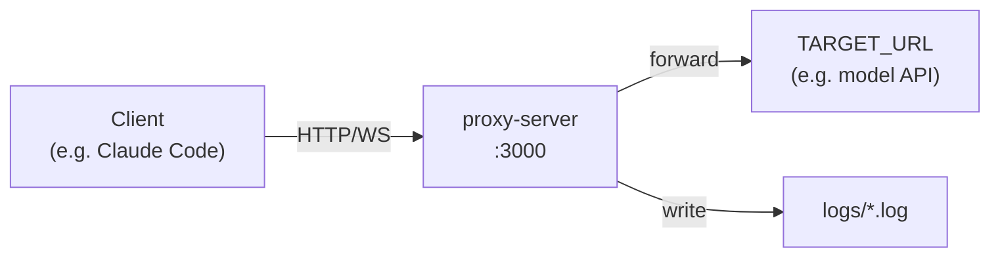

# AI — learn-2&3

# AI — learn-2&3

This module is a learning lab for understanding how AI model layers 2 and 3 (transport and application) handle input/output. It contains two sub-components:

1. **`_proxy-server/`** — A transparent HTTP/HTTPS/WebSocket proxy that intercepts and logs all traffic between a client (e.g., Claude Code) and a target server, so you can inspect raw request/response payloads.
2. **`skill/`** — Captured examples and notes on how Claude Code's skill/tool invocation system works at the protocol level.

The core idea: to learn how a model processes input and output, intercept the traffic with a proxy and study the payloads.

---

## Proxy Server (`_proxy-server/`)

### Purpose

A lightweight, single-dependency Node.js proxy that sits between any HTTP client and a target server. It forwards every request transparently while writing a detailed log file for each request/response pair. This makes it possible to observe exactly what a model API receives and returns — headers, bodies, encoding, timing — without modifying the client or server.

### Architecture



The proxy is **transparent** — it does not modify requests or responses in transit. All decoding (gzip, brotli, deflate) and UTF-8 interpretation happens only in the logging layer.

### Key Components

#### Entry Point — `index.js`

The entire server is a single file (~300 lines). It:

1. Reads configuration from environment variables (loaded via `dotenv`)
2. Creates an `http-proxy` instance targeting `TARGET_URL`
3. Starts an `http.createServer` that intercepts every request
4. Monkey-patches `res.write` and `res.end` to capture response body chunks
5. On `res.finish`, writes a structured log file and triggers log cleanup
6. Handles WebSocket upgrades via `server.on('upgrade', ...)`

#### Request/Response Logging — `logRequestResponse()`

Each HTTP transaction produces one `.log` file containing:

- **Request**: method, URL, protocol version, headers, body (decoded + raw base64)
- **Response**: status code, status message, headers, body (decoded + raw base64)
- **Metadata**: request ID, timestamp, duration, target URL

Body logging uses `formatBodyForLog()`, which:

1. Reads the `content-encoding` header via `getHeader()`
2. Decompresses using `decodeContentEncoding()` (supports gzip, brotli, deflate)
3. Attempts UTF-8 decode via `decodeUtf8()`
4. Outputs both the decoded text and the raw base64 — so you always have the original bytes available

#### Log File Management

- **Naming**: `request-0-{reverse-timestamp-sort-key}-{ISO-timestamp}-{uuid}.log`
  - The reverse sort key (`MAX_TIMESTAMP_MS - Date.now()`, zero-padded to 13 digits) ensures lexicographic ascending order shows newest files first.
- **Rotation**: `cleanupOldLogs()` keeps at most 20 files, deleting the oldest by `mtime` when the limit is exceeded. Called after every log write.

#### WebSocket Support

WebSocket upgrade requests are logged separately with a `-websocket` suffix in the filename. The log captures the initial handshake headers. The actual WebSocket frames are proxied transparently without logging (by design — frame-level logging would require a different approach).

#### Error Handling

- If `TARGET_URL` is not set, the process exits immediately with an error message.
- If the target server is unreachable, the proxy returns `502 Bad Gateway` with a JSON error body.
- WebSocket connection failures destroy the client socket gracefully.

### Configuration

| Variable | Required | Default | Description |
|----------|----------|---------|-------------|
| `TARGET_URL` | **Yes** | — | Target server URL (e.g., `http://localhost:8080`) |
| `PORT` | No | `3000` | Proxy listen port |
| `LOG_DIR` | No | `./logs` | Log output directory (auto-created) |
| `LOG_LEVEL` | No | `info` | Console verbosity: `error` / `warn` / `info` / `debug` |

### Running

```bash
# Basic
TARGET_URL=https://api.example.com npm start

# Development (auto-restart on changes)
TARGET_URL=https://api.example.com npm run dev

# With Claude Code (bypasses system proxy for localhost)
npm run start:claude
```

### Claude Code Integration — `start-claude-with-proxy.sh`

When the host shell exports `http_proxy` / `https_proxy` (common with Clash or similar tools), requests to `localhost:3000` may still route through the external proxy, causing `502` errors. The `start:claude` script solves this:

1. Starts `node index.js` in the background
2. Waits up to 30 seconds for port 3000 to become ready
3. Writes the PID to `logs/proxy-server.pid`
4. Sets `NO_PROXY=localhost,127.0.0.1` for the Claude Code subprocess only
5. Launches `claude` with all arguments forwarded
6. On exit (any signal), kills the background proxy and cleans up the PID file

If the launcher is force-killed without cleanup, use `npm run stop:proxy` to stop any orphaned proxy processes. The stop script checks both the PID file and `lsof` for processes listening on the configured port.

### Log File Format

```
=================================
转发目标: https://api.example.com/v1/messages

请求日志
时间: 2026-05-05T12:00:00.000Z
请求ID: a1b2c3d4e5f6
耗时: 234ms

=== 请求信息 ===
方法: POST
URL: /v1/messages
协议: 1.1

请求头:
  content-type: application/json
  authorization: Bearer sk-...

请求体:
--- body metadata ---
raw_bytes: 1024
decoded_bytes: 1024
content_encoding: identity
decode: identity

--- decoded body ---
{"model":"claude-sonnet-4-6","messages":[...]}

--- raw body base64 ---
eyJtb2RlbCI6...

=== 响应信息 ===
状态码: 200
状态消息: OK

响应头:
  content-type: application/json

响应体:
...
=================================
```

### Dependencies

| Package | Version | Purpose |
|---------|---------|---------|
| `http-proxy` | ^1.18.1 | Core proxy engine |
| `dotenv` | ^17.3.1 | `.env` file loading |
| `nodemon` | ^3.0.1 | Dev-only auto-restart |

---

## Skill System Notes (`skill/`)

The `skill/` directory contains captured protocol-level examples of how Claude Code's skill invocation works. This is not executable code — it's reference material for understanding the request/response flow.

### How Skills Work (from captured data)

When a user types a slash command (e.g., `/pua:pua`), the flow is:

1. **User input** arrives at Claude Code
2. Claude Code injects a `<system-reminder>` block listing all available skills with their trigger conditions
3. The user's command is wrapped as `<command-message>` / `<command-name>` tags
4. The model receives the full context (system prompt + skill list + user command) and decides which skill to invoke
5. The model returns a `tool_use` response calling the `Skill` tool with the skill name
6. Claude Code reads the skill's full content (progressive disclosure) and feeds it back to the model
7. The model continues processing with the skill's instructions loaded

The captured example in `skill/ex-pua/req.json` shows the complete request body sent to the model, including:
- The full system prompt with all skill definitions
- Hook-injected system reminders (e.g., PUA activation on user frustration)
- The command routing logic (parameter → skill mapping)

This is useful for understanding how Claude Code's tool-use protocol works at the HTTP layer — exactly the kind of layer 2/3 insight this module is designed to provide.