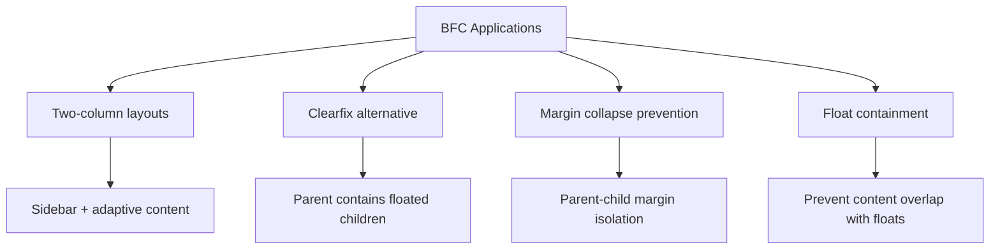

# CSS — BFC

# CSS — BFC (Block Formatting Context)

## Overview

This module demonstrates practical applications of CSS Block Formatting Contexts (BFC) through four standalone HTML examples. BFC is a fundamental CSS concept that creates an isolated layout environment, preventing certain layout behaviors like margin collapsing and float interference. Each example showcases a specific BFC use case with clear, minimal code.

## What is a BFC?

A Block Formatting Context is a part of the visual CSS rendering where block boxes are laid out. It creates an isolated environment that:

1. **Contains internal floats** - The BFC's height expands to include floated children
2. **Prevents margin collapsing** - Margins don't collapse across BFC boundaries
3. **Excludes external floats** - BFC boxes don't overlap with floated elements
4. **Contains internal elements** - Prevents content from escaping the context

## Examples

### 1. Sidebar Fixed and Adaptive (`侧边栏固定后自适应.html`)

**Purpose:** Create a two-column layout where a fixed-width sidebar floats left and the main content adapts to fill remaining space without overlapping.

**Key Technique:**
```css
.container {
    overflow: hidden; /* Creates BFC */
}
```

**How it works:**
- The `.float` element (sidebar) is floated left with a fixed width of 200px
- The `.container` creates a BFC using `overflow: hidden`
- The BFC ensures the container's content box starts after the float, creating an adaptive layout
- The container's padding provides internal spacing

**Important Note:** The `margin-left` on the container is relative to the viewport, not the float. To adjust spacing between sidebar and content, modify the float's right margin instead.

### 2. Margin Collapsing Prevention (`外边距合并.html`)

**Purpose:** Demonstrate how BFC prevents vertical margin collapsing between parent and child elements.

**Key Technique:**
```css
.container {
    overflow: hidden; /* Creates BFC */
}
```

**How it works:**
- Without BFC, a child's top margin would collapse with the parent's top margin
- Creating a BFC on the parent (`.container`) prevents this collapse
- The child's 50px margin now creates space inside the parent, not outside

**Critical Insight:** BFC only prevents margin collapsing between elements in *different* formatting contexts. Two sibling paragraphs both in the root BFC will still have their margins collapse, even if each has `overflow: hidden` (they're still in the same BFC).

### 3. Box Not Overlapping Float (`边框盒不与浮动元素重叠.html`)

**Purpose:** Prevent a block element from overlapping with a floated element.

**Key Technique:**
```css
.container {
    overflow: hidden; /* Creates BFC */
}
```

**How it works:**
- The `.float` element is floated left with margins
- The `.container` creates a BFC, which forces it to respect the float's space
- The container's content box starts after the float's margin box
- `margin-left: 300px` is relative to the viewport, not the float

**Layout Behavior:** BFC elements establish their own coordinate system for margins, so `margin-left` on the container is measured from the viewport edge, not from the float.

### 4. Height Collapse Fix (`高度坍塌.html`)

**Purpose:** Fix the common problem where a parent container collapses to zero height when all children are floated.

**Key Technique:**
```css
.container {
    overflow: hidden; /* Creates BFC */
}
```

**How it works:**
- Floated elements are removed from normal flow, causing parent height collapse
- Creating a BFC on the parent forces it to contain its floated children
- The parent's height now expands to include all floated children

**Alternative Solution:** The commented `.clearfix` class uses the `::after` pseudo-element with `clear: both` to achieve the same effect without creating a BFC.

## Creating a BFC

Multiple CSS properties can establish a BFC. The examples primarily use `overflow: hidden` due to its minimal side effects:

```css
/* Common BFC triggers */
.bfc {
    overflow: hidden;      /* Most common, minimal side effects */
    overflow: auto;        /* Adds scrollbars when needed */
    overflow: scroll;      /* Always shows scrollbars */
    float: left/right;     /* Creates BFC but also floats */
    position: absolute;    /* Creates BFC but removes from flow */
    position: fixed;       /* Creates BFC but removes from flow */
    display: inline-block; /* Creates BFC but changes display */
    display: flow-root;    /* Modern, dedicated BFC trigger */
}
```

**Recommended:** Use `overflow: hidden` or `display: flow-root` (modern browsers) for minimal side effects.

## Key Takeaways

1. **BFC is isolation** - It creates a self-contained layout environment
2. **Float containment** - BFC parents contain floated children
3. **Margin control** - Prevents margin collapsing across BFC boundaries
4. **Float exclusion** - BFC boxes don't overlap with external floats
5. **Coordinate system** - BFC establishes its own margin coordinate system

## Common Use Cases



## Browser Support

BFC is a fundamental CSS concept supported in all browsers. The `display: flow-root` property (dedicated BFC trigger) has excellent modern browser support but may require fallbacks for older browsers.

## Best Practices

1. **Use `overflow: hidden`** for BFC creation when you don't need scrolling
2. **Consider `display: flow-root`** for modern applications
3. **Understand margin context** - BFC margins are relative to the BFC container, not the viewport
4. **Combine with other techniques** - BFC works well with flexbox and grid for complex layouts

## Debugging BFC

When BFC doesn't behave as expected:
1. Check if the element actually creates a BFC (inspect computed styles)
2. Verify margin context (BFC vs viewport)
3. Ensure no conflicting `overflow` or `float` properties
4. Use browser devtools to visualize formatting contexts

This module provides practical, minimal examples of BFC in action. Each file can be opened directly in a browser to see the effects immediately.