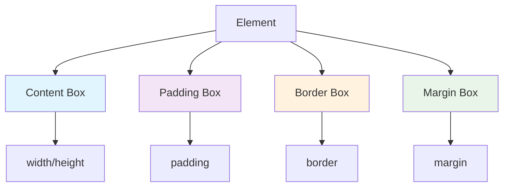

# CSS — box

# CSS — Box Module

This module demonstrates core CSS box model concepts, inline element behavior, and practical styling patterns through three standalone HTML examples. Each file explores different aspects of how elements are sized, laid out, and styled.

## Key Concepts Demonstrated

### Box Model Fundamentals

The `index.html` file illustrates critical box model behaviors:

- **Border Shorthand**: The `.border` class shows the shorthand `border: 4px dashed red` versus individual properties.
- **Box Sizing**: Contrasts default `content-box` (`.width`) with `border-box` (`.boxSizing`), showing how padding affects total width.
- **Background Clipping**: The `.back-cover` class uses `background-clip: content-box` to control where background extends relative to borders.
- **Overflow and Scrolling**: The `.container` class demonstrates `overflow: auto` with custom scrollbar styling using WebKit pseudo-elements.
- **Word Breaking**: `.break-all` and `.keep-all` classes show different `word-break` behaviors for text wrapping.
- **Text Truncation**: The `li` elements use `white-space: nowrap`, `overflow: hidden`, and `text-overflow: ellipsis` for single-line text truncation.

### Inline Element Behavior

The `inline.html` file explores inline and inline-block elements:

- **Inline Element Limitations**: Shows that `width` has no effect on inline elements (like `<a>` tags) since their width is content-driven.
- **Inline-Block Advantages**: Demonstrates how `display: inline-block` allows setting explicit dimensions while maintaining inline flow.
- **Vertical Centering**: Uses the `height` equals `line-height` technique for vertical centering in inline-block elements.

### Practical Layout Patterns

The `pager.html` file shows a real-world pagination component:

- **Inline-Block Navigation**: Uses `display: inline-block` for horizontal link layout.
- **Spacing Control**: Avoids whitespace issues by removing line breaks between elements.
- **State Styling**: Demonstrates hover states and selected states with proper specificity (using `nav a.selected` to override hover styles).

## File Structure

```
CSS/box/
├── index.html      # Box model fundamentals and text handling
├── inline.html     # Inline vs inline-block element behavior
└── pager.html      # Practical pagination component
```

## How It Works

Each HTML file is self-contained with embedded CSS styles. There are no external dependencies or JavaScript interactions. The examples are designed to be viewed directly in a browser to observe the visual results of the CSS properties.

### Box Model Visualization



## Integration Notes

This module is standalone and doesn't connect to other parts of a codebase. It serves as:

1. **Educational Reference**: Demonstrates CSS concepts for learning purposes.
2. **Pattern Library**: Shows reusable styling patterns (text truncation, scrollbar customization, pagination).
3. **Testing Ground**: Provides isolated environments for experimenting with box model behaviors.

## Usage

To use these examples:

1. Open any HTML file directly in a web browser.
2. Modify the CSS properties to observe how changes affect layout and appearance.
3. Use browser developer tools to inspect computed styles and box model dimensions.

## Browser Compatibility Notes

- **Scrollbar Styling**: The `::-webkit-scrollbar` pseudo-elements are WebKit-specific (Chrome, Safari, Edge). Firefox uses `scrollbar-width` and `scrollbar-color` properties.
- **Text Truncation**: The `text-overflow: ellipsis` technique requires fixed width, `white-space: nowrap`, and `overflow: hidden`.
- **Box Sizing**: `box-sizing: border-box` is widely supported and recommended for predictable layouts.

## Best Practices Illustrated

1. **Use `box-sizing: border-box`** for more intuitive width calculations.
2. **Combine `white-space`, `overflow`, and `text-overflow`** for single-line text truncation.
3. **Use `inline-block`** for horizontal layouts where you need explicit dimensions.
4. **Manage specificity carefully** when overriding hover/active states (as shown in the pagination example).
5. **Avoid whitespace in inline layouts** by removing line breaks between elements or using negative margins.