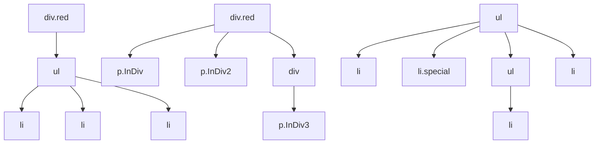

# CSS — choose

# CSS Selectors Demonstration Module

## Overview

This module demonstrates practical usage of CSS selectors, specifically descendant, child, adjacent sibling, and general sibling selectors. It serves as an educational example showing how different selector types target elements in an HTML document.

## File Structure

```
CSS/choose/
├── index.html          # HTML document with structured content
└── css/
    └── descendant.css  # CSS rules demonstrating selector patterns
```

## CSS Selectors Demonstrated

### Descendant Selectors

Descendant selectors target elements nested anywhere within a parent element, regardless of depth.

```css
div.red li,
.red .InDiv {
    color: red;
}
```

**How it works:** Selects all `<li>` elements inside any `<div>` with class `red`, and all elements with class `InDiv` inside any element with class `red`.

### Child Selectors

Child selectors (`>`) target only direct children, not deeper descendants.

```css
.red>.InDiv2,
.red>.InDiv3 {
    color: red;
}
```

**Key distinction:** `.red>.InDiv3` will NOT match the `<p class="InDiv3">` in the example because it's wrapped in an additional `<div>`, making it a grandchild rather than a direct child.

### Adjacent Sibling Selectors

The adjacent sibling selector (`+`) targets the immediately following sibling element.

```css
.special+li {
    color: purple
}
```

**Behavior:** Only selects the `<li>` element that directly follows `.special` with no other elements between them.

### General Sibling Selectors

The general sibling selector (`~`) targets all following sibling elements.

```css
.special~li {
    color: green;
}
```

**Behavior:** Selects all `<li>` siblings that come after `.special`, regardless of other elements in between.

## HTML Structure Analysis

The HTML file creates specific DOM relationships to demonstrate each selector type:



### Key DOM Relationships

1. **Descendant demonstration**: `<li>` elements are nested within `<div class="red">` through a `<ul>` intermediate
2. **Child selector demonstration**: 
   - `.InDiv` and `.InDiv2` are direct children of `.red`
   - `.InDiv3` is a grandchild (not direct child) of `.red`
3. **Sibling demonstrations**:
   - `.special` has adjacent sibling `<li>` and general sibling `<li>` elements
   - Nested `<ul>` creates non-sibling relationships

## Selector Specificity and Cascade

The CSS file shows commented-out individual rules that were consolidated into combined selectors:

```css
/* Original individual rules (commented out):
.red .InDiv { color: red; }
.red>.InDiv2 { color: red; }
.red>.InDiv3 { color: red; }
*/

/* Consolidated into single rule: */
div.red li,
.red .InDiv,
.red>.InDiv2,
.red>.InDiv3 {
    color: red;
}
```

**Note:** The consolidated rule has the same specificity as the individual rules but reduces code duplication.

## Practical Application

### When to Use Each Selector Type

| Selector | Use Case | Example |
|----------|----------|---------|
| Descendant (`A B`) | Style all nested elements regardless of depth | `nav a` - all links in navigation |
| Child (`A > B`) | Style only direct children, avoid unintended deep matches | `ul > li` - list items only in immediate list |
| Adjacent Sibling (`A + B`) | Style the next element after a specific element | `h2 + p` - first paragraph after heading |
| General Sibling (`A ~ B`) | Style all following siblings | `.error ~ input` - inputs after error message |

### Common Pitfalls Demonstrated

1. **Child vs. Descendant confusion**: `.red>.InDiv3` doesn't match because of intermediate `<div>`
2. **Adjacent sibling requirement**: Elements must be immediate siblings with no intervening elements
3. **Selector consolidation**: Combining selectors with commas reduces repetition without affecting specificity

## Integration Notes

This module is self-contained with no external dependencies. The CSS file is linked directly in the HTML:

```html
<link rel="stylesheet" href="./css/descendant.css">
```

To modify or extend:
1. Edit `css/descendant.css` to add or change selector rules
2. Modify `index.html` to create new DOM structures for testing
3. Open `index.html` in a browser to see immediate visual results

## Browser Compatibility

All demonstrated selectors have excellent browser support:
- Descendant selectors: CSS Level 1
- Child selectors: CSS Level 2
- Adjacent sibling selectors: CSS Level 2
- General sibling selectors: CSS Level 3

No vendor prefixes or fallbacks are required for modern browsers.