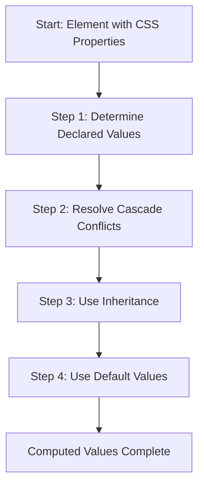

# CSS — compute

# CSS — Compute Module

## Overview

The CSS compute module documents the **property value calculation process** — the algorithm browsers use to determine the final computed value of every CSS property for every element. This process ensures each element has a complete set of property values before rendering.

The module consists of educational materials explaining the four-step cascade and inheritance algorithm, with practical examples demonstrating how browsers resolve CSS values.

## Property Value Calculation Process

Browsers render elements in document tree order (depth-first: parent → child → grandchild). For each element, the browser must compute a value for every CSS property through this four-step process:



### Step 1: Determine Declared Values

The browser examines all applicable stylesheets for declarations that apply to the element. Declarations without conflicts (no competing rules for the same property) are used directly as the property's value.

**Example**: If only one rule sets `color: red` for an element, that becomes the declared value.

### Step 2: Resolve Cascade Conflicts

When multiple declarations compete for the same property, the browser resolves conflicts using the cascade algorithm in this priority order:

1. **Importance** (`!important` declarations win)
2. **Specificity** (more specific selectors win)
3. **Source Order** (later declarations win)

**Example**: If two rules both set `color` for the same element, the more specific selector or later declaration wins.

### Step 3: Use Inheritance

Properties that still have no value after steps 1-2 inherit values from their parent element. Only properties marked as "inherited" in the CSS specification use this step.

**Example**: `color` is inherited by default. If a parent has `color: red` and no child declaration exists, the child inherits `red`.

### Step 4: Use Default Values

Properties that remain valueless after steps 1-3 receive their initial (default) value as defined in the CSS specification.

**Example**: `background-color` defaults to `transparent` (rgba(0,0,0,0)).

## Special CSS Values

### `inherit` Keyword

Forces a property to inherit its parent's value, even if the property isn't normally inherited. This "early inheritance" happens during step 1 (declared values), not step 3.

```css
a {
    color: inherit; /* Forces inheritance, overriding browser defaults */
}
```

**Use case**: Override browser default styles (like link colors) to match parent styling.

### `initial` Keyword

Resets a property to its specification-defined initial value, regardless of inheritance or cascade.

```css
.container {
    background-color: initial; /* Resets to transparent */
}
```

## Practical Examples

### Example 1: Link Color Inheritance

**Problem**: Browsers apply default styles to `<a>` elements (typically blue with underline), preventing inheritance of parent `color`.

**Solution**: Use `inherit` to force inheritance:

```css
/* aInherit.css */
a {
    color: inherit; /* Overrides browser default, inherits from parent */
}
```

**HTML context**:
```html
<div class="container" style="color: red;">
    <a href="">Link</a> <!-- Will be red due to inherit -->
    <p>Paragraph</p>   <!-- Will be red via normal inheritance -->
</div>
```

Without `color: inherit`, the link would use the browser's default blue color because the browser's user-agent stylesheet provides a declared value in step 1.

### Example 2: Initial Value Reset

```css
.container {
    color: red;
    background-color: initial; /* Resets to transparent */
}

div {
    background-color: green;
}
```

```html
<div class="container">
    <!-- Background will be transparent (initial), not green -->
    <!-- Color will be red (declared) -->
</div>
```

The `initial` keyword overrides the cascade, resetting `background-color` to its default value.

## Key Concepts

1. **Computed vs. Declared Values**: The computed value is the final value after all four steps; declared values are the raw values from stylesheets.

2. **Inheritance Scope**: Only properties marked as "inherited" in the CSS specification inherit by default (e.g., `color`, `font-family`). Non-inherited properties (e.g., `background-color`, `border`) require explicit `inherit` keyword.

3. **Cascade Priority**: The cascade resolves conflicts before inheritance is considered, which is why `inherit` must be explicitly declared to override default styles.

## Connection to Browser Rendering

This module explains the theoretical foundation for how browsers process CSS. In practice, this algorithm is implemented in browser rendering engines (like Blink, Gecko, WebKit) during the style recalculation phase. The computed values become the basis for layout calculations and painting.

The educational materials here help developers understand why certain CSS behaviors occur, particularly around inheritance and the cascade, which are common sources of confusion.