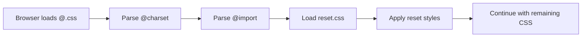

# CSS — @

# CSS — @ Module

## Overview

The `@.css` module serves as the primary entry point for the project's base stylesheet. It establishes the foundational CSS environment by setting the character encoding and importing a reset stylesheet to normalize browser defaults.

## File Structure

```
CSS/@/
└── @.css
```

## Key Components

### Character Encoding Declaration
```css
@charset "utf-8";
```
- Sets the character encoding for the stylesheet to UTF-8
- Ensures proper rendering of Unicode characters and special symbols
- Must appear as the first element in the stylesheet (before any other rules)

### Reset Stylesheet Import
```css
@import "../reset.css";
```
- Imports the project's reset stylesheet from the parent directory
- Normalizes default browser styling across different platforms
- Provides a consistent baseline for custom styling

## Execution Order

The `@import` rule follows sequential parsing order:



**Important**: CSS processes `@import` rules in the order they appear. Styles defined later in the imported file will override earlier ones, and subsequent CSS rules in the main file will override imported styles.

## Integration with Codebase

This module acts as the root stylesheet that:

1. **Establishes encoding** for all subsequent CSS files
2. **Imports foundational styles** from `reset.css`
3. **Provides a base layer** that other CSS modules build upon

The module connects to the rest of the codebase through:
- The `reset.css` import (direct dependency)
- Being referenced by HTML files or other CSS entry points

## Usage

Include this stylesheet in HTML documents as the primary CSS file:

```html
<link rel="stylesheet" href="CSS/@/@.css">
```

## Important Notes

1. **File naming**: The `@` symbol in the filename is unconventional but valid. Ensure build tools and servers handle this character correctly.

2. **Import path**: The relative path `../reset.css` assumes the directory structure:
   ```
   project/
   ├── CSS/
   │   ├── @/
   │   │   └── @.css
   │   └── reset.css
   └── ...
   ```

3. **Override behavior**: Any CSS rules defined after the `@import` statement in this file will override the reset styles. This allows for project-specific base customizations.

4. **Performance**: Using `@import` can impact loading performance as it creates additional HTTP requests. Consider bundling CSS files in production environments.