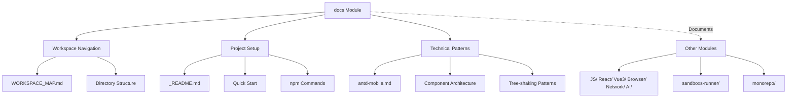

# docs

# `docs` Module

The `docs` module serves as the central documentation hub for the entire workspace. It contains architectural overviews, quick-start guides, and conceptual notes that explain the workspace's structure, purpose, and key technical decisions.

## Purpose

This module provides the primary entry points for understanding the workspace. It answers fundamental questions:
- What is this workspace and how is it organized?
- How do I get started and run experiments?
- What are the key technical patterns used in the codebase?

## Key Files

### `WORKSPACE_MAP.md`
The most comprehensive document, providing a complete map of the workspace's directory structure and purpose. It categorizes the workspace into five main areas:
1. OpenClaw collaboration files
2. Frontend/browser/network/AI knowledge base
3. Source code reading mirrors
4. Runnable sandbox/demo projects
5. Diagrams, test assets, and automation scripts

This file serves as the definitive guide to navigating the workspace's 30+ directories.

### `_README.md` and `_README-CN.md`
The main project README files (English and Chinese). They describe the workspace as a "Vite-based experimental playground" with three primary modules:
1. **Sandboxs** - Individual experiments in `sandboxs/<name>/` accessible via `/sandboxs/<name>/` routes
2. **Agent** - AI agent development and testing
3. **Monorepo** - Submodule for studying and reimplementing elegant engineering solutions

These files include quick-start instructions and available npm commands.

### `antd-mobile.md`
Documents the architectural patterns of the antd-mobile component library, explaining:
- Multi-format output (ESM, CJS, UMD)
- Component organization with per-component style imports
- Tree-shaking optimization through `sideEffects` configuration
- The pattern of attaching static methods to components (e.g., `ActionSheet.show`)

### `JS.md`
A concise note about JavaScript fundamentals: "Function → produces function object → creates ordinary object."

### `think.md`
Philosophical observations about frontend development and AI, including:
- "Frontend is the art of giving perceivable form to abstract data in the browser"
- The formula `UI = f(state)` and how frameworks like React implement this
- Speculation about AI agents and their relationship to human capabilities

### `ideas.md`
A single idea for a future feature: allowing users to select text anywhere and add it to OpenClaw's configuration files, enabling cross-platform memory and rule management for AI agents.

## How It Connects to the Workspace

The `docs` module provides the conceptual framework that ties together the workspace's diverse technical content. While other modules contain executable code, source mirrors, and experiments, this module provides the "map" that makes the workspace navigable and understandable.

## Usage Patterns

1. **New contributors** should start with `_README.md` for setup instructions, then consult `WORKSPACE_MAP.md` for orientation.
2. **Developers studying antd-mobile** can reference `antd-mobile.md` to understand its component architecture and optimization patterns.
3. **Those exploring the workspace's philosophy** can read `think.md` for high-level insights about frontend development and AI.

The documentation is intentionally kept alongside the code it describes, making it easy to update as the workspace evolves.