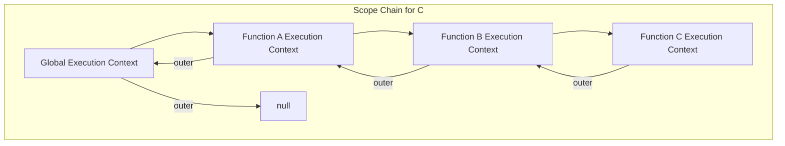

# JS — call-stack

# JS — call-stack Module

This module contains a collection of JavaScript examples that demonstrate core language mechanics: the call stack, execution contexts, scope chains, variable hoisting, and closures. Each file isolates a specific concept to illustrate how JavaScript engines process code.

## Core Concepts Demonstrated

### Execution Contexts and the Call Stack

When JavaScript code runs, the engine creates an **execution context** for each function call. The global code runs in the **Global Execution Context (GEC)**, and each function invocation creates a new **Function Execution Context (FEC)**. These contexts are managed in a **call stack** — a LIFO (Last-In, First-Out) data structure.

Each execution context contains:
- **Variable Environment (VE)** / **Activation Object (AO)**: Stores `var` declarations and function declarations.
- **Lexical Environment (LE)**: Stores `let`/`const` declarations and provides the scope chain reference.
- **`this` binding**: Determined by how the function is called.

### Scope Chain

Each execution context has a reference to its **outer environment**, forming a chain. When a variable is accessed, the engine searches the current context, then walks up the chain until it finds the variable or reaches the global scope.

### Variable Hoisting

`var` declarations and function declarations are **hoisted** to the top of their containing function or global scope. `var` declarations are initialized as `undefined`; function declarations are fully hoisted with their body.

### Closures

A **closure** is formed when a function retains access to its lexical scope even after the outer function has finished executing. The inner function "closes over" the variables of the outer scope.

---

## File-by-File Breakdown

### `test1.html` / `test1.js` — Call Stack and `this` in Global Scope

These files demonstrate the basic call stack and `this` binding in the global context.

```javascript
console.log(this); // In global scope, `this` is the global object (window in browsers)

function A() {
    console.log(this); // `this` is still the global object (non-strict mode, direct call)
    function B() {
        console.log(this); // Same as above
    }
    B(); // B is pushed onto the call stack
}
A(); // A is pushed onto the call stack
```

**Key Points:**
- In non-strict mode, `this` in a plain function call refers to the global object.
- The call stack grows with each function call and shrinks when functions return.
- The comments in the code trace the stack operations: `console.log` is pushed and popped for each call.

### `test2.html` — `this` with `new` and Nested Functions

```javascript
function A() {
    this.abc = 123; // `this` is the new instance when called with `new`
    function B() {
        console.log(this); // `this` is the global object (B is called directly, not as a method)
    }
    B();
}
var a = new A(); // `new` changes `this` binding for A
console.log(a.abc); // 123
```

**Key Points:**
- Using `new` creates a new object and sets `this` to that object inside the constructor.
- Nested functions called directly (not as methods) still have `this` as the global object in non-strict mode.

### `test3.html` — Hoisting and Variable Shadowing

```javascript
function A(a, b) {
    console.log(a, b); // 1, function b (hoisted function declaration overrides parameter)
    var b = 123; // Reassigns b
    function b() {} // Hoisted to top
    var a = function () {} // Reassigns a
    console.log(a, b); // function a, 123
}
A(1, 2);
```

**Key Points:**
- Function declarations are hoisted above `var` declarations.
- Parameters are part of the activation object and can be shadowed by hoisted declarations.
- The order of hoisting: function declarations first, then `var` declarations (as `undefined`).

### `test4.html` — Hoisting Inside Conditional Blocks

```javascript
var foo = 1;
function bar() {
    console.log(foo); // undefined (local `foo` is hoisted, shadows global)
    if (!foo) {
        var foo = 10; // This `var` is hoisted to the top of `bar`
    }
    console.log(foo); // 10
}
bar();
```

**Key Points:**
- `var` declarations are hoisted to the function scope, regardless of block boundaries (like `if`).
- The hoisted variable is initialized as `undefined`, so the condition `!foo` is `true`.

### `test5.html` — Function Declarations Hoisting Over Variables

```javascript
var a = 1;
function b() {
    console.log(a); // function a (hoisted function declaration)
    a = 10; // Reassigns the local `a`
    return;
    function a() {} // Hoisted to top of function b
}
b();
console.log(a); // 1 (global `a` unchanged)
```

**Key Points:**
- Inside function `b`, the function declaration `a` is hoisted, creating a local variable `a` that shadows the global one.
- Assignments inside the function affect the local variable, not the global one.

### `test6.html` — Multiple Hoisting and Reassignment

```javascript
console.log(foo); // function foo (hoisted function declaration)
var foo = "A"; // Reassigns foo to "A"
console.log(foo); // "A"
var foo = function () { console.log("B"); }; // Reassigns foo to function
console.log(foo); // function (B)
foo(); // "B"
function foo() { console.log("C"); } // Already hoisted, this line is ignored at runtime
console.log(foo); // function (B) (still the last assigned function)
foo(); // "B"
```

**Key Points:**
- Function declarations are hoisted first, then `var` declarations (as `undefined`).
- Subsequent assignments overwrite the variable in order.
- The function declaration at the bottom does not reassign `foo` because it was already hoisted.

### `!test7.html` — Complex Hoisting and Scope Chain

```javascript
var foo = 1;
function bar(a) {
    var a1 = a; // a1 = 3 (parameter a)
    var a = foo; // Reassigns a to 1 (global foo)
    function a() { console.log(a); } // Hoisted function declaration overrides a
    a1(); // a1 is still the function from the hoisted declaration? Wait, let's analyze.
}
bar(3);
```

**Detailed Analysis:**
1. **Hoisting Phase**:
   - `var a` (parameter) is part of the activation object.
   - `var a1` is hoisted as `undefined`.
   - `function a()` is hoisted, overriding the parameter `a` with the function.
2. **Execution Phase**:
   - `a1 = a` → `a1` gets the function (since `a` is now the function).
   - `var a = foo` → This reassigns `a` to `1` (global `foo`).
   - `a1()` → Calls the function stored in `a1`. Inside that function, `a` refers to the outer `a` (which is now `1`), so it logs `1`.

**Key Points:**
- Hoisting order: function declarations first, then `var` declarations (including parameters).
- Reassignments happen in execution order, but the hoisted function declaration initially sets the variable.

### `closure.js` — Closures

```javascript
function outer() {
    let count = 0;
    return function inner() {
        count++;
        console.log("count =", count);
    };
}
const fn = outer(); // outer finishes, but its scope is retained
fn(); // count = 1
fn(); // count = 2
fn(); // count = 3
```

**Key Points:**
- `inner` forms a closure over `count` from `outer`'s scope.
- Even after `outer` returns, `count` persists because `inner` still references it.
- Each call to `fn` increments and logs the same `count` variable.

### `scope-chain/test1.html` — Nested Scope Chain

```javascript
var g = 0;
function A() {
    var a = 1;
    function B() {
        var b = 2;
        var C = function () {
            var c = 3;
            console.log(c, b, a, g); // 3, 2, 1, 0
        };
        C();
    }
    B();
}
A();
```

**Key Points:**
- Each function has access to its own scope and the scopes of all outer functions.
- The scope chain for `C` is: `C` → `B` → `A` → Global.
- Variables are resolved by walking up this chain.

---

## Execution Flow Diagram

The following diagram illustrates the call stack and scope chain for a typical nested function call:



**Diagram Explanation:**
- The call stack grows from Global → A → B → C.
- Each execution context has a reference to its outer environment (the scope chain).
- When `C` accesses a variable, it searches its own scope, then B's, then A's, then Global.

---

## Key Takeaways

1. **Hoisting is two-phase**: Creation phase (declarations hoisted) and execution phase (assignments happen in order).
2. **Function declarations hoist completely**, including their body. `var` declarations hoist as `undefined`.
3. **`this` binding** depends on the call site: plain functions get the global object (or `undefined` in strict mode), methods get their object, constructors get the new instance.
4. **Closures** allow functions to remember their lexical scope, enabling data privacy and stateful functions.
5. **Scope is lexical**: Determined by where functions are written, not where they are called.

This module serves as a practical reference for understanding these fundamental JavaScript behaviors. Each file can be run in a browser console or Node.js to observe the output and verify the concepts.