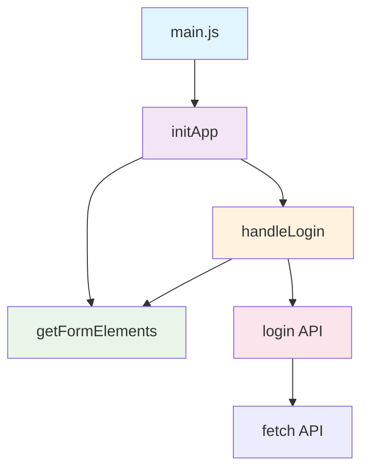

# JS — ESM

# JS — ESM Module

## Overview

This module implements a user login interface using JavaScript ES Modules (ESM). It demonstrates a modular architecture with clear separation of concerns: API communication, DOM utilities, form validation, and application initialization. The codebase follows modern ESM patterns with explicit imports/exports and proper dependency management.

## Architecture



## Module Structure

```
JS/ESM/
├── demo/
│   ├── JS/
│   │   ├── api/
│   │   │   ├── index.js          # API module barrel export
│   │   │   └── login.js          # Login API implementation
│   │   ├── utils/
│   │   │   ├── index.js          # Utils barrel export
│   │   │   ├── console.js        # Console utilities
│   │   │   ├── query.js          # DOM query utilities
│   │   │   └── verify.js         # Form validation & login logic
│   │   ├── index.js              # Main barrel export
│   │   └── main.js               # Application entry point
│   ├── css/
│   └── index.html
└── test/
    ├── foo.js                    # Test module with class
    └── test-foo.js               # ESM behavior test
```

## Key Components

### 1. Application Entry Point (`main.js`)

The main entry file initializes the application and sets up event listeners:

```javascript
import { getFormElements, handleLogin } from './index.js';

function initApp() {
    const { formContainer } = getFormElements();
    formContainer.addEventListener('submit', (e) => {
        e.preventDefault();
        handleLogin();
    });
}

// DOM ready check
if (document.readyState === 'loading') {
    document.addEventListener('DOMContentLoaded', initApp);
} else {
    initApp();
}
```

**Key behaviors:**
- Imports utilities from the barrel export
- Waits for DOM readiness before initialization
- Binds form submission to `handleLogin`

### 2. API Layer (`api/login.js`)

Handles authentication requests to the server:

```javascript
export function login(username, password) {
    return fetch(url, {
        method: 'POST',
        headers: { 'content-type': 'application/json' },
        body: JSON.stringify({ loginId: username, loginPwd: password }),
    })
    .then(resp => {
        if (!resp.ok) throw new Error(`HTTP error! status: ${resp.status}`);
        return resp.json();
    })
    .then(resp => resp.data)
    .catch(error => {
        console.error('登录 API 请求失败:', error);
        throw error;
    });
}
```

**Features:**
- Uses `fetch` API for HTTP requests
- Configurable base URL from environment (`window._ENV.BASE_URL`)
- Proper error handling with meaningful messages
- Returns user data on success, throws on failure

### 3. Utility Modules (`utils/`)

#### DOM Query Utilities (`query.js`)
```javascript
export function getFormElements() {
    return {
        txtUserName: document.querySelector('#userName'),
        txtUserPassword: document.querySelector('#userPassword'),
        formContainer: document.querySelector('#formContainer'),
        btnSubmit: document.querySelector('#btnSubmit')
    };
}
```

#### Form Validation & Login Logic (`verify.js`)
```javascript
export async function handleLogin() {
    // Prevents duplicate submissions
    if (isLoginning) return;
    
    // Form validation
    const { txtUserName, txtUserPassword, btnSubmit } = getFormElements();
    const userName = txtUserName.value.trim();
    const password = txtUserPassword.value;
    
    if (!userName) { alert('请填写账号'); return; }
    if (!password) { alert('请填写密码'); return; }
    
    // API call with state management
    try {
        const user = await loginApi(userName, password);
        if (user) {
            alert('登录成功，' + user.nickname);
        } else {
            alert('登录失败，账号密码错误');
            // Clear fields on failure
            txtUserName.value = '';
            txtUserPassword.value = '';
            txtUserName.focus();
        }
    } catch (error) {
        alert('登录请求失败，请检查网络连接');
    } finally {
        isLoginning = false;
        btnSubmit.value = '登录';
    }
}
```

**Key patterns:**
- **Debouncing**: Uses `isLoginning` flag to prevent duplicate submissions
- **State management**: Updates button text during login process
- **Error handling**: Distinguishes between validation errors, API failures, and network issues
- **User feedback**: Provides clear alerts for different scenarios

### 4. Barrel Exports

The module uses barrel exports to simplify imports:

```javascript
// api/index.js
export * from './login.js';

// utils/index.js
export * from './console.js';
export * from './query.js';
export * from './verify.js';

// JS/index.js (main barrel)
export * from './utils/index.js';
export * from './api/index.js';
```

This allows consumers to import from a single entry point:
```javascript
import { getFormElements, handleLogin } from './index.js';
```

## Data Flow

1. **Initialization**: `main.js` → `initApp()` → `getFormElements()` → DOM ready
2. **User Action**: Form submit → `handleLogin()`
3. **Validation**: `handleLogin()` → `getFormElements()` → validate inputs
4. **API Call**: `handleLogin()` → `login()` → `fetch()` → server
5. **Response Handling**: Server response → user feedback → UI state update

## ESM-Specific Features Demonstrated

### 1. Static Module Structure
All imports are statically analyzable, enabling:
- Tree-shaking by bundlers
- Early error detection
- Clear dependency graph

### 2. Live Bindings
ESM exports are live bindings, not copies:
```javascript
// test/foo.js
export default function foo() {
    console.log('hello');
}
foo.prototype.name = 'ceilf6';

// test/test-foo.js
import foo from "./foo.js";
const fooIns = new foo();
console.log(fooIns.name); // 'ceilf6' - same reference
```

### 3. Module Scoping
Each module has its own scope, preventing global pollution:
- `isLoginning` in `verify.js` is module-scoped
- No global variables except `window._ENV` for configuration

## Environment Configuration

The API module reads configuration from `window._ENV`:
```javascript
import "../../../../env.js";
const BASE_URL = window._ENV.BASE_URL;
```

This pattern allows environment-specific configuration without code changes.

## Error Handling Strategy

The module implements layered error handling:

1. **Network errors**: Caught in `login()` and re-thrown
2. **HTTP errors**: Detected via `resp.ok` check
3. **Validation errors**: Handled in `handleLogin()` with user alerts
4. **Duplicate submissions**: Prevented via `isLoginning` flag

## Testing Approach

The `test/` directory demonstrates ESM behavior:
- `foo.js` exports a constructor function with prototype modification
- `test-foo.js` verifies that ESM imports maintain live bindings

## Integration Points

### HTML Integration
```html
<script src="./JS/main.js" type="module"></script>
```

### CSS Integration
The module expects specific DOM structure with IDs:
- `#formContainer` - Form element
- `#userName` - Username input
- `#userPassword` - Password input
- `#btnSubmit` - Submit button

## Development Notes

1. **Module Resolution**: Uses relative paths with `.js` extensions (required for ESM)
2. **Async/Await**: Modern async patterns for API calls
3. **Event Delegation**: Single event listener on form container
4. **Progressive Enhancement**: Works with JavaScript enabled, fails gracefully otherwise

## Potential Improvements

1. **Type Safety**: Add TypeScript or JSDoc type annotations
2. **Accessibility**: Add ARIA attributes and keyboard navigation
3. **Internationalization**: Externalize string literals
4. **Configuration**: Make API endpoints configurable
5. **Testing**: Add unit tests for validation logic
6. **Error Boundaries**: More granular error handling for different failure modes