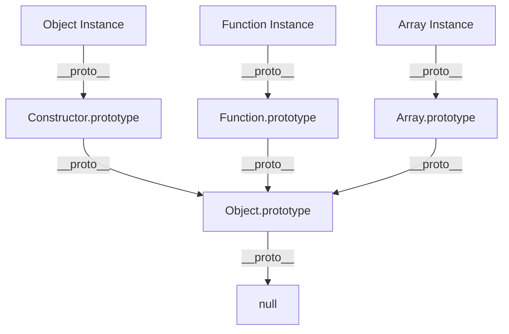

# JS — function

# JS — Function Module

This module explores JavaScript's function mechanics, object creation patterns, prototype chains, and inheritance models. It serves as a practical reference for understanding how functions work as constructors, how objects are created and linked, and how inheritance is implemented in both ES5 and ES6+.

## Core Concepts

### Object Creation Patterns

JavaScript offers multiple ways to create objects, each with different behaviors:

```javascript
// Constructor function with `new`
function newObj(name, age) {
    this.name = name;
    this.age = age;
}
const obj = new newObj('ceilf6', 20);

// Object literal (syntax sugar)
const obj1 = { x: valX };

// Object constructor
const obj2 = new Object();

// Object.create with explicit prototype
const obj3 = Object.create(Object.prototype);
```

The `new` keyword triggers special behavior: it creates a new object, sets its prototype, binds `this`, and returns the object (unless the constructor returns a different object).

### Constructor Functions vs. Factory Functions

**Factory functions** return objects explicitly without `new`:
```javascript
function createObj(name = 'ceilf5', age = 5) {
    return {
        name,
        age,
        sayHello() {
            console.log(`I'm ${name}, ${age} years old`);
        }
    };
}
```

**Constructor functions** are designed to be used with `new`:
```javascript
function CreateObj(name = 'ceilf5', age = 5) {
    this.name = name;
    this.age = age;
}
const instance = new CreateObj();
```

Key differences:
- Factory functions return new objects each time (no shared prototype)
- Constructor functions create instances linked to the constructor's prototype
- Using `new.target` can enforce proper constructor usage

### Prototype Chain and Inheritance

Every object has a hidden `[[Prototype]]` property (accessible via `__proto__` or `Object.getPrototypeOf()`) that forms a chain for property lookup:

```javascript
function Construct(name) {
    this.name = name;
    this.notShareFunc = function() { /* ... */ };
}

// Shared method via prototype
Construct.prototype.shareFunc = function() { /* ... */ };

const obj1 = new Construct();
const obj2 = new Construct();

// Instance methods are unique per object
obj1.notShareFunc === obj2.notShareFunc; // false

// Prototype methods are shared
obj1.shareFunc === obj2.shareFunc; // true
```

### ES6 Classes

Classes provide syntactic sugar over the prototype-based inheritance:

```javascript
class Example1 {
    constructor(name) {
        this.name = name;
    }
    sayName() {
        console.log(this.name);
    }
}

// Equivalent ES5 code
function Example1(name) {
    this.name = name;
}
Example1.prototype.sayName = function() {
    console.log(this.name);
};
```

## Key Files and Patterns

### `Funcion.js` — Basic Constructor Pattern
Demonstrates creating objects with constructor functions and adding properties dynamically.

### `createFunction.js` — Factory vs. Constructor
Compares factory functions (return objects) with constructor functions (use `new`). Shows how `new.target` can enforce constructor usage and how return values affect object creation.

### `proto/` Directory — Prototype Mechanics
- **`__proto__.js`**: Shows that instances from the same constructor share the same prototype object
- **`shareFunc.js`**: Demonstrates instance methods vs. prototype methods
- **`API.js`**: Explores `isPrototypeOf` and prototype chain relationships
- **`拿构造函数名称.js`**: Shows how to retrieve the constructor name from an instance

### `arrow-func/inherit.js` — Arrow Function Limitations
Arrow functions don't have their own `this`, `arguments`, or `prototype`, making them unsuitable as constructors.

### `继承.js` and `继承.ts` — Inheritance Patterns
**ES5 inheritance** requires manual prototype chain setup:
```javascript
function Child(prop, extProp) {
    Father.call(this, prop); // Call parent constructor
    this.extProp = extProp;
}
// Set up prototype chain
Child.prototype = Object.create(Father.prototype);
Child.prototype.constructor = Child;
```

**ES6 inheritance** uses `extends` and `super`:
```javascript
class Child extends Father {
    constructor(prop, extProp) {
        super(prop); // Call parent constructor
        this.extProp = extProp;
    }
}
```

TypeScript adds access modifiers (`public`, `protected`, `private`) for encapsulation.

### `test1.js`, `test2.js`, `test3.js` — Prototype Chain Behavior
These files demonstrate:
- How properties are resolved up the prototype chain
- The difference between own properties and inherited properties
- How `Object.prototype` and `Function.prototype` relate

### `number.html` — Primitive Wrapper Objects
Shows how primitive types have corresponding wrapper objects (`Number`, `String`, `Boolean`) that provide methods while maintaining primitive behavior through auto-boxing.

## Prototype Chain Visualization



## Common Patterns and Pitfalls

### Monkey Patching
Extending built-in prototypes (like `String.prototype.ceilf6`) is possible but generally discouraged as it can cause conflicts.

### Array-like Objects
DOM collections like `NodeList` are array-like but not true arrays. Convert them using:
```javascript
// ES6
Array.from(nodeList);

// ES5
Array.prototype.slice.call(nodeList);
```

### Property Enumeration
Use `hasOwnProperty` to distinguish own properties from inherited ones:
```javascript
for (const prop in obj) {
    if (obj.hasOwnProperty(prop)) {
        // Own property
    }
}
```

### Type Checking
Multiple ways to check types:
```javascript
Array.isArray(target); // Best for arrays
target instanceof Array; // Checks prototype chain
Object.prototype.toString.call(target); // Returns "[object Type]"
```

## Integration with Other Modules

This module's concepts are foundational for:
- **React component patterns** (class components, hooks)
- **Node.js module system** (module exports as objects)
- **DOM manipulation** (understanding NodeList, HTMLCollection)
- **Design patterns** (factory, singleton, observer)

The prototype chain understanding is crucial for debugging property lookup issues and optimizing memory usage by sharing methods via prototypes rather than creating them per instance.