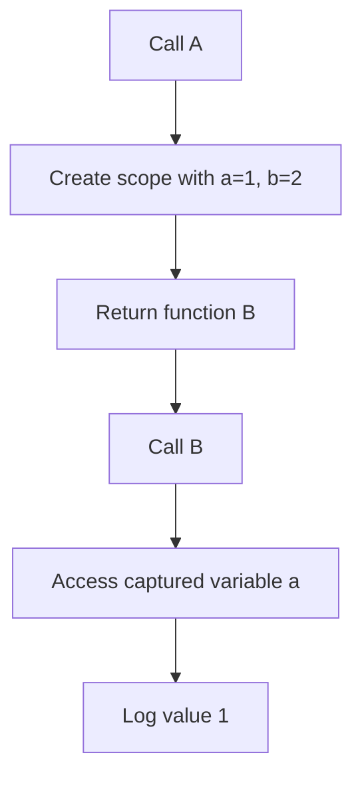

# JS — JS

# JS — JS Module

## Overview

This module demonstrates a fundamental JavaScript closure pattern. It defines a function `A` that creates a local scope and returns an inner function `B` that retains access to variables from that scope even after `A` has finished executing.

## Module Structure

### Function `A`

```javascript
function A() {
    const a = 1;
    const b = 2;
    return function B() {
        console.log(a)
    }
}
```

**Purpose**: Creates a closure environment and returns a function that captures variables from this environment.

**Behavior**:
1. Declares two constants: `a` (value `1`) and `b` (value `2`)
2. Returns the inner function `B`
3. Only `a` is captured by the returned function (not `b`)

### Function `B` (returned by `A`)

**Purpose**: Demonstrates closure by accessing the variable `a` from `A`'s scope.

**Behavior**:
- Logs the value of `a` (which will be `1`) when called
- Maintains a reference to `A`'s scope even after `A` has returned

## Closure Mechanics

The key concept demonstrated is **lexical scoping** and **closure**:

1. When `A()` is called, it creates a new execution context with variables `a` and `b`
2. The returned function `B` forms a closure over `A`'s scope
3. Even after `A` completes execution, `B` retains access to `a`
4. Variable `b` is not captured because it's not referenced in `B`

## Usage Example

```javascript
// Create the closure
const myFunction = A();

// Call the returned function
myFunction(); // Outputs: 1

// The closure maintains its own captured state
const anotherFunction = A();
anotherFunction(); // Also outputs: 1
```

## Execution Flow



## Key Characteristics

1. **No External Dependencies**: This module is self-contained with no imports or exports
2. **Pure Function**: `A` is a pure function that always returns the same type of closure
3. **Memory Considerations**: Each call to `A` creates a new closure with its own captured scope
4. **Unused Variable**: `b` is declared but never used in the returned function, demonstrating that only referenced variables are captured in closures

## Integration Notes

This module appears to be a standalone demonstration or educational example. It has:
- No incoming calls from other modules
- No outgoing calls to other modules
- No execution flows detected in the broader codebase

The pattern shown here is commonly used in:
- Module patterns
- Factory functions
- Callback configurations
- Data privacy implementations