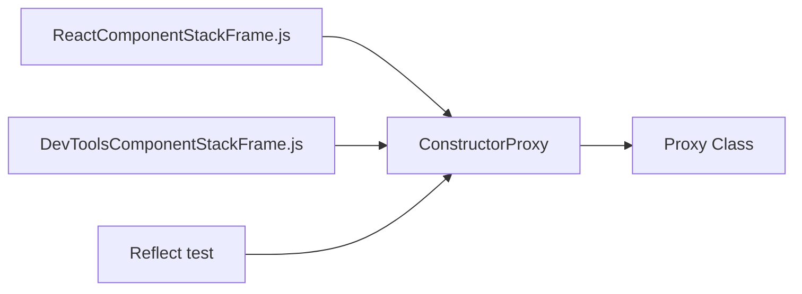

# JS — Proxy

# JS/Proxy Module

## Overview

The JS/Proxy module provides utilities for creating and working with JavaScript Proxy objects. It includes a `ConstructorProxy` factory function that intercepts class instantiation to automatically assign constructor arguments as named properties, along with examples demonstrating fundamental Proxy patterns.

## ConstructorProxy

The `ConstructorProxy` function creates a Proxy wrapper around a class constructor that intercepts the `construct` trap to map constructor arguments to named properties on the resulting instance.

### API

```javascript
constructorProxy(Class, ...propNames)
```

**Parameters:**
- `Class` - The class constructor to proxy
- `...propNames` - Variable number of property names to assign from constructor arguments

**Returns:** A proxied version of the class that automatically assigns arguments to named properties.

### Implementation Details

The proxy intercepts the `construct` trap using `Reflect.construct` to create the instance, then iterates through the provided property names and assigns each corresponding constructor argument:

```javascript
propNames.forEach((name, idx) => {
    obj[name] = args[idx]
})
```

This creates a direct mapping between constructor arguments and instance properties based on their positional order.

### Usage Example

```javascript
class ClassName {}

const ClassProxy = constructorProxy(ClassName, "属性1", "属性2", "属性n")
const obj = new ClassProxy("1值", "2值", "n值")

// obj.属性1 === "1值"
// obj.属性2 === "2值"  
// obj.属性n === "n值"
```

## Basic Proxy Patterns

The module includes examples of fundamental Proxy operations:

### Property Interception

```javascript
const proxyObj = new Proxy(targetObj, {
    set(target, propertyKey, value, receiver) {
        // Custom set logic
        Reflect.set(target, propertyKey, value)
        return true // Required for set trap
    },
    get(target, propertyKey) {
        if (Reflect.has(target, propertyKey)) {
            return Reflect.get(target, propertyKey);
        } else {
            return -1; // Default for missing properties
        }
    },
    has(target, propertyKey) {
        return false; // Always report properties as missing
    }
})
```

### Key Proxy Traps Demonstrated

1. **`set` trap** - Intercepts property assignment with validation/logging
2. **`get` trap** - Provides default values for missing properties
3. **`has` trap** - Controls `in` operator behavior
4. **`apply` trap** - (Shown in structure) For function call interception

## Integration with Codebase

The ConstructorProxy is utilized in React internals for component stack frame generation:



The proxy is used to create enhanced class constructors that automatically capture and store component metadata during instantiation, aiding in debugging and development tools.

## Best Practices

1. **Always return `true` from `set` trap** - Otherwise, strict mode will throw errors
2. **Use `Reflect` methods** - Maintain proper prototype chain and receiver context
3. **Keep traps minimal** - Proxy overhead increases with trap complexity
4. **Document proxy behavior** - Proxies can create non-obvious object behavior

## Limitations

- Cannot proxy certain built-in objects (like `Map`, `Set`) without careful trap implementation
- Performance overhead compared to direct property access
- Debugging proxied objects can be challenging due to intercepted operations