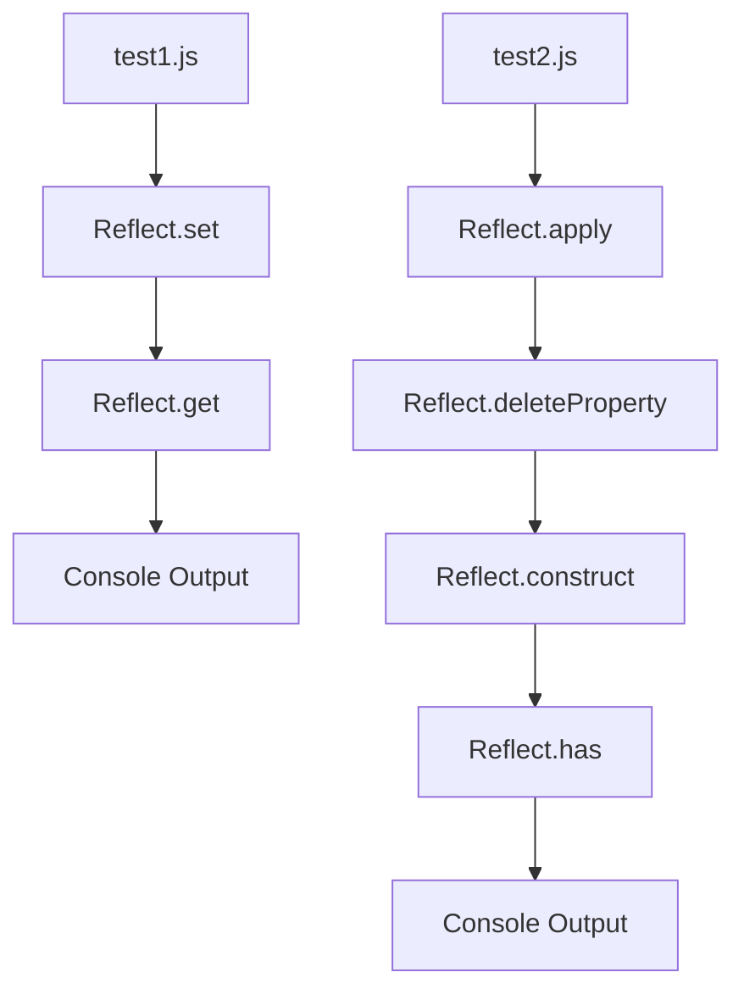

# JS — Reflect

# JS — Reflect Module

## Overview

The **JS — Reflect** module demonstrates the use of the JavaScript `Reflect` API, which provides methods for interceptable JavaScript operations. These methods correspond to the proxy handler methods and offer a more functional approach to object manipulation compared to traditional operators and methods.

## Purpose

This module serves as a practical reference for using `Reflect` methods to perform common object operations in a more explicit and functional style. The `Reflect` API provides:

- **Consistency**: Methods for operations that were previously only available as operators or object methods
- **Better return values**: Methods return booleans indicating success/failure instead of throwing errors
- **First-class functions**: Operations that were previously syntax are now callable functions

## Key Components

### Property Access and Modification

```javascript
// test1.js
const obj = { a: 1, b: 2 };

// Setting a property
Reflect.set(obj, "a", 10);

// Getting a property
console.log(Reflect.get(obj, "a")); // 10
```

**`Reflect.set(target, propertyKey, value)`** - Sets a property on an object, equivalent to `target[propertyKey] = value`

**`Reflect.get(target, propertyKey)`** - Gets a property value from an object, equivalent to `target[propertyKey]`

### Function Application

```javascript
// test2.js
function method(a, b) {
    console.log("method", a, b);
}

// Calling a function with specific context and arguments
Reflect.apply(method, null, [3, 4]);
```

**`Reflect.apply(target, thisArgument, argumentsList)`** - Calls a function with a given `this` value and arguments, equivalent to `Function.prototype.apply()`

### Property Deletion

```javascript
// test2.js
const obj1 = { a: 1, b: 2 };

// Deleting a property
Reflect.deleteProperty(obj1, "a");
console.log(obj1); // { b: 2 }
```

**`Reflect.deleteProperty(target, propertyKey)`** - Deletes a property from an object, equivalent to the `delete` operator

### Object Construction

```javascript
// test2.js
function Test(a, b) {
    this.a = a;
    this.b = b;
}

// Creating a new instance
const t = Reflect.construct(Test, [1, 3]);
console.log(t); // Test { a: 1, b: 3 }
```

**`Reflect.construct(target, argumentsList[, newTarget])`** - Creates a new object with the specified constructor, equivalent to the `new` operator

### Property Existence Check

```javascript
// test2.js
const obj = { a: 1, b: 2 };

// Checking if property exists
console.log(Reflect.has(obj, "a")); // true
```

**`Reflect.has(target, propertyKey)`** - Checks if a property exists on an object, equivalent to the `in` operator

## Execution Flow

The module executes two test files sequentially:



## Connection to Proxy API

The `Reflect` API is designed to work seamlessly with the `Proxy` API. Each `Reflect` method corresponds to a trap in the Proxy handler. This relationship is evident in the call graph, where `Reflect.construct` connects to the `Proxy/ConstructorProxy` module.

When using Proxies, you can use `Reflect` methods to forward operations to the target object:

```javascript
const handler = {
    construct(target, args) {
        console.log('Constructing...');
        return Reflect.construct(target, args);
    }
};

const proxy = new Proxy(Test, handler);
const instance = new proxy(1, 3); // Logs "Constructing..."
```

## Best Practices

1. **Use `Reflect` for explicit operations** when you need clear, functional-style code
2. **Prefer `Reflect` in Proxy handlers** to properly forward operations to target objects
3. **Use return values** - `Reflect` methods return success/failure indicators instead of throwing errors
4. **Combine with Proxy** for advanced metaprogramming patterns

## Example: Complete Object Manipulation

```javascript
const target = { x: 10, y: 20 };

// Complete property lifecycle
Reflect.set(target, 'z', 30);        // Add property
console.log(Reflect.get(target, 'z')); // 30
console.log(Reflect.has(target, 'z')); // true
Reflect.deleteProperty(target, 'z');  // Remove property
console.log(Reflect.has(target, 'z')); // false
```

## Notes

- All `Reflect` methods are static (called on the `Reflect` object)
- `Reflect` methods provide a more predictable behavior than their operator equivalents
- The module demonstrates basic usage patterns; advanced use cases involve metaprogramming with Proxies