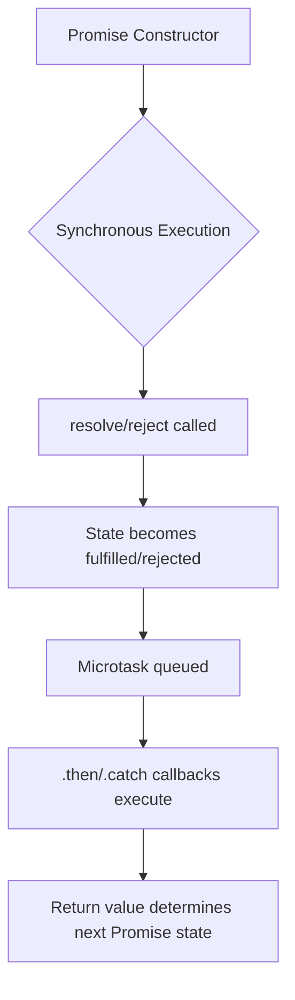

# JS — sync

# JS — sync Module

This module contains a collection of examples and tests demonstrating JavaScript's asynchronous programming patterns, focusing on Promises and async/await syntax. It serves as a practical reference for understanding how asynchronous operations are handled in JavaScript, including execution order, error propagation, and chaining.

## Core Concepts

### Promises
A Promise represents the eventual completion (or failure) of an asynchronous operation. Key behaviors demonstrated in this module:

- **Constructor execution is synchronous**: The function passed to `new Promise()` executes immediately.
- **State transitions**: A Promise can be `pending`, `fulfilled`, or `rejected`. Once settled, its state cannot change.
- **Chaining**: `.then()` and `.catch()` return new Promises, enabling sequential asynchronous operations.

### Async/Await
Syntactic sugar over Promises that makes asynchronous code look synchronous:
- `async` functions always return a Promise.
- `await` pauses execution until the awaited Promise settles.

## Module Structure

### Async Function Examples (`async/`)

#### `empty.js`
Demonstrates that an `async` function without an explicit return value returns a Promise that resolves to `undefined`.

```javascript
async function emp() {}
console.log(emp()); // Promise { undefined }
```

#### `returnPro.js`
Shows the three equivalent ways to return a value from an `async` function, all resulting in a fulfilled Promise:

1. Direct return: `return 'apro1'`
2. Return a new Promise: `return new Promise(resolve => resolve('apro2'))`
3. Return `Promise.resolve()`: `return Promise.resolve('apro3')`

Also demonstrates that `await` works with non-Promise values by wrapping them in `Promise.resolve()`.

### Utility Functions

#### `delay.js`
A reusable utility that creates a Promise-based delay:

```javascript
function delay(time) {
    return new Promise((resolve, reject) => {
        setTimeout(() => resolve(), time);
    });
}
```

### Practical Examples

#### `fetchData2List.html`
A complete example of fetching data from an API and populating a dropdown. Demonstrates:
- Using `fetch()` with Promise chaining
- Error handling with `.then(success, failure)`
- DOM manipulation with asynchronous data

#### `sync-img.html`
Shows how to wrap callback-based APIs (image loading) in Promises:
- `createImage()` returns a Promise that resolves with the image element on load or rejects on error
- Demonstrates multiple consumers of the same Promise

### Promise Chaining Examples (`link/`)

These files illustrate how Promises chain together and how state propagates:

#### `all.js`
Demonstrates `Promise.all()` which waits for all Promises to fulfill and returns an array of results.

#### `empty.js` and `linkWithoutDeal.js`
Show that `.then()` without a handler still creates a new Promise that follows the original's state.

#### `ex1.js` through `ex3.js`
Progressive examples of error handling in chains:
- Errors thrown in `.then()` create rejected Promises
- `.catch()` can recover from errors or re-throw
- Unhandled rejections propagate down the chain

#### `newPro.js`
Demonstrates returning a new Promise from `.then()`:
- The chain waits for the returned Promise to settle
- Creates a "two-way binding" between the chain and the new Promise

#### `lastPro.js`
Shows how `.catch()` handles rejection and can either recover (return a value) or propagate (throw an error).

### Execution Order Tests (`tests/`)

These files test understanding of JavaScript's event loop and Promise microtask queue:

#### `synchronization.js` and `tests/1.js`
Show that Promise constructor code runs synchronously, but `.then()` callbacks are queued as microtasks.

#### `tests/2.js`
Demonstrates that `resolve()` inside a `setTimeout` delays the fulfillment until the next event loop iteration.

#### `tests/3.js`
Shows that `.catch()` on a pending Promise creates a new Promise that follows the original until it settles.

#### `tests/4.js`
Confirms that `async` functions return Promises immediately, even before the function body completes.

## Execution Flow Patterns



## Key Takeaways

1. **Promise constructor is synchronous**: Code inside `new Promise(executor)` runs immediately.
2. **`.then()` returns a new Promise**: The chain continues based on the return value of the handler.
3. **Error propagation**: Unhandled rejections propagate until caught by `.catch()`.
4. **Async/await simplification**: `async` functions return Promises; `await` unwraps them.
5. **Microtask queue**: Promise callbacks execute before the next macrotask (like `setTimeout`).

## Connection to Broader Codebase

This module serves as a standalone reference for asynchronous JavaScript patterns. The examples can be used to:
- Understand Promise behavior before implementing complex async logic
- Test assumptions about execution order
- Learn proper error handling patterns
- See practical applications like API calls and image loading

The patterns demonstrated here are fundamental to modern JavaScript development and are used throughout the codebase for handling asynchronous operations.