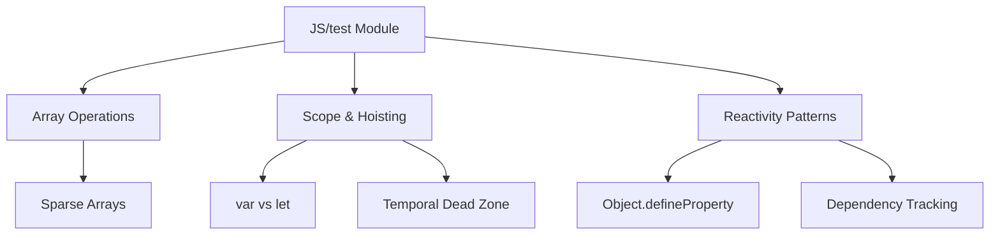

# JS — test

# JS — test Module

This module contains standalone JavaScript test files that demonstrate core language behaviors and patterns. Each file explores a specific concept, serving as a reference or learning tool for developers working with JavaScript.

## Files Overview

### `arr.js`
Demonstrates basic array operations and sparse array behavior.

```javascript
const arr = [];
arr[1] = 2; // Creates a sparse array with empty slot at index 0
console.log(arr); // Output: [ <1 empty item>, 2 ]
```

**Key Concepts:**
- Array initialization and assignment
- Sparse arrays (arrays with empty slots)
- Index-based assignment without sequential initialization

### `var&块级.js`
Illustrates the difference between `var` and `let` declarations in block scope, with reference to V8 engine internals.

```javascript
if (true) {
    var name = 'ceilf6'; // Function-scoped, hoisted
    let age = 20; // Block-scoped
}
console.log(name); // 'ceilf6'
console.log(age); // ReferenceError
```

**Key Concepts:**
- `var` declarations are function-scoped and hoisted
- `let` declarations are block-scoped
- V8 engine implementation details (referenced from `globals.h`)
- LexicalEnvironment vs VariableEnvironment creation during block entry

### `变量提升.js`
Shows variable hoisting behavior differences between `var` and `let`.

```javascript
console.log(typeof(x)); // 'undefined' (var hoisted, initialized to undefined)
var x = 1;

let y = 'outer';
{
    console.log(y); // ReferenceError (temporal dead zone)
    let y = 'inner';
}
```

**Key Concepts:**
- `var` hoisting with initialization to `undefined`
- `let` hoisting without initialization (temporal dead zone)
- Block scoping and variable shadowing

### `属性描述符.js`
Implements a basic reactive property system using `Object.defineProperty`, similar to Vue.js reactivity.

```javascript
const obj = {};
let value;
const watchList = [];

Object.defineProperty(obj, "att", {
    get() {
        if (Dep.target) {
            watchList.push(Dep.target);
        }
        return value;
    },
    set(val) {
        value = val;
        watchList.forEach(w => w());
    }
});
```

**Key Concepts:**
- Property descriptors and accessor properties
- Getter/setter interception
- Dependency tracking pattern (similar to Vue.js reactivity)
- Observer pattern implementation

## Architecture

These files are independent test cases with no interdependencies. They collectively demonstrate:



## Usage

These files are intended for:
- Learning JavaScript fundamentals
- Testing runtime behavior in different environments
- Understanding engine implementation details
- Studying reactive programming patterns

Each file can be executed independently in any JavaScript runtime (Node.js, browser console, etc.) to observe the demonstrated behavior.

## Connection to Codebase

This module serves as a reference implementation and test suite. While not directly integrated into production code, it:
- Documents JavaScript language behaviors relevant to the main codebase
- Provides examples of patterns used in the project (like reactivity)
- Can be used for regression testing of JavaScript engine behavior
- Helps onboard developers to JavaScript concepts used throughout the project

The reactive property example in `属性描述符.js` particularly mirrors patterns found in the main application's state management and UI reactivity systems.