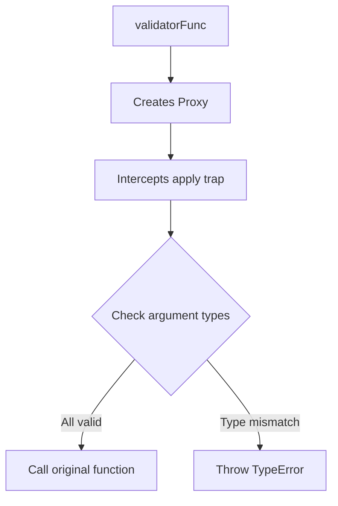

# JS — TypeJS

# TypeJS Module

A lightweight runtime type-checking utility that enforces argument types for JavaScript functions using ES6 Proxy.

## Overview

TypeJS provides a single function that wraps any function with a Proxy to validate argument types at call time. When the wrapped function is invoked, each argument is checked against the specified type string (using `typeof`). If any argument fails validation, a `TypeError` is thrown before the original function executes.

## Installation and Import

```javascript
import validatorFunc from './JS/TypeJS/index.js'
```

## API Reference

### `validatorFunc(func, ...types)`

Wraps a function with type-checking behavior.

**Parameters:**
- `func` (Function): The original function to wrap
- `...types` (string[]): Type strings for each argument position (e.g., `"number"`, `"string"`, `"boolean"`)

**Returns:** A Proxy-wrapped function with identical behavior but with type validation

**Throws:** `TypeError` if any argument doesn't match its specified type

## Usage Examples

### Basic Type Enforcement

```javascript
import validatorFunc from './JS/TypeJS/index.js'

const sum = (a, b) => a + b
const sumProxy = validatorFunc(sum, "number", "number")

// Valid call
console.log(sumProxy(1, 2))  // Output: 3

// Invalid call - throws TypeError
console.log(sumProxy('ceilf6', 20))  // Throws: "第1参数类型有问题"
```

### Multiple Type Specifications

```javascript
const processUser = (name, age, isActive) => {
  return { name, age, isActive }
}

const processUserProxy = validatorFunc(
  processUser, 
  "string", 
  "number", 
  "boolean"
)

processUserProxy("Alice", 30, true)  // Works
processUserProxy("Bob", "twenty", false)  // Throws TypeError for age
```

## Error Handling

When type validation fails, the module throws a `TypeError` with a Chinese error message indicating which parameter failed:

```
第${idx + 1}参数类型有问题
```

Translation: "Parameter ${idx + 1} has a type problem"

The error includes the 1-based index of the failing parameter.

## How It Works



The module uses JavaScript's `Proxy` and `Reflect` APIs:

1. **Proxy Creation**: Wraps the original function in a Proxy
2. **Apply Trap**: Intercepts function calls via the `apply` trap
3. **Type Validation**: Iterates through specified types, checking each argument with `typeof`
4. **Execution**: Only calls the original function via `Reflect.apply` if all type checks pass

## Implementation Details

The core implementation is minimal:

```javascript
export default (func, ...types) => {
    return new Proxy(func, {
        apply(target, thisArgument, args) {
            types.forEach((type, idx) => {
                if (typeof args[idx] !== type) {
                    throw new TypeError(`第${idx + 1}参数类型有问题`)
                }
            })
            return Reflect.apply(target, thisArgument, args)
        }
    })
}
```

Key aspects:
- Uses rest parameters to accept variable type specifications
- Validates arguments in order against the provided type strings
- Preserves the original function's `this` context and return value
- Only validates arguments that have corresponding type specifications (extra arguments are ignored)

## Limitations and Considerations

1. **Primitive Types Only**: Only validates against `typeof` results (`"string"`, `"number"`, `"boolean"`, `"function"`, `"object"`, `"symbol"`, `"undefined"`, `"bigint"`)

2. **No Complex Type Checking**: Cannot validate:
   - Array vs Object
   - Specific object shapes
   - Class instances
   - Null (typeof null === "object")

3. **Argument Count**: Only validates arguments up to the number of specified types. Extra arguments pass through without validation.

4. **Performance**: Adds minimal overhead per function call due to Proxy interception and type checking.

5. **Error Messages**: Error messages are in Chinese. For international applications, consider extending the module to support custom error messages.

## Integration Notes

This module is standalone with no external dependencies. It connects to the broader codebase through:

- **Proxy API**: Uses the structural Proxy pattern (referenced in `Structural/Proxy/ProxyClass.ts`)
- **Reflect API**: Uses `Reflect.apply` for clean function invocation

The module can be used to wrap any function in the codebase that needs runtime type safety, particularly useful for:
- Public API functions
- Functions processing user input
- Critical business logic where type errors could cause subtle bugs