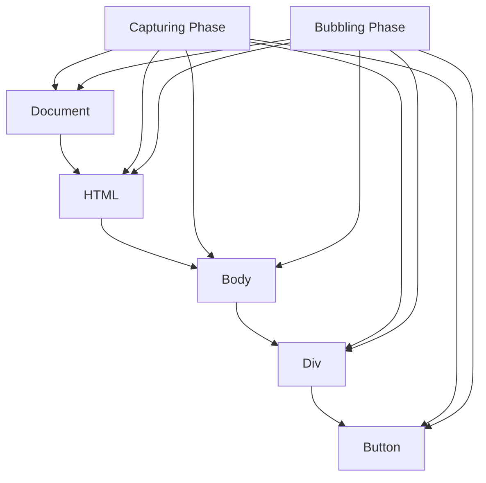

# JS — Web-API

# JS — Web-API Module

This module provides practical examples of core Web API concepts in JavaScript, focusing on DOM manipulation, event handling, and the underlying prototype chains that power these APIs. Each HTML file serves as a self-contained demonstration of a specific concept.

## Module Structure

The module is organized into several key areas:

```
JS/Web-API/
├── DOM节点原型链.html          # DOM node prototype chain
├── 事件原型链.html             # Event object prototype chain
├── 事件流.html                 # Event flow (capturing & bubbling)
├── event/
│   ├── <a>.html               # Link click prevention
│   ├── <button>.html          # Form submission handling
│   └── eventObj.html          # Event object & delegation
└── 元素操作/
    └── index.html             # DOM element creation & manipulation
```

## Core Concepts Demonstrated

### 1. DOM Node Prototype Chain

The `DOM节点原型链.html` file demonstrates how DOM elements inherit from a chain of prototypes. When you traverse the prototype chain of `document.body`, you see the inheritance hierarchy:

```javascript
document.body
→ HTMLBodyElement.prototype
→ HTMLElement.prototype
→ Element.prototype
→ Node.prototype
→ EventTarget.prototype
→ Object.prototype
→ null
```

This shows that all DOM elements ultimately inherit from `EventTarget`, which provides the `addEventListener` method, and from `Object`, which provides basic JavaScript object functionality.

### 2. Event Handling

#### Preventing Default Behavior

The `event/<a>.html` file shows how to prevent a link from navigating by calling `e.preventDefault()` in a click event handler:

```javascript
a.addEventListener('click', (e) => {
    e.preventDefault();
    console.log('被点击')
})
```

#### Form Submission Control

The `event/<button>.html` file demonstrates multiple ways to prevent form submission:

1. Using `e.preventDefault()` in a click handler
2. Using `e.returnValue = false` (legacy approach)
3. Returning `false` from an `onclick` handler

The example also shows how to use `fetch()` for AJAX form submission instead of traditional form submission.

### 3. Event Object & Delegation

The `event/eventObj.html` file demonstrates event delegation - a pattern where a single event handler on a parent element manages events for multiple child elements:

```javascript
container[0].onclick = function (e) {
    const source = e.target || e.srcElement;
    if (e.target.tagName === "BUTTON") {
        e.target.parentElement.remove();
    }
};
```

Key properties of the event object demonstrated:
- `e.target` - The element that triggered the event
- `e.currentTarget` - The element the event handler is attached to
- `e.type` - The type of event (e.g., "click")

### 4. Event Flow (Capturing & Bubbling)

The `event/事件流.html` file demonstrates the complete event flow through the DOM:

1. **Capturing phase**: Event travels from `document` down to the target element
2. **Target phase**: Event reaches the target element
3. **Bubbling phase**: Event bubbles back up to `document`

The example shows how to:
- Listen during the capturing phase by passing `true` as the third argument to `addEventListener`
- Stop event propagation with `e.stopPropagation()`
- Use `e.eventPhase` to determine which phase the event is in



### 5. Event Prototype Chain

The `事件原型链.html` file shows the inheritance hierarchy of event objects:

```javascript
PointerEvent
→ MouseEvent
→ UIEvent
→ Event
→ Object
→ null
```

This demonstrates that different event types (click, mouseover, etc.) inherit from common base classes, with `Event` being the root event class.

### 6. DOM Element Operations

The `元素操作/index.html` file demonstrates basic DOM manipulation:

- Creating elements with `document.createElement()`
- Adding elements to the DOM with `appendChild()`
- Setting content with `innerHTML` and `innerText`
- Querying elements with `getElementsByTagName()` and `querySelector()`

### 7. Getting DOM Nodes

The `获取DOM节点/doc.md` file documents various methods for selecting DOM elements:

**Legacy methods:**
- `document.getElementById()`
- `document.getElementsByTagName()`
- `document.getElementsByClassName()`
- `document.getElementsByName()`

**Modern methods:**
- `document.querySelector()` - Returns first matching element
- `document.querySelectorAll()` - Returns all matching elements

**Document properties:**
- `document.body`, `document.head`, `document.documentElement`
- `document.links`, `document.anchors`, `document.forms`

## Key Patterns & Best Practices

### Event Delegation
Instead of attaching event handlers to every child element, attach a single handler to a parent and use `e.target` to determine which child was clicked. This is more memory-efficient and works with dynamically added elements.

### Preventing Default Behavior
Always use `e.preventDefault()` instead of returning `false` from event handlers. The `preventDefault()` method is more explicit and works with `addEventListener`.

### Event Flow Understanding
Understanding capturing vs. bubbling is crucial for:
- Managing event handler execution order
- Implementing complex UI interactions
- Debugging event-related issues

### DOM Manipulation
Prefer `textContent` over `innerText` for better performance when you don't need layout information. Use `createElement` and `appendChild` for creating dynamic content rather than `innerHTML` when security is a concern.

## Connection to Other Modules

This Web-API module provides the foundation for:
- **UI Frameworks**: Understanding DOM manipulation is essential for React, Vue, and Angular
- **Single Page Applications**: Event handling and DOM updates are core to SPA architecture
- **Accessibility**: Proper event handling ensures keyboard and screen reader compatibility
- **Performance**: Efficient DOM operations and event delegation improve application performance

The concepts demonstrated here are fundamental to all client-side JavaScript development and form the basis for more advanced patterns like virtual DOM implementations and reactive UI systems.