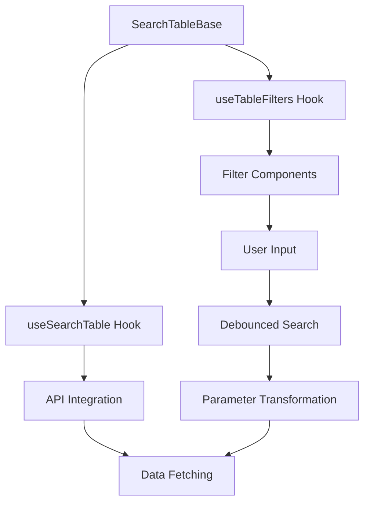
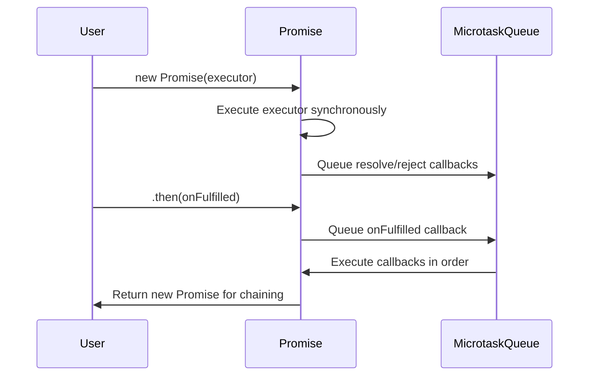

# monorepo

# Monorepo Module Documentation

## Overview

This monorepo is a collection of JavaScript/TypeScript examples, reimplementations of core concepts, and React/Vue component examples. It serves as a learning resource and reference implementation for fundamental programming patterns, framework internals, and practical UI components.

The repository is organized into three main sections:
1. **Reimplementing-Masterpieces** - Core JavaScript/TypeScript concepts and framework reimplementations
2. **React** - React component examples and patterns
3. **Vue** - Vue.js examples and reactive system implementations

## Repository Structure

```
monorepo/
├── Reimplementing-Masterpieces/
│   ├── JS_TS/                    # JavaScript/TypeScript fundamentals
│   ├── React/                    # React component examples
│   ├── Vue/                      # Vue.js examples
│   ├── async/                    # Async programming patterns
│   └── this/                     # JavaScript 'this' binding
└── React/                        # Additional React examples
```

## Key Components

### 1. JavaScript/TypeScript Fundamentals (`Reimplementing-Masterpieces/JS_TS/`)

#### String Operations (`str.js`)
Demonstrates string immutability and reference behavior:
- `main1()` returns the original string reference
- `main2()` returns a copy via `slice()`

#### Type Checking (`Object-tostring.js`)
Implements type checking utilities using `Object.prototype.toString`:
- `isType(value, type)` - Core type checking function
- Factory functions: `isBoolean`, `isNumber`, `isNull`, `isString`, `isSymbol`, `isUndefined`

#### Iterator Protocol (`iterator.js`)
Custom iterator implementation following the iterable protocol:
- `MyIterator` class with `[Symbol.iterator]()` and `next()` methods
- Demonstrates the iterator protocol pattern

#### Sorting Algorithms (`sort/`)
Reimplementations of classic sorting algorithms:
- **Bubble Sort** (`bubble.js`) - O(n²) comparison-based sorting
- **Selection Sort** (`select.js`) - O(n²) in-place sorting
- **Quick Sort** (`quick.js`) - O(n log n) divide-and-conquer sorting

#### Template Literals (`template-string.js`)
Demonstrates tagged template literals:
- `tag` function processes template strings and interpolated values
- Shows how template literals are parsed into string parts and value arrays

### 2. React Components (`Reimplementing-Masterpieces/React/`)

#### Search Table Implementation (`SearchTable/`)
A comprehensive search table implementation with filtering, pagination, and status tags:

**Core Components:**
- `ApprovalStatusTag` - Displays workflow status with color-coded tags
- `ReceiveStatusTag` - Shows document receipt status
- `TableFilter` - Filter form with debounced auto-search
- `tableColumns` - Table column definitions with custom cell renderers

**Search Table Architecture:**


**Key Features:**
- **Debounced Auto-Search**: 500ms debounce on filter changes
- **Parameter Transformation**: Converts form values to API parameters
- **Status Tags**: Color-coded status indicators for workflow and receipt status
- **Column Configuration**: Custom cell renderers for dates, amounts, and links

#### Example Implementations (`e.g./`)
- **Basic Search Table** (`index.tsx`) - Simple search table with mock data
- **Row Editing** (`e.g.callback.tsx`) - Advanced table with inline editing, validation, and linked field calculations

#### React Hooks (`stateHook.ts`)
Custom React hooks for common state patterns:
- `useBoolean` - Boolean state with `setTrue`, `setFalse`, `toggle`
- `useCounter` - Counter state with `increment`, `decrement`, `reset`

#### State Management Patterns
- **State Lifting** (`stateUp.js`, `react-jsx-test/src/main.js`) - Sharing state between sibling components
- **Observer Pattern** (`useSource.js`) - Custom observable state management with `Source` class and `useSource` hook

#### Tic-Tac-Toe Game (`playSquare/`)
Complete React application demonstrating:
- Component composition and state management
- Game logic with win detection
- Move history and time travel functionality

### 3. Vue.js Examples (`Reimplementing-Masterpieces/Vue/`)

#### Reactive Systems
- **Vue 2 Reactivity** (`Vue2Reactive.js`) - `Object.defineProperty` based reactivity with `Dep` and `Watcher`
- **Vue 3 Reactivity** (`Vue3Reactive.js`) - `Proxy` based reactivity with `track` and `trigger` functions

#### Virtual DOM Diffing (`diff.js`)
Implementation of virtual DOM diffing algorithm:
- `createElement` - Creates real DOM from virtual nodes
- `patch` - Efficient DOM updates using dual-pointer comparison
- `sameVNode` - Node comparison helper

#### Component Communication
- **Props Passing** (`Father.vue`, `Child.vue`) - Parent-child component communication
- **Reactivity Examples** (`ref-reactive.js`) - `ref` and `reactive` usage

### 4. Async Programming Patterns (`Reimplementing-Masterpieces/async/`)

#### Promise Implementation (`1_Promise.js`)
Complete Promise/A+ specification implementation:
- **Core Features**: State management, chaining, error propagation
- **Static Methods**: `resolve`, `reject`, `all`, `allSettled`, `race`, `any`
- **Key Concepts**: Microtask scheduling, thenable handling, immutability

#### Generator-based Async (`2_Co.js`)
`co` library implementation for generator-based async flow:
- Automatic promise resolution in generator functions
- Error handling via generator `throw` method

#### Async/Await Polyfill (`3_Async_Await.js`)
`async/await` implementation using generators and promises:
- `myAsync` - Converts generator functions to async functions
- `myAwait` - Promise wrapper for generator yield points

#### Event Loop Examples (`examples.js`, `nextTick.js`)
Demonstrates JavaScript event loop behavior:
- Microtask vs macrotask ordering
- `process.nextTick` vs `Promise.resolve` execution order

### 5. JavaScript 'this' Binding (`Reimplementing-Masterpieces/this/`)

#### Function Binding Implementations
- **`call`/`apply`** (`call-apply.js`) - Explicit this binding with argument passing
- **`bind`** (`bind.js`) - Partial application with new operator support
- **`new`** (`new.js`) - Constructor function implementation
- **`reduce`** (`reduce.js`) - Array method implementation with accumulator pattern

## Execution Flows

### Search Table Data Flow
1. User interacts with filter components
2. `useTableFilters` hook captures input changes
3. Debounced auto-search triggers after 500ms
4. `transformSearchParams` converts form values to API parameters
5. `queryOperateExpenses` API call with transformed parameters
6. Response data populates table with pagination

### Promise Execution Flow


## Integration Points

### Cross-Module Dependencies
- **React Components** use **TypeScript types** from business modules
- **Search Table** integrates with **API layer** (`@tmc/business/src/apis`)
- **Async implementations** are used throughout **React** and **Vue** examples
- **Sorting algorithms** are standalone but demonstrate algorithmic thinking

### External Dependencies
- **React**: `react`, `react-dom`, `@finfe/beetle-ui`, `@finfe/materiel-mtd`
- **Vue**: `vue` (implied by `.vue` files)
- **Utilities**: `dayjs` for date manipulation, `ahooks` for React hooks

## Development Patterns

### Code Organization
- **Feature-based structure**: Components grouped by functionality
- **Separation of concerns**: UI components, hooks, utilities, and API integration
- **Type safety**: TypeScript interfaces for component props and API responses

### Best Practices Demonstrated
1. **Custom Hooks**: Reusable logic extraction (`useTableFilters`, `useBoolean`)
2. **Component Composition**: Building complex UIs from simple components
3. **Performance Optimization**: Debouncing, memoization, efficient DOM updates
4. **Error Handling**: Comprehensive error boundaries and validation
5. **Testing Patterns**: Mock data and API simulation for development

## Usage Examples

### Using Search Table Components
```tsx
import { SearchTable, Filter, useSearchTable } from '@finfe/beetle-ui';
import { useTableFilters } from './component/TableFilter';
import columns from './component/tableColumns';

function MySearchPage() {
  const { filters, setSearchCommand } = useTableFilters();
  const { config, commands } = useSearchTable({
    onSearch: async (params) => {
      // Transform and fetch data
      return { data: [], pagination: { total: 0 } };
    }
  });

  useEffect(() => {
    if (commands?.search) setSearchCommand(commands.search);
  }, [commands?.search]);

  return (
    <SearchTable config={config}>
      <Filter.Root>
        <Filter.Panel>{filters}</Filter.Panel>
      </Filter.Root>
      <SearchTable.Table columns={columns} />
    </SearchTable>
  );
}
```

### Implementing Custom Iterator
```typescript
class RangeIterator {
  constructor(private start: number, private end: number) {}
  
  [Symbol.iterator]() {
    return this;
  }
  
  next() {
    if (this.start <= this.end) {
      return { value: this.start++, done: false };
    }
    return { done: true };
  }
}

// Usage
for (const num of new RangeIterator(1, 5)) {
  console.log(num); // 1, 2, 3, 4, 5
}
```

## Contributing Guidelines

### Adding New Examples
1. Create a new directory under the appropriate section
2. Include a README.md explaining the example's purpose
3. Add TypeScript types where applicable
4. Include unit tests for complex implementations
5. Update this documentation with the new example

### Code Standards
- Use TypeScript for type safety
- Follow React/Vue best practices for framework-specific code
- Include JSDoc comments for public APIs
- Maintain consistent naming conventions
- Write self-documenting code with clear variable names

## Conclusion

This monorepo serves as a comprehensive reference for JavaScript/TypeScript fundamentals, React/Vue patterns, and async programming. It demonstrates both theoretical concepts and practical implementations, making it valuable for learning and development reference. The modular structure allows for easy navigation and reuse of components across different projects.