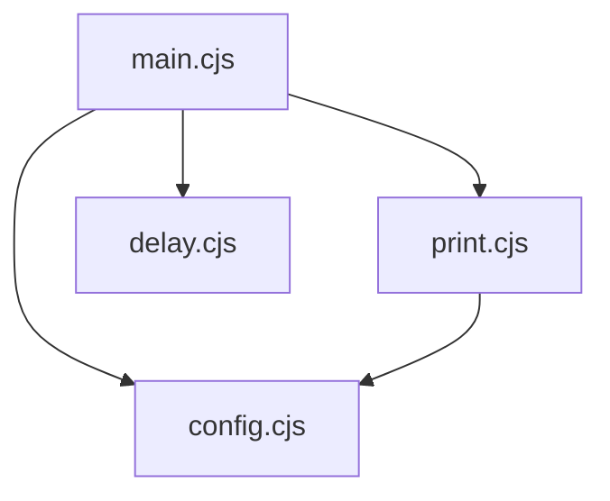

# NodeJS

# Node.js Module Documentation

This module provides a comprehensive collection of Node.js examples and utilities, demonstrating core concepts including CommonJS module system, file system operations, HTTP/HTTPS servers, networking, event loop behavior, and various built-in modules.

## Module Structure

The code is organized into two main directories:

```
NodeJS/
├── CMJ/                    # CommonJS module examples
│   ├── a.cjs               # Basic module export
│   ├── demo/               # Typewriter demo application
│   │   ├── config.cjs      # Configuration module
│   │   ├── delay.cjs       # Promise-based delay utility
│   │   ├── main.cjs        # Main application entry
│   │   └── print.cjs       # Console printing utility
│   ├── dynamic/            # Dynamic module export examples
│   │   ├── dynamic.cjs     # Conditional CommonJS exports
│   │   ├── esm-dynamic.js  # Conditional ESM exports
│   │   ├── esm-test.js     # ESM import test
│   │   └── test.cjs        # CommonJS require test
│   └── log.cjs             # Module system demonstration
└── sandboxs/               # Core Node.js API examples
    ├── GlobalObject.js     # Global objects and process
    ├── LifeCycle/          # Event loop behavior examples
    ├── fs/                 # File system operations
    ├── http/               # HTTP/HTTPS server examples
    ├── net/                # TCP networking examples
    └── test*.js            # Built-in module demonstrations
```

## CommonJS Module System (CMJ)

### Basic Module Export

The `a.cjs` file demonstrates basic CommonJS module exports:

```javascript
// a.cjs
var a = 1;

function funcA() {
    console.log('ceilf6')
}

module.exports = {
    a,
    funcA
}
```

Key patterns:
- `module.exports` defines what the module exposes
- Variables and functions can be exported as object properties
- CommonJS modules are loaded synchronously with `require()`

### Typewriter Demo Application

The `demo/` directory contains a complete application that prints text character by character:



**Execution Flow:**
1. `main.cjs` imports configuration, print function, and delay utility
2. The `run()` function iterates through each character in the configured text
3. For each character, it calls `print(index)` to display text up to that position
4. Uses `await delay(config.wordDuration)` to pause between characters
5. `print.cjs` clears the console and outputs the substring

**Key Features:**
- Async/await pattern for sequential execution
- Configuration separation from logic
- Console clearing for typewriter effect

### Dynamic Module Exports

The `dynamic/` directory shows conditional module exports:

```javascript
// dynamic.cjs - CommonJS conditional export
const flag = false // true

if (flag) {
    module.exports = { a: 1 }
} else {
    module.exports = { a: 0 }
}
```

**Important Notes:**
- CommonJS allows conditional `module.exports` assignment
- ESM (`esm-dynamic.js`) requires static `export` statements at module level
- ESM imports must be at the top level (cannot be inside conditionals)

## Core Node.js APIs (sandboxs)

### Global Objects and Process

`GlobalObject.js` demonstrates Node.js-specific globals:

```javascript
console.log(__dirname)      // Directory of current module
console.log(__filename)     // Full path of current module
console.log(process.cwd())  // Current working directory
console.log(process.argv)   // Command line arguments
console.log(process.env)    // Environment variables
```

**Key Differences from Browser:**
- `setTimeout` returns an object (not a number)
- `Buffer` class for binary data handling
- `process` object for system interaction

### File System Operations

#### Reading Files (`fsReadFile.js`)

Multiple approaches to file reading:

```javascript
// Callback-based (legacy)
fs.readFile('./path', (err, data) => { ... })

// Promise-based (modern)
const data = await fs.promises.readFile('./path', 'utf-8')

// Synchronous (blocking)
const data = fs.readFileSync('./path', 'utf-8')
```

**Path Handling:**
- Relative paths resolve from `process.cwd()`, not current file
- Use `path.resolve(__dirname, './relative')` for consistent paths

#### Writing Files (`fsWriteFile.js`)

Demonstrates file writing and copying strategies:

```javascript
// Basic write
await fs.promises.writeFile(path, content, { encoding: 'utf-8' })

// File copying methods:
// 1. copyFile (simplest)
await fs.promises.copyFile(from, to)

// 2. Read then write (binary)
const content = fs.readFileSync(from)
await fs.promises.writeFile(to, content)

// 3. Streams (memory efficient for large files)
const rs = fs.createReadStream(from)
const ws = fs.createWriteStream(to)
rs.pipe(ws)
```

#### Streams (`fsCreateReadStream.js`, `fsCreateWriteStream.js`)

**Readable Streams:**
```javascript
const readStream = fs.createReadStream(path, {
    highWaterMark: 64 * 1024,  // Buffer size
    encoding: null             // Binary mode
})

readStream.on('data', chunk => { ... })
readStream.on('end', () => { ... })
```

**Writable Streams and Backpressure:**
```javascript
const writeStream = fs.createWriteStream(path, {
    highWaterMark: 3  // Small buffer for demonstration
})

const canWrite = writeStream.write(data)
if (!canWrite) {
    // Buffer full - wait for 'drain' event
    writeStream.once('drain', () => { ... })
}
```

**Backpressure Handling Pattern:**
```javascript
function tryWrite() {
    let ok = true
    while (position < size && ok) {
        ok = writeStream.write(data)
        position++
    }
    if (position < size) {
        writeStream.once('drain', tryWrite)
    }
}
```

#### Recursive Directory Reading (`fsDFSread.js`)

Advanced file system traversal with caching:

```javascript
class MyFile {
    static childNamesProsCache = new Map()  // Global cache
    static contentProsCache = new Map()
    
    static async create(dir) { ... }        // Factory method
    async getChildren() { ... }             // Cached directory listing
    async getContent() { ... }              // Cached file content
    static async fsDFSread(dir) { ... }     // Recursive traversal
}
```

**Key Features:**
- Static factory pattern for async construction
- Global Promise caching to prevent duplicate reads
- Error handling with cache cleanup
- TypeScript version with full type safety

### HTTP/HTTPS Servers

#### Basic HTTP Server (`http/server.js`)

```javascript
const server = http.createServer((req, res) => {
    // Parse URL
    const urlObj = new URL(req.url, `http://${req.headers.host}`)
    
    // Handle request body as stream
    req.on('data', chunk => { ... })
    req.on('end', () => { ... })
    
    // Send response
    res.statusCode = 200
    res.setHeader('Content-Type', 'text/plain')
    res.write('Hello')
    res.end()
})

server.listen(80)
```

#### Static Resource Server (`http/staticResourceServer.js`)

Production-ready static file server with:

1. **Path Security:**
```javascript
function req2path(req) {
    const safePath = path.resolve(publicRoot, `.${pathname}`)
    // Prevent directory traversal
    if (!safePath.startsWith(publicRoot)) {
        throw new Error('Forbidden path')
    }
    return safePath
}
```

2. **MIME Type Detection:**
```javascript
const mimeTypes = {
    '.html': 'text/html',
    '.css': 'text/css',
    '.js': 'text/javascript',
    // ... more types
}
```

3. **Stream-based File Serving:**
```javascript
const rs = fs.createReadStream(filePath)
rs.pipe(res)  // Efficient streaming
```

4. **Error Handling:**
- 404 for missing files
- 403 for forbidden paths
- 500 for internal errors

### TCP Networking (`net/`)

#### Raw TCP Server (`net/server.js`)

```javascript
const server = net.createServer()
server.on('connection', socket => {
    socket.on('data', async chunk => {
        // Parse HTTP request manually
        // Send HTTP response with proper headers
        const response = Buffer.from(
            'HTTP/1.1 200 OK\r\n' +
            'Content-Type: image/jpeg\r\n' +
            `Content-Length: ${fileBuffer.length}\r\n` +
            '\r\n'
        )
        socket.write(Buffer.concat([response, fileBuffer]))
        socket.end()
    })
})
```

#### TCP Client (`net/client.js`)

Demonstrates low-level HTTP client implementation:
- Manual HTTP request formatting
- Response parsing with header/body separation
- Content-Length based completion detection

### Event Loop Behavior (`LifeCycle/`)

#### Timer vs Immediate (`check2.js`)

```javascript
setTimeout(() => console.log('setTimeout'), 0)
setImmediate(() => console.log('setImmediate'))
// Order depends on event loop phase timing
```

#### Event Loop Phases (`test1.js`)

Demonstrates execution order:
1. **Timers** - `setTimeout`, `setInterval`
2. **Poll** - I/O callbacks
3. **Check** - `setImmediate`
4. **Close** - Cleanup callbacks

#### Microtask Priority (`test4.js`)

```javascript
setImmediate(() => console.log('Immediate'))

process.nextTick(() => {
    console.log('nextTick')
    process.nextTick(() => console.log('nextTick => nextTick'))
})

Promise.resolve().then(() => {
    console.log('pro')
    process.nextTick(() => console.log('pro => nextTick'))
})
// Execution order: nextTick → Promise → Immediate
```

### Built-in Module Examples

#### Path Module (`testPath.js`)

```javascript
path.basename('/a/b/c.txt', '.txt')  // 'c'
path.dirname('/a/b/c.txt')           // '/a/b'
path.extname('/a/b/c.txt')           // '.txt'
path.resolve(__dirname, './file')    // Absolute path
path.join('a', '../b', 'c')          // 'b/c'
```

#### URL Module (`testURL.js`)

```javascript
const urlObj = new URL('https://example.com:8080/path?query=value')
console.log(urlObj.pathname)  // '/path'
console.log(urlObj.searchParams.get('query'))  // 'value'
```

#### Util Module (`testUtil.js`)

```javascript
// Convert between callback and promise patterns
const callbackFn = util.callbackify(asyncFn)
const promiseFn = util.promisify(callbackFn)

// Deep equality check
util.isDeepStrictEqual(obj1, obj2)
```

## Key Patterns and Best Practices

### 1. Error Handling in File Operations
```javascript
// Don't use existsSync - use stat with error handling
try {
    const stat = await fs.promises.stat(path)
    // File exists
} catch (e) {
    if (e.code === 'ENOENT') {
        // File doesn't exist
    } else {
        throw e  // Re-throw unexpected errors
    }
}
```

### 2. Stream Backpressure Management
```javascript
// Always handle backpressure in writable streams
const canContinue = stream.write(data)
if (!canContinue) {
    stream.once('drain', () => {
        // Resume writing
    })
}
```

### 3. Module System Compatibility
```javascript
// CommonJS can import ESM via dynamic import
import('./esm-module.mjs').then(module => {
    // Use module.default
})

// ESM cannot use require() - use import instead
```

### 4. Path Resolution
```javascript
// Always use absolute paths for file operations
const absolutePath = path.resolve(__dirname, './relative/path')
// __dirname is relative to current module
// process.cwd() is relative to where node was executed
```

## Running Examples

Most examples can be run directly with Node.js:

```bash
# Run a specific file
node NodeJS/sandboxs/fs/fsReadFile.js

# Run the typewriter demo
node NodeJS/CMJ/demo/main.cjs

# Run HTTP server (requires port 80)
sudo node NodeJS/sandboxs/http/server.js
```

**Note:** Some examples require specific setup:
- HTTP/HTTPS servers need appropriate ports and certificates
- File system examples assume test files exist in `testFiles/`
- Network examples may require firewall adjustments

## Connection to Other Modules

This module serves as a reference implementation for:
- **File system operations** used by build tools and scripts
- **HTTP servers** for API development and static file serving
- **Stream processing** for large data handling
- **Module system** understanding for package development

The patterns demonstrated here are foundational for Node.js application development and can be extended for production use with additional error handling, logging, and configuration management.