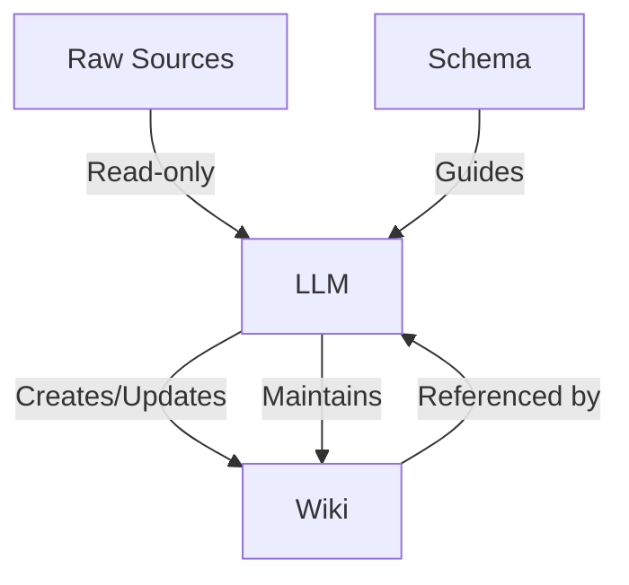

# Obsidion — Obsidion

# Obsidion — Obsidion Module

## Overview

The Obsidion module implements a pattern for building persistent, LLM-maintained personal knowledge bases. Unlike traditional RAG systems that rediscover knowledge on each query, this pattern creates a structured, interlinked wiki that accumulates and synthesizes knowledge over time. The LLM acts as an automated wiki maintainer, handling all cross-referencing, summarization, and consistency checks while the human focuses on sourcing, exploration, and analysis.

## Core Architecture

The system operates on three distinct layers:

### 1. Raw Sources Layer
- **Purpose**: Immutable collection of source documents (articles, papers, images, data files)
- **Characteristics**: 
  - Never modified by the LLM
  - Serves as the source of truth
  - Can include various formats (text, images, data)
- **Example**: `raw/` directory containing original documents

### 2. Wiki Layer
- **Purpose**: LLM-generated, structured knowledge base
- **Characteristics**:
  - Consists of interconnected Markdown files
  - Includes entity pages, concept pages, summaries, comparisons
  - Continuously updated as new sources are added
  - Maintains cross-references and consistency
- **Example**: `wiki/` directory with organized Markdown files

### 3. Schema Layer
- **Purpose**: Configuration document defining wiki structure and workflows
- **Characteristics**:
  - Tells the LLM how to maintain the wiki
  - Defines conventions for page formats, naming, organization
  - Evolves over time as the workflow matures
- **Example**: `CLAUDE.md` or `AGENTS.md` file

## Key Operations

### Ingest Operation
The process of adding new sources to the knowledge base:

1. **Source Placement**: Add new document to raw sources collection
2. **LLM Processing**: 
   - Reads and analyzes the source
   - Discusses key takeaways with the user
   - Creates summary page in wiki
   - Updates index and log files
   - Updates relevant entity and concept pages
   - Adds cross-references to existing content
3. **Result**: Single source may update 10-15 wiki pages

### Query Operation
Retrieving and synthesizing information from the wiki:

1. **Question Input**: User asks a question against the wiki
2. **Search & Synthesis**:
   - LLM searches relevant pages via index
   - Reads and synthesizes information
   - Generates answer with citations
3. **Answer Formats**: 
   - Markdown pages
   - Comparison tables
   - Slide decks (Marp)
   - Charts (matplotlib)
   - Canvas visualizations
4. **Knowledge Compounding**: Good answers can be filed back as new wiki pages

### Lint Operation
Periodic health checks and maintenance:

1. **Consistency Checks**:
   - Identify contradictions between pages
   - Find stale information superseded by newer sources
   - Locate orphan pages with no inbound links
2. **Gap Analysis**:
   - Identify important concepts lacking dedicated pages
   - Find missing cross-references
   - Suggest data gaps fillable via web search
3. **Growth Planning**: LLM suggests new research questions and sources

## Indexing and Logging System

### index.md (Content-Oriented)
- **Purpose**: Catalog of all wiki content
- **Structure**: 
  - Each page listed with link and one-line summary
  - Optional metadata (date, source count)
  - Organized by category (entities, concepts, sources)
- **Usage**: 
  - Updated on every ingest operation
  - First reference point for query operations
  - Effective at moderate scale (~100 sources, hundreds of pages)

### log.md (Chronological)
- **Purpose**: Append-only record of operations
- **Structure**: 
  - Consistent prefix format: `## [YYYY-MM-DD] operation | Title`
  - Records ingests, queries, and lint passes
- **Usage**:
  - Provides timeline of wiki evolution
  - Parseable with simple tools: `grep "^## \[" log.md | tail -5`
  - Helps LLM understand recent operations

## Optional Tools and Integrations

### CLI Tools
- **Search Engine**: For wikis beyond moderate scale
  - Recommended: [qmd](https://github.com/tobi/qmd) - local markdown search with hybrid BM25/vector search
  - Features: CLI interface, MCP server, LLM re-ranking
  - Alternative: Custom scripts built with LLM assistance

### Obsidian Integration
- **Web Clipper**: Browser extension for converting web articles to Markdown
- **Image Handling**: 
  - Set fixed attachment folder path (e.g., `raw/assets/`)
  - Bind hotkey for downloading attachments
  - Enables LLM to reference local images
- **Visualization**: 
  - Graph view for observing wiki structure
  - Marp plugin for slide deck generation
  - Dataview plugin for querying frontmatter

## Workflow Patterns

### Single-Source Ingestion (Recommended)
1. Add one source at a time
2. Stay involved in the process
3. Read summaries and check updates
4. Guide LLM on emphasis and priorities
5. Review cross-references and connections

### Batch Ingestion
1. Add multiple sources simultaneously
2. Less supervision required
3. Useful for initial wiki population
4. May require more lint operations afterward

### Exploration Workflow
1. Ask questions against the wiki
2. Review generated answers
3. File valuable analyses as new pages
4. Knowledge compounds through exploration

## Why This Pattern Works

### Maintenance Automation
- **Human Limitation**: Maintenance burden grows faster than value
- **LLM Advantage**: 
  - Doesn't get bored or forget updates
  - Can modify 15+ files in one pass
  - Maintains consistency at near-zero cost
  - Handles cross-referencing automatically

### Knowledge Compounding
- **Traditional RAG**: Rediscovery on each query
- **Wiki Pattern**: 
  - Knowledge compiled once, kept current
  - Cross-references pre-established
  - Contradictions already flagged
  - Synthesis reflects all sources

### Division of Labor
- **Human Responsibilities**:
  - Curate sources
  - Direct analysis
  - Ask good questions
  - Interpret meaning
- **LLM Responsibilities**:
  - Summarization
  - Cross-referencing
  - Filing and bookkeeping
  - Consistency maintenance

## Implementation Notes

### Modular Design
All components are optional and modular:
- Skip image handling for text-only sources
- Use only index.md for small wikis
- Choose output formats based on needs
- Customize schema for specific domains

### Evolutionary Approach
- Start with basic structure
- Co-evolve schema with LLM over time
- Adapt workflows to personal style
- Document conventions in schema file

### Git Integration
- Wiki is a git repository of Markdown files
- Provides version history for free
- Enables branching and collaboration
- Natural backup and synchronization

## Getting Started

1. **Share Pattern**: Provide this documentation to your LLM agent
2. **Define Schema**: Create initial configuration file (CLAUDE.md/AGENTS.md)
3. **Set Up Structure**: Establish raw sources and wiki directories
4. **Initial Ingestion**: Add first few sources with close supervision
5. **Refine Workflow**: Adjust processes based on experience
6. **Document Conventions**: Update schema with learned patterns

## Limitations and Considerations

- **Scale**: Index-based navigation works for moderate wikis; larger wikis need search tools
- **Image Handling**: LLMs cannot process inline images in single pass; requires separate viewing
- **Domain Specificity**: Schema and conventions must be tailored to specific use cases
- **Human Oversight**: Still required for quality control and direction setting

This pattern represents a shift from query-time knowledge discovery to compile-time knowledge accumulation, creating a persistent, growing knowledge artifact that becomes more valuable over time.