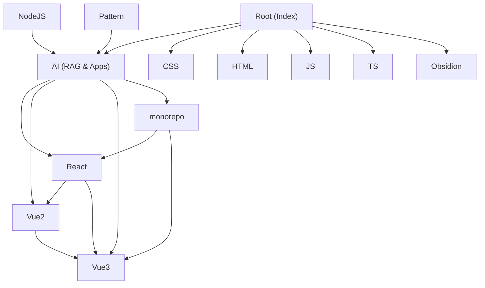

# Wiki — Wiki

# Wiki — Knowledge Base & Learning Hub

Welcome! This repository is a personal knowledge base that blends the organizational philosophies of **Obsidian**, **Notion**, and **LLM-powered retrieval** into a single, searchable workspace. It serves as both a human-readable reference (searchable with `Ctrl+F`) and a machine-readable knowledge graph for intelligent retrieval via RAG.

Whether you're here to study frontend frameworks, explore design patterns, review academic coursework, or understand how the pieces connect — this page is your starting point.

---

## What This Repository Contains

The Wiki is organized into **modules**, each covering a distinct domain. At the center is the [Root](Root.md) module — the single source of truth and index that connects everything. From there, knowledge branches into:

- **Frontend frameworks** — [React](React.md), [Vue2](Vue2.md), [Vue3](Vue3.md), and their source-level deep dives
- **Web fundamentals** — [CSS](CSS.md), [HTML](HTML.md), [JS](JS.md), [TS](TS.md)
- **Backend & tooling** — [NodeJS](NodeJS.md), [Network](Network.md), [engineering](engineering.md) (Webpack, build systems)
- **Architecture & patterns** — [Pattern](Pattern.md) (design patterns in TypeScript), [monorepo](monorepo.md) (framework reimplementations)
- **AI & retrieval** — [AI](AI.md) (RAG pipeline, application layer, infrastructure)
- **Academic study** — [Obsidion](Obsidion.md) (exam-oriented coursework across engineering disciplines)
- **Reference & automation** — [_reference](_reference.md) (external site snapshots), [scripts](scripts.md) (Git hooks, README automation), [docs](docs.md) (workspace-level documentation)

---

## Architecture at a Glance

The diagram below shows how the major modules relate. The **AI** module sits at the center of cross-module activity, heavily referencing framework source code for learning and retrieval. **Root** is the navigational entry point for humans and machines alike.

**Reading the diagram:** Arrows indicate knowledge flow — where one module references, depends on, or draws from another. The framework modules (React, Vue2, Vue3) are tightly interconnected, reflecting shared concepts and cross-study. The AI module orchestrates retrieval across all of them.

---

## How Knowledge Flows

The heaviest cross-module activity happens between the **AI** application layer and the three frontend frameworks. When the AI module needs to answer a question or retrieve context, it draws from [React](React.md), [Vue2](Vue2.md), and [Vue3](Vue3.md) source analyses, as well as the [monorepo](monorepo.md) reimplementation examples. This creates a feedback loop: studying framework internals informs the AI, and the AI helps surface relevant knowledge.

The [sandboxs-runner](sandboxs-runner.md) module provides a live experimentation environment that both Vue and React modules feed into, allowing code to be tested and validated in isolation.

---

## Getting Started

1. **Browse by topic** — Start from [Root](Root.md) and use `Ctrl+F` to search for any pointer or topic.
2. **Dive into a module** — Each module page has its own overview, structure, and key concepts. Pick one from the list above.
3. **Run experiments** — The [TS](TS.md) module includes a Vite-based React app you can run locally. The [engineering](engineering.md) module has a Webpack demo. Check each module's docs for setup instructions.
4. **Understand the workspace** — For a comprehensive map of every directory and its purpose, see [docs/WORKSPACE_MAP.md](docs.md).

---

## Key Files

| File | Purpose |
|------|---------|
| `Root.md` | Master index — the human and machine entry point |
| `docs/WORKSPACE_MAP.md` | Complete directory-by-directory workspace map |
| `README.md` | Repository overview with quick-reference pointers |
| `scripts/setup-hooks.sh` | Git hook configuration for submodule sync |
| `scripts/update-readme.mjs` | Automated README maintenance |

---

Welcome aboard — pick a module and start exploring.