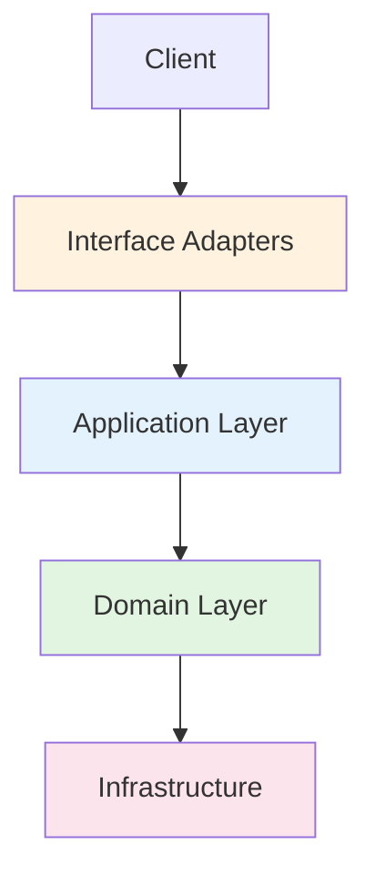
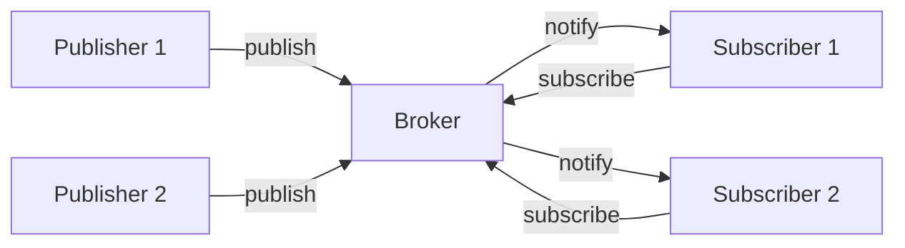

# Pattern

# Pattern Module

This module contains practical implementations of software design patterns and architectural patterns in TypeScript. Each example demonstrates a specific pattern with clear, runnable code that illustrates the pattern's structure, purpose, and usage.

## Architecture Patterns

### Clean Architecture

The Clean Architecture example demonstrates a layered approach to organizing code with clear separation of concerns. The implementation follows the dependency rule where source code dependencies point inward toward the domain layer.



**Key Components:**

- **Domain Layer** (`1-domain/Order.ts`): Contains core business entities and rules. The `Order` class enforces business invariants like requiring a customer ID and at least one item, with validation for quantities and prices.

- **Application Layer** (`2-application/`): Contains use cases that orchestrate business logic. `CreateOrderUseCase` coordinates order creation by generating an ID, creating an `Order` entity, and persisting it through the repository port.

- **Ports** (`2-application/ports/OrderRepository.ts`): Define interfaces that the application layer depends on. The `OrderRepository` interface specifies persistence operations without implementation details.

- **Interface Adapters** (`3-interface-adapters/`): Translate between external formats and the application layer. `CreateOrderController` handles HTTP requests, converts them to commands, and formats responses.

- **Infrastructure** (`4-infrastructure/`): Contains concrete implementations of ports. `InMemoryOrderRepository` provides a simple in-memory storage implementation.

**Execution Flow:**
1. Client creates infrastructure, application, and adapter instances
2. HTTP request is handled by `CreateOrderController`
3. Controller delegates to `CreateOrderUseCase.execute()`
4. Use case creates `Order` entity (validates business rules)
5. Use case persists order via `OrderRepository` port
6. Controller formats and returns HTTP response

## Design Patterns

### Behavioral Patterns

#### Iterator Pattern
Demonstrates using generators as iterators for sequential access to collection elements.

**Key Components:**
- `BookCollection`: Maintains a collection of books
- `createIterator()`: Returns a generator that yields books one by one
- Supports both manual `next()` calls and `for...of` loops

**Usage Example:**
```typescript
const collection = new BookCollection();
collection.add({ id: 1, title: "Design Patterns" });

// Manual iteration
const iterator = collection.createIterator();
let result = iterator.next();
while (!result.done) {
    console.log(result.value);
    result = iterator.next();
}

// for...of iteration
for (const book of collection.createIterator()) {
    console.log(book.title);
}
```

#### Pub-Sub Pattern
Implements a publish-subscribe system with a broker mediating between publishers and subscribers.



**Key Components:**
- `IBroker`: Central message broker interface
- `IPublisher`: Publisher interface for sending messages
- `ISubscriber`: Subscriber interface for receiving messages
- `Broker`: Concrete implementation managing topic subscriptions

**Execution Flow:**
1. Subscribers register with broker for specific topics
2. Publishers send messages to broker for specific topics
3. Broker notifies all subscribers of that topic

#### Strategy Pattern
Demonstrates interchangeable algorithms encapsulated as strategy objects.

**Two Examples:**

1. **Form Validation Strategy**
   - `ValidateStrategy` interface defines validation contract
   - Concrete strategies: `RequiredStrategy`, `MinLengthStrategy`, `EmailStrategy`, `NumberRangeStrategy`
   - `FormValidator` aggregates multiple validation rules
   - Rules are built using `buildValidatorRules()` function

2. **Internationalization Strategy**
   - `I18nStrategy` interface for translation
   - `DictionaryStrategy` implements translation using message dictionaries
   - `I18nContext` allows runtime strategy switching
   - Supports parameter interpolation with `{param}` syntax

**Usage Example (i18n):**
```typescript
const i18n = new I18nContext(new DictionaryStrategy(zhCNMessages));
console.log(i18n.t('welcome', { name: 'ceilf6' })); // "欢迎你，ceilf6！"

i18n.setStrategy(new DictionaryStrategy(enUSMessages));
console.log(i18n.t('welcome', { name: 'ceilf6' })); // "Welcome, ceilf6!"
```

#### Template Method Pattern
Defines an algorithm skeleton with concrete implementations providing specific steps.

**Key Components:**
- `Template` abstract class with time-based methods (`at8AM()`, `at10AM()`, etc.)
- `Programmer` and `AI` classes implement the template with different behaviors
- Each class defines what happens at specific times

**Execution Flow:**
1. Client iterates through time slots
2. Calls corresponding method on each object
3. Each object executes its specific implementation

#### Watcher Pattern
Implements reactive data observation using different JavaScript mechanisms.

**Three Implementations:**

1. **Proxy-based** (`Proxy.html`): Uses ES6 Proxy for deep observation
2. **defineProperty with separate object** (`defineProperty.html`): Creates observer object with getter/setter properties
3. **defineProperty on target** (`defineProperty1Obj.html`): Modifies target object directly with getter/setter properties

**Key Features:**
- Deep observation of nested objects
- Automatic re-rendering on property changes
- Recursive proxy creation for nested objects

**Class-based Implementation:**
- `Subject`: Maintains state and observer list
- `Observer`: Receives updates when state changes
- `ISubject` and `IObserver` interfaces define contracts

### Creational Patterns

#### Factory Pattern
Three variations demonstrating object creation patterns.

**1. Simple Factory**
- `SimpleFactory.createProduct(type)` creates products based on type string
- Products implement `IProduct` interface
- Violates Open/Closed Principle (requires modification for new products)

**2. Factory Method**
- `IFactory` interface defines factory contract
- Concrete factories: `FileLoggerFactory`, `DatabaseLoggerFactory`
- Each factory creates specific logger implementations
- Products implement `ILogger` interface

**3. Abstract Factory**
- `UIComponentFactory` abstract class defines component creation methods
- Concrete factories: `MaterialUIComponentFactory`, `AntDesignUIComponentFactory`
- Creates families of related UI components (Button, Input)
- Ensures consistent styling across component families

### Structural Patterns

#### Adapter Pattern
Converts the interface of a class into another interface clients expect.

**Key Components:**
- `ClientInterface`: Expected interface by client code
- `Server1`, `Server2`: Existing classes with incompatible interfaces
- `Server1Adaptor`, `Server2Adaptor`: Adapt server interfaces to client interface

**Execution Flow:**
1. Client calls `method()` on adapter
2. Adapter translates call to appropriate server method
3. Server executes its specific implementation

#### Decorator Pattern
Attaches additional responsibilities to objects dynamically.

**Two Implementations:**

1. **Class-based Decorators**
   - `IFunc` interface defines component contract
   - `BaseDecorator` wraps components and delegates calls
   - `Decorator1`, `Decorator2` extend base decorator with additional behavior
   - Supports decorator stacking

2. **TypeScript Decorators**
   - Uses TypeScript experimental decorators
   - `Decorator1`, `Decorator2` are class decorator factories
   - Modify class prototype methods at decoration time

**Usage Example (Class-based):**
```typescript
const func = new Func();
const decorated = new Decorator2(new Decorator1(func, 'Dec1'), 'Dec2');
decorated.func('test');
// Output: Func => test
//         ID:Dec1 Decorator1 => test
//         ID:Dec2 Decorator2 => test
```

#### Proxy Pattern
Provides a surrogate or placeholder for another object to control access.

**Two Implementations:**

1. **Proxy Class**
   - `Proxy` class implements `IServer` interface
   - Contains reference to real `Server` object
   - Adds permission checking before delegating calls

2. **ES6 Proxy API**
   - `createProxyServer()` function creates proxy using ES6 Proxy
   - Uses `Reflect` API for property access
   - Intercepts `operation` method calls for permission checking

**Key Features:**
- Permission-based access control
- Transparent interface to client
- Can add logging, caching, or other cross-cutting concerns

### OOP Patterns

#### Encapsulation
Demonstrates different approaches to implementing encapsulation in JavaScript/TypeScript.

**Three Approaches:**

1. **ES2020 Private Fields** (`ESM2020.js`)
   - Uses `#` syntax for private fields and methods
   - True private members at language level

2. **TypeScript Private** (`TS.ts`)
   - Uses `private` keyword
   - Compile-time enforcement only
   - Supports getter/setter with validation logic

3. **Function + Closure** (`func+closure.js`)
   - Uses function scope and closures for privacy
   - Exposes public methods that access private variables

## Usage Patterns

Each example follows a consistent structure:
1. Interface/type definitions
2. Concrete implementations
3. Client code demonstrating usage

To run any example:
1. Navigate to the example directory
2. Install dependencies if needed
3. Execute the client file (e.g., `npx ts-node Client.ts`)

## Key Takeaways

1. **Separation of Concerns**: Patterns help separate what changes from what stays stable
2. **Interface Segregation**: Small, focused interfaces are easier to implement and adapt
3. **Composition over Inheritance**: Many patterns favor object composition for flexibility
4. **Open/Closed Principle**: Patterns often enable extension without modification
5. **Dependency Inversion**: High-level modules should depend on abstractions, not concretions

This module serves as both a learning resource and a reference implementation for common software design patterns in TypeScript.