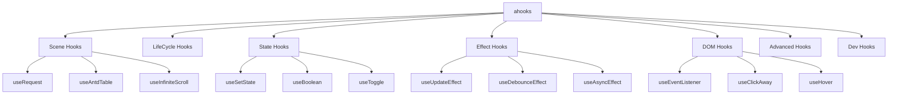
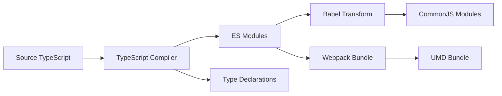

# React — Ahooks-source

# ahooks - React Hooks Library

## Overview

ahooks is a high-quality, reliable React Hooks library developed by Alibaba. It provides a comprehensive collection of hooks for common use cases, from basic state management to advanced data fetching and DOM interactions. The library is designed to be easy to learn, supports SSR, and includes special handling to avoid closure problems.

## Key Features

- **Easy to learn and use**: Intuitive API design with consistent patterns
- **SSR Support**: Full server-side rendering compatibility
- **Closure Problem Prevention**: Special treatment for input/output functions
- **Business-Refined Hooks**: Advanced hooks refined from real-world scenarios
- **Comprehensive Basic Hooks**: Complete collection of fundamental hooks
- **TypeScript Support**: Written in TypeScript with complete type definitions

## Installation

```bash
npm install --save ahooks
# or
yarn add ahooks
# or
pnpm add ahooks
# or
bun add ahooks
```

## Quick Start

```tsx
import { useRequest, useBoolean, useToggle } from 'ahooks';

function App() {
  const [state, { toggle }] = useToggle();
  const { data, loading, run } = useRequest(fetchData);
  
  return (
    <div>
      <button onClick={toggle}>Toggle</button>
      {loading ? 'Loading...' : data}
    </div>
  );
}
```

## Architecture

ahooks follows a modular architecture with hooks organized by functionality:



## Core Design Principles

### 1. Function Reference Stability

All output functions from ahooks hooks have stable references, similar to React's `setState`:

```tsx
const [state, { toggle }] = useToggle();
// toggle reference never changes
```

### 2. Latest Function Execution

All input functions are wrapped to ensure they always reference the latest version:

```tsx
const [state, setState] = useState();

useInterval(() => {
  console.log(state); // Always logs latest state
}, 1000);
```

This is achieved using `useRef` to store the latest function:

```tsx
const fnRef = useRef(fn);
fnRef.current = fn;
```

### 3. SSR Compatibility

Hooks are designed to work in server-side rendering environments:

```tsx
// Safe for SSR - defers DOM access
useEffect(() => {
  setState(document.visibilityState);
}, []);

// SSR-safe layout effect
const useIsomorphicLayoutEffect = isBrowser() ? useLayoutEffect : useEffect;
```

### 4. Dynamic Target Support

DOM hooks support dynamic target elements:

```tsx
const [boolean, { toggle }] = useBoolean();
const ref1 = useRef(null);
const ref2 = useRef(null);

const isHovering = useHover(boolean ? ref1 : ref2);
```

## Hook Categories

### Scene Hooks
Specialized hooks for common business scenarios:
- **useRequest**: Powerful data fetching with caching, retry, polling
- **useAntdTable**: Integration with Ant Design Table/Form
- **useInfiniteScroll**: Infinite scrolling implementation
- **usePagination**: Pagination management

### State Hooks
State management utilities:
- **useSetState**: Merge state updates (like class component's setState)
- **useBoolean/useToggle**: Boolean state management
- **useLocalStorageState/useSessionStorageState**: Persistent state
- **useCookieState**: Cookie-based state

### Effect Hooks
Enhanced effect hooks:
- **useUpdateEffect**: Effect that skips initial render
- **useDebounceEffect/useThrottleEffect**: Debounced/throttled effects
- **useAsyncEffect**: Async effect support
- **useDeepCompareEffect**: Deep comparison for dependencies

### DOM Hooks
DOM interaction hooks:
- **useEventListener**: Event listener management
- **useClickAway**: Click outside detection
- **useHover/useFocus**: Hover/focus state tracking
- **useSize/useScroll**: Element size/scroll position tracking

### Advanced Hooks
Advanced utilities:
- **useMemoizedFn**: Memoized function with stable reference
- **useLatest**: Always reference latest value
- **useControllableValue**: Controlled/uncontrolled component pattern
- **useEventEmitter**: Event emitter pattern

## Build System

ahooks uses a sophisticated build pipeline:



### Build Commands

```bash
# Initialize project
pnpm run init

# Development
pnpm start

# Run tests
pnpm run test

# Build library
pnpm run build

# Build documentation
pnpm run build:doc
```

### Package Structure

```
packages/hooks/
├── src/                    # Source code
│   ├── index.ts           # Main entry point
│   ├── useRequest/        # useRequest implementation
│   ├── useBoolean/        # useBoolean implementation
│   └── utils/             # Shared utilities
├── lib/                   # CommonJS output
├── es/                    # ES modules output
├── dist/                  # UMD bundle
└── package.json           # Package configuration
```

## Testing

ahooks uses Vitest for testing with comprehensive coverage:

```bash
# Run all tests
pnpm run test

# Run tests with coverage
pnpm run test:cov

# Run tests in strict mode
pnpm run test:strict
```

## Documentation

Documentation is built with Dumi and includes:
- **Guides**: Introduction, upgrade guides, best practices
- **Hook API**: Detailed API documentation for each hook
- **Examples**: Interactive code examples
- **Blog**: Technical articles about React Hooks patterns

## Contributing

We welcome contributions! Please follow these steps:

1. Fork the repository
2. Create a feature branch from `master`
3. Add tests for new features
4. Ensure all tests pass: `pnpm run test`
5. Submit a pull request

### Development Workflow

```bash
# Clone repository
git clone git@github.com:alibaba/hooks.git
cd hooks

# Install dependencies
pnpm run init

# Start development server
pnpm start

# Run tests
pnpm run test

# Build library
pnpm run build
```

## Common Patterns

### Custom Hook Creation

```tsx
import { useMemoizedFn, useLatest } from 'ahooks';

function useCustomHook(callback) {
  const callbackRef = useLatest(callback);
  
  const stableCallback = useMemoizedFn((...args) => {
    return callbackRef.current(...args);
  });
  
  return stableCallback;
}
```

### SSR-Safe Hook

```tsx
import { useIsomorphicLayoutEffect } from 'ahooks';

function useSSRSafeEffect(effect, deps) {
  useIsomorphicLayoutEffect(() => {
    if (typeof window !== 'undefined') {
      return effect();
    }
  }, deps);
}
```

### Data Fetching Pattern

```tsx
import { useRequest } from 'ahooks';

function UserProfile({ userId }) {
  const { data, loading, error, run } = useRequest(
    () => fetchUser(userId),
    {
      refreshDeps: [userId],
      cacheKey: `user-${userId}`,
    }
  );

  if (loading) return <div>Loading...</div>;
  if (error) return <div>Error: {error.message}</div>;
  
  return <div>{data.name}</div>;
}
```

## Troubleshooting

### Strict Mode Issues

ahooks is compatible with React's Strict Mode. In development, some hooks may execute twice - this is expected behavior for detecting side effects.

### HMR (Hot Module Replacement)

ahooks handles React Refresh correctly. State is preserved during hot updates, and effects are properly cleaned up and re-executed.

### SSR Considerations

1. Avoid direct DOM/BOM access outside `useEffect`/`useLayoutEffect`
2. Use `isBrowser()` utility for environment detection
3. Prefer `useIsomorphicLayoutEffect` over `useLayoutEffect`

## Performance Considerations

- **Memoization**: Use `useMemoizedFn` for stable function references
- **Debouncing/Throttling**: Use `useDebounceFn`/`useThrottleFn` for expensive operations
- **Caching**: Leverage `useRequest`'s caching capabilities
- **Lazy Initialization**: Use function form for initial state when computation is expensive

## Migration from v2

For upgrading from ahooks v2 to v3, see the [upgrade guide](https://ahooks.js.org/guide/upgrade). Key changes include:

- New `useRequest` implementation
- SSR support
- Closure problem prevention
- Dynamic target support for DOM hooks
- Strict Mode and HMR compatibility

## Community

- **GitHub**: [alibaba/hooks](https://github.com/alibaba/hooks)
- **Documentation**: [ahooks.js.org](https://ahooks.js.org)
- **Discussions**: GitHub Issues and Discussions

## License

MIT Licensed. Copyright © 2019-present Alibaba Group.