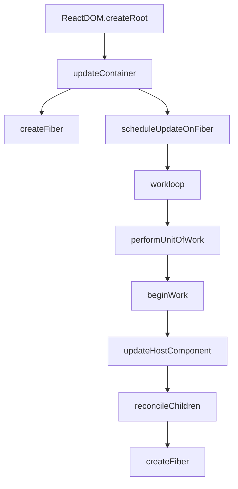

# React — mini-react-app

# mini-react-app

A minimal implementation of React's core architecture, demonstrating the virtual DOM, Fiber reconciler, and work loop scheduling. This module provides a simplified version of React's rendering pipeline for educational purposes.

## Architecture Overview

The module implements a subset of React's rendering architecture with three main layers:

1. **ReactDOM** - Entry point for rendering
2. **Reconciler** - Creates and updates Fiber nodes
3. **Work Loop** - Schedules and processes work units



## Key Concepts

### Virtual DOM (vnode)
JSX expressions are compiled to `React.createElement` calls, which produce virtual DOM nodes (vnodes). These are lightweight JavaScript objects describing the UI structure.

### Fiber Node
Fiber nodes are runtime instances of vnodes that serve as work units for the reconciler. Each fiber node contains:
- `type` - Component type or DOM element type
- `tag` - Numeric identifier for component category
- `stateNode` - Reference to the actual DOM node
- `child`, `sibling`, `return` - Linked list pointers for tree traversal
- `flags` - Bitmask indicating required operations (Placement, Update, Deletion)
- `alternate` - Reference to the previous fiber node (for double buffering)

## Module Structure

```
package/
├── react-dom/          # Entry point for rendering
│   └── ReactDOM.js
├── reconciler/         # Fiber reconciler implementation
│   ├── ReactChildFiber.js
│   ├── ReactFiber.js
│   ├── ReactFiberBeginWork.js
│   ├── ReactFiberReconciler.js
│   ├── ReactFiberWorkLoop.js
│   └── ReactWorkTags.js
└── shared/             # Utility functions
    └── utils.js
```

## How It Works

### Rendering Flow

1. **Initialization**: `ReactDOM.createRoot(container)` creates a `ReactDOMRoot` instance
2. **Render**: `root.render(children)` triggers `updateContainer`
3. **Fiber Creation**: `createFiber` converts vnodes to fiber nodes
4. **Scheduling**: `scheduleUpdateOnFiber` initiates the work loop
5. **Processing**: The work loop processes fiber nodes using `requestIdleCallback`
6. **Commit**: After processing, changes are committed to the DOM

### Work Loop Execution

The work loop uses `requestIdleCallback` to process fiber nodes during idle browser time:

```javascript
function workloop(deadline) {
    while (wip && deadline.timeRemaining() > 0) {
        performUnitOfWork()
    }
    if (!wip) {
        commitRoot() // Commit changes to DOM
    }
}
```

Each `performUnitOfWork` call:
1. Processes the current fiber node via `beginWork`
2. Traverses the fiber tree depth-first
3. Moves to child nodes, then sibling nodes, then back up to parent nodes

## Key Components

### ReactDOM (`react-dom/ReactDOM.js`)

The public API for rendering:

```javascript
const root = ReactDOM.createRoot(document.getElementById('root'))
root.render(<App />)
```

**`createRoot(container)`**: Creates a `ReactDOMRoot` instance bound to a DOM container.

**`ReactDOMRoot.render(children)`**: Triggers the rendering pipeline by calling `updateContainer`.

**`updateContainer(element, container)`**: 
1. Creates a root fiber node from the container
2. Schedules an update via `scheduleUpdateOnFiber`

### Reconciler (`reconciler/`)

#### Fiber Creation (`ReactFiber.js`)

`createFiber(vnode, returnFiber)` converts vnodes to fiber nodes:

- Determines `tag` based on `vnode.type`:
  - String → `HostComponent` (DOM element)
  - Function → `FunctionComponent` or `ClassComponent`
  - Undefined → `HostText` (text node)
  - Other → `Fragment`

#### Child Reconciliation (`ReactChildFiber.js`)

`reconcileChildren(returnFiber, children)` handles child node reconciliation:

1. Normalizes children to an array
2. For initial render: creates fiber nodes for each child and links them as a linked list
3. For updates: implements a simplified diff algorithm (currently incomplete)

**`placeChild(newFiber, lastPlacedIndex, newIndex, shouldTrackSideEffects)`**: Updates the `lastPlacedIndex` for tracking node positions during updates.

#### Begin Work (`ReactFiberBeginWork.js`)

`beginWork(wip)` processes the current fiber node based on its `tag`:

- `HostComponent`: Calls `updateHostComponent`
- `HostText`: Calls `updateHostText`
- Other component types: Currently unimplemented

#### Reconciler Operations (`ReactFiberReconciler.js`)

**`updateHostComponent(wip)`**:
1. Creates a DOM element if `stateNode` is null
2. Updates DOM properties via `updateNode`
3. Reconciles children via `reconcileChildren`

**`updateHostText(wip)`**: Creates a text node for text content.

### Work Loop (`ReactFiberWorkLoop.js`)

Manages the scheduling and processing of fiber nodes:

**`scheduleUpdateOnFiber(fiber)`**: 
1. Sets the work-in-progress (`wip`) fiber
2. Schedules `workloop` via `requestIdleCallback`

**`performUnitOfWork()`**: Processes a single fiber node:
1. Calls `beginWork` on the current fiber
2. Traverses depth-first: child → sibling → parent
3. Calls `completeWork` (currently unimplemented)

### Work Tags (`ReactWorkTags.js`)

Numeric constants identifying fiber node types:
- `FunctionComponent` (0)
- `ClassComponent` (1)
- `HostComponent` (5) - DOM elements
- `HostText` (6) - Text nodes
- `Fragment` (7)

### Utilities (`shared/utils.js`)

**Type checking**: `isStr`, `isFn`, `isUndefined`, `isArray`

**DOM updates**: `updateNode(node, preVal, nextVal)` handles:
- Event listeners (on* attributes)
- Regular properties
- Text content

**Flags**: Bitmask constants for fiber operations:
- `Placement` (2) - Node insertion
- `Update` (4) - Property updates
- `Deletion` (8) - Node removal

## Current Limitations

1. **Incomplete Diff Algorithm**: The child reconciliation only handles initial renders, not updates
2. **Missing Component Types**: Function and class components are not fully implemented
3. **No Commit Phase**: `commitRoot()` is empty - DOM changes aren't actually applied
4. **Scheduling**: Uses `requestIdleCallback` instead of React's `MessageChannel`/Scheduler
5. **No Hooks**: State and effect hooks are not implemented
6. **No Error Boundaries**: Error handling is not implemented

## Usage Example

```jsx
// test/src/main.jsx
import ReactDOM from '@/react-dom/ReactDOM'

const root = ReactDOM.createRoot(document.getElementById('root'))
root.render(
    <div>
        test1
        <div>
            text2
            <div>test3</div>
            test4
        </div>
    </div>
)
```

This creates a fiber tree with nested div elements, demonstrating the depth-first traversal of the work loop.

## Development

The test application uses Vite with path aliases to import from the package directory:

```javascript
// vite.config.js
alias: {
    '@': path.resolve(__dirname, '../package')
}
```

Run with `npm run dev` to see the console output from the reconciler processing the fiber tree.