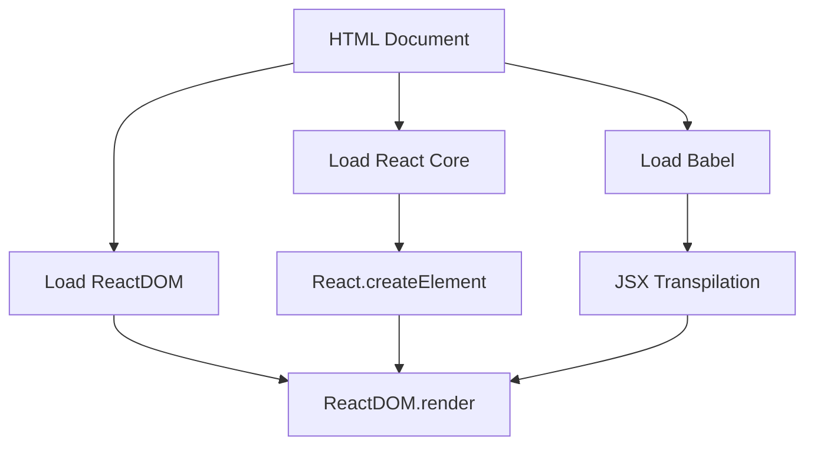

# React — pre

# React — pre Module

## Overview

This module demonstrates React fundamentals without a build tool or scaffolding. It's a standalone HTML file that loads React and ReactDOM from CDN, showing both the low-level `React.createElement` API and JSX syntax (transpiled in-browser via Babel). This serves as a minimal reference for understanding React's core rendering mechanics.

## How It Works

The module operates in three distinct phases:

1. **Core Library Loading** - React and ReactDOM are loaded as UMD bundles from unpkg CDN
2. **Direct API Usage** - Elements are created using `React.createElement()` and rendered with `ReactDOM.render()`
3. **JSX Transpilation** - Babel is loaded to compile JSX syntax in the browser



## Key Components

### 1. React Core Libraries
```html
<script crossorigin src="https://unpkg.com/react@16/umd/react.development.js"></script>
<script crossorigin src="https://unpkg.com/react-dom@16/umd/react-dom.development.js"></script>
```
- **React** - Core library for creating virtual DOM elements
- **ReactDOM** - Handles rendering to the actual DOM
- Both loaded as development builds with `crossorigin` attribute for detailed error reporting

### 2. Direct API Usage (`React.createElement`)

```javascript
var span = React.createElement("span", {}, "一个span元素");
var h1 = React.createElement("h1", {
    shuxing: "value"
}, "Hello", "World", span);
```

**Parameters:**
- First argument: Element type (string for HTML elements)
- Second argument: Props object (attributes)
- Remaining arguments: Children (text, elements, or arrays)

### 3. JSX with Babel

```html
<script src="https://unpkg.com/babel-standalone@6/babel.min.js"></script>
<script type="text/babel">
    const ele = <h1 title="第一个React元素">Hello World <span>一个span元素</span></h1>
    ReactDOM.render(ele, document.getElementById("root2"));
</script>
```

- Babel transpiles JSX to `React.createElement` calls in the browser
- `type="text/babel"` prevents browser from executing the script directly
- JSX provides syntactic sugar over the verbose `createElement` API

### 4. Rendering Targets

```html
<div id="root"></div>
<div id="app"></div>
<div id="root2"></div>
```

Three separate mount points demonstrate:
- `#app` - Simple text rendering
- `#root` - Complex element tree via `createElement`
- `#root2` - JSX-rendered elements

## Example Code Breakdown

### Simple Text Rendering
```javascript
ReactDOM.render("nihao", document.getElementById("app"))
```
Renders plain text directly into the DOM.

### Element Tree Construction
```javascript
var span = React.createElement("span", {}, "一个span元素");
var h1 = React.createElement("h1", {
    shuxing: "value"
}, "Hello", "World", span);
```
Creates a nested structure: `<h1 shuxing="value">Hello World<span>一个span元素</span></h1>`

### JSX Equivalent
```jsx
<h1 title="第一个React元素">Hello World <span>一个span元素</span></h1>
```
Compiles to the same `React.createElement` call structure.

## Notes

1. **No Build Step** - This approach loads all dependencies at runtime, suitable for learning but not production
2. **Development Builds** - Uses unminified React with full warnings and error messages
3. **Cross-origin** - The `crossorigin` attribute enables detailed error reporting from CDN resources
4. **Babel Version** - Uses Babel 6 standalone (older version) for browser transpilation
5. **React Version** - Targets React 16 (older but demonstrates core concepts still relevant in newer versions)

## Connection to Broader Codebase

This module is self-contained and doesn't interact with other modules. It serves as:
- A reference implementation for React's core rendering API
- A baseline for understanding how JSX transforms to JavaScript
- A template for quick React prototyping without tooling setup

The patterns shown here (`createElement`, `ReactDOM.render`, JSX) form the foundation that build tools like Create React App, Next.js, and Vite abstract away in production applications.