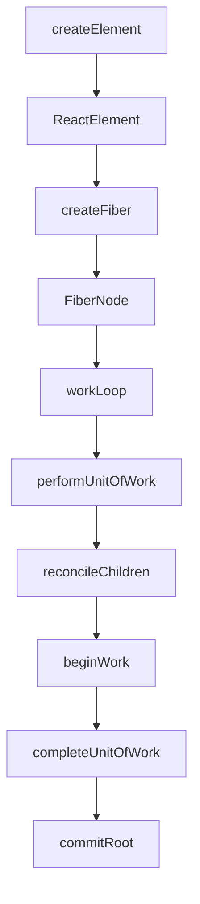

# React — source-analyse

# React — source-analyse Module

This module provides a simplified, educational implementation of React's core architecture, focusing on the Fiber reconciler, element creation, and scheduling concepts. It demonstrates how React's virtual DOM, component reconciliation, and time-slicing work internally.

## Core Architecture

The module implements a simplified version of React's Fiber architecture, where the UI is represented as a tree of `FiberNode` objects. These nodes are processed by a reconciler that can operate in both synchronous and concurrent modes.

### Key Components

#### 1. FiberNode (`ARCH/FiberObj.js`)

The fundamental unit of work in React's reconciliation process. Each `FiberNode` represents a component instance, DOM element, or text node.

```javascript
// Create a fiber node instance
const fiber = createFiber(tag, pendingProps, key, mode);
```

**Key properties:**
- **Instance properties**: `tag`, `key`, `type`, `stateNode` (maps to real DOM)
- **Tree structure**: `return` (parent), `child`, `sibling` (linked list for time-slicing)
- **State & hooks**: `pendingProps`, `memoizedState`, `updateQueue`
- **Effects**: `flags`, `subtreeFlags`, `deletions` (for tracking side effects)
- **Scheduling**: `lanes`, `childLanes` (priority levels)
- **Double buffering**: `alternate` (points to the work-in-progress or current fiber)

#### 2. Reconciler (`ARCH/Reconciler.js`)

The reconciler processes fiber nodes and builds the fiber tree. It supports two execution modes:

**Synchronous mode** (`workLoopSync`):
```javascript
// Processes all work without interruption
while (workInProgress !== null) {
    workInProgress = performUnitOfWork(workInProgress);
}
```

**Concurrent mode** (`workLoopConcurrent`):
```javascript
// Yields to browser when time slice expires
while (workInProgress !== null && !shouldYield()) {
    workInProgress = performUnitOfWork(workInProgress);
}
```

**Core reconciliation flow:**
1. `performUnitOfWork` processes a single fiber node
2. `reconcileChildren` creates child fibers from JSX children
3. Tree traversal follows depth-first pattern: child → sibling → parent

#### 3. createElement (`createElement.js`)

Converts JSX-like syntax into React elements (virtual DOM objects):

```javascript
// <h1 id="aa">hello</h1>
const element = createElement('h1', { id: 'aa' }, 'hello');
```

**Process:**
1. Extracts `key`, `ref`, and other special props
2. Processes children (single or array)
3. Applies default props
4. Returns a `ReactElement` object with `$typeof: REACT_ELEMENT_TYPE`

#### 4. Double Buffering (`ARCH/double-buddering.js`)

Implements React's double buffering strategy where two fiber trees exist:
- **Current tree**: Represents the UI currently displayed
- **Work-in-progress tree**: Being built in memory

```javascript
// Link the two trees
current.alternate = workInProgress;
workInProgress.alternate = current;
```

## Execution Flow

The reconciliation process follows this pattern:



1. **Element creation**: `createElement` creates virtual DOM elements
2. **Fiber creation**: Elements are converted to `FiberNode` objects
3. **Work loop**: Processes fibers in either sync or concurrent mode
4. **Reconciliation**: `performUnitOfWork` processes each fiber, creating child fibers
5. **Commit phase**: (Not shown in this module) Applies changes to the DOM

## Scheduling Concepts

The module includes test files demonstrating scheduling strategies:

### MessageChannel (`Test/MessageChannel.html`)
Demonstrates the `MessageChannel` API used by React's scheduler for non-blocking task execution.

### Scheduler (`Test/Scheduler.html`)
Shows how React uses `requestIdleCallback` to schedule work during idle periods:
- Processes tasks during frame idle time
- Yields back to the browser when time runs out
- Continues in the next idle period

### setTimeout (`Test/setTimeout.html`)
Illustrates the 4ms minimum delay issue with nested `setTimeout` calls, which React avoids by using `MessageChannel`.

## Connection to React's Architecture

This module demonstrates several key React concepts:

1. **Fiber Architecture**: The linked list structure enables pausing and resuming work
2. **Concurrent Mode**: Time-slicing via `shouldYield()` prevents blocking the main thread
3. **Reconciliation**: The diffing algorithm (simplified here) determines minimal DOM updates
4. **Double Buffering**: Enables smooth transitions between UI states
5. **Priority Scheduling**: `lanes` system (referenced but not fully implemented) manages task priorities

## Usage Notes

This is an educational implementation. For production React:
- The actual reconciler is in `react-reconciler` package
- Scheduling uses a custom `Scheduler` package
- The full implementation includes error boundaries, suspense, and hooks

The module serves as a foundation for understanding React's internal architecture and how component updates flow from creation to DOM updates.