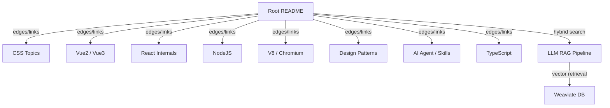

# Root

# Root Module

The Root module is the top-level entry point and index of the Wiki knowledge base. It serves a dual purpose: a human-navigable pointer index (searchable via `Ctrl+F`) and a machine-readable knowledge graph root node used by the RAG (Retrieval Augmented Generation) pipeline for intelligent retrieval.

## Purpose

The Root module acts as the **single source of truth** for the entire Wiki. Every piece of knowledge — whether it lives in a source file, a commit, a discussion, or an external resource — is reachable from this index. It bridges three knowledge management paradigms:

- **Obsidian-style** bidirectional linking
- **Notion-style** structured pages
- **Wiki-style** pointer tables

The README at the root is not merely documentation — it is a **structured knowledge graph** where each link is an edge pointing to a target node containing domain-specific knowledge.

## Architecture



## How It Works

### Human Access: Pointer Search

The README is a flat list of entries. Each entry follows this pattern:

```
- [path/to/file](GitHub URL)
    - Brief description or key insight
    - Related issue links
```

Developers use `Ctrl+F` (hybrid key search) to locate relevant pointers by keyword. This is the primary human-facing interface — there is no sidebar, no nested navigation, just a searchable index.

### Machine Access: RAG Knowledge Graph

For the AI agent pipeline, the Root README serves as the **graph root**:

1. The README is parsed into chunks (with special handling for markdown lists, code blocks, and links).
2. Each chunk is embedded via an embedding model and stored in a **Weaviate vector database**.
3. At query time, the agent performs **hybrid search** — combining keyword matching with semantic vector similarity — against this indexed knowledge.
4. The links in the README act as **edges** in the knowledge graph, allowing the system to traverse from the root to specific knowledge nodes.

Key implementation details from the commit history:

- **Embedding model** defaults to the LLM's configuration, with the endpoint requiring `/embeddings` appended to the base URL (`cabfeea6`).
- **Chunking** uses special-character-based splitting with token-aware sizing (characters ÷ 3–4 for token estimation) to avoid excessive API calls (`02a3b949`).
- **Reranking** applies cross-encoding over initial bi-encoder results for higher precision retrieval (`c906e694`).
- **Query translation** uses the LLM to translate user queries into frontend-domain terminology before vector search (`e1fae5de`).

### Knowledge Organization

The README organizes knowledge into these major domains:

| Domain | Coverage |
|--------|----------|
| **CSS** | Box model, visual formatting, layout, positioning, animations |
| **HTML** | Form elements, CSS styling |
| **Vue 2** | Sandbox projects, directives, lifecycle, Vuex, router, mixins |
| **Vue 3** | Composition API, reactivity (`ref`/`reactive`/`computed`), Teleport, async components, Vite |
| **React** | Lifecycle, hooks source analysis, Fiber architecture, Scheduler, Reconciler, context, HOC |
| **NodeJS** | CMJ/ESM, fs streams, net/http/https modules, event loop |
| **V8 / Chromium** | Execution context, closures, GC, event loop internals |
| **TypeScript** | Common types, React+Vite integration, declaration files |
| **Design Patterns** | Factory, decorator, adapter, proxy, template, strategy, observer |
| **AI / Agent** | Skills architecture, sub-agents, memory optimization, RAG, vector DB |
| **Shell** | Scripting utilities, tree implementation, awk/sed patterns |

## Connection to the Rest of the Codebase

The Root module connects to the broader system through several integration points:

### FrontAgent Integration

The Wiki is consumed by [FrontAgent](https://github.com/ceilf6/FrontAgent), an AI agent system that:

- Uses the README as its primary knowledge source for RAG retrieval
- Manages sub-agents via `a2a` (agent-to-agent) protocol, where the main agent holds the "fact source" and dispatches snapshots to sub-agents (`5ccfb746`)
- Implements a **planner → skill → executor** pipeline where skills are registered and selected dynamically (`16b11dae`, `4705f912`)

### Skills System

Reusable capabilities are extracted as standalone skill packages:

- `agent-memory-optimizer` — optimizes agent memory across sessions
- `skill-lifecycle` — binary analysis for skill optimization
- `frontend-design` — aesthetic improvement for agent output
- `requirement-interviewer` — transforms user input into structured prompts
- `frontend-reviewer` — code and UI auditing
- `agent-cli-architect` — CLI architecture design
- `tui-render-optimizer` — terminal UI rendering optimization
- `agent-state-architect` — layered state architecture for streaming interfaces

### Git Submodule Management

The Wiki uses git submodules extensively. Submodules can be temporarily collapsed via `git.ignoredRepositories` to reduce workspace clutter (`a7d3918d`). A githook configuration enables automatic follow-on commits for submodule changes (`52144dd5`).

## Adding New Knowledge

To add a new entry to the Root module:

1. Append a new list item to `README.md` following the existing format:
   ```markdown
   - [relative/path/to/file](https://github.com/ceilf6/Wiki/blob/main/relative/path/to/file)
       - Brief description of the key insight or technique
   ```

2. For commit-based references:
   ```markdown
   - [Descriptive title](https://github.com/ceilf6/Wiki/commit/<sha>)
   ```

3. For discussions:
   ```markdown
   - [#N](https://github.com/ceilf6/Wiki/discussions/N)
       - Topic summary
   ```

The auto-update GitHub Action (`e8a2c1d`) keeps the README in sync. After adding entries, the RAG pipeline will pick up new knowledge on the next indexing cycle.

## Key Design Decisions

- **Flat structure over hierarchy**: The README is intentionally flat. This maximizes `Ctrl+F` searchability and avoids the maintenance burden of nested navigation. The knowledge graph structure emerges from link relationships, not directory nesting.
- **Commit-as-documentation**: Many entries link directly to commits rather than standalone documents. This preserves full context — the diff, the message, and the surrounding code — as the canonical source of knowledge.
- **Bilingual content**: Entries mix Chinese and English, reflecting the developer's working language. The embedding model handles multilingual semantic search.
- **No separation of concerns in the index**: Frontend, backend, infrastructure, and AI knowledge coexist in a single file. The vector search handles disambiguation at query time rather than at index time.