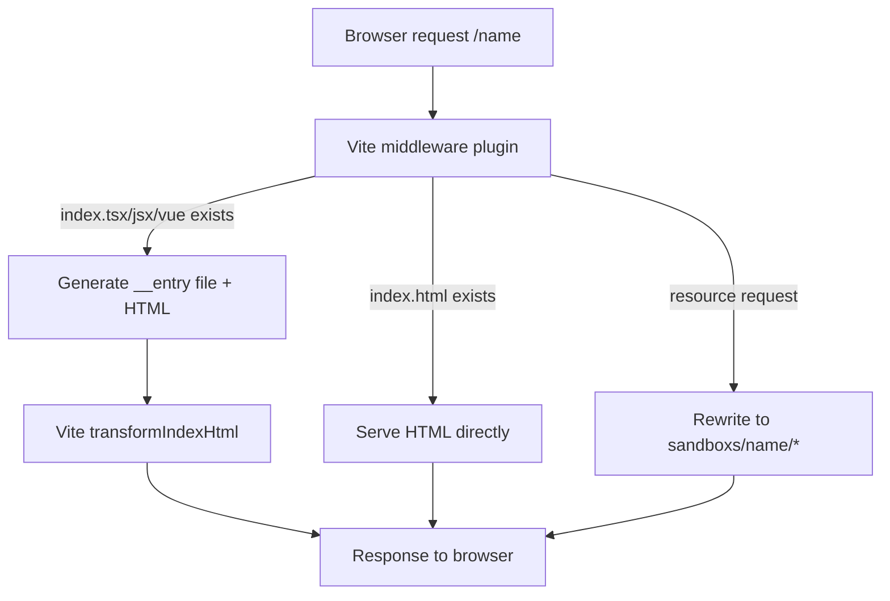

# sandboxs-runner — sandboxs-runner

# sandboxs-runner

A Vite-powered development environment for creating and previewing isolated UI experiments. Each "sandbox" is a self-contained folder under `sandboxs/` that can use plain HTML, React (JSX/TSX), or Vue, and is automatically served at a clean URL like `http://localhost:8030/my-widget`.

## Quick Start

```bash
pnpm install
pnpm dev          # starts Vite dev server on port 8030
```

Open `http://localhost:8030` to see the playground landing page with links to all available sandboxes.

## Creating a Sandbox

1. Create a folder under `sandboxs/`, e.g. `sandboxs/my-widget/`
2. Add one of the supported entry files:

| Entry file | Framework | What happens |
|---|---|---|
| `index.html` | Any (plain HTML) | Served directly |
| `index.tsx` | React | Auto-generated entry mounts via `createRoot` |
| `index.jsx` | React | Auto-generated entry mounts via `createRoot` |
| `index.vue` | Vue | Auto-generated entry mounts via `createApp` |

3. Visit `http://localhost:8030/my-widget`

The server handles the rest — no manual entry point or HTML boilerplate required for React/Vue sandboxes.

## Architecture

The module consists of three layers that work together:



### Landing Page (`index.html`)

The root page serves as a directory of all available sandboxes. In development mode, it uses Vite's `import.meta.glob` to dynamically scan `sandboxs/*/index.html` and populate the link list at runtime:

```js
const modules = import.meta.glob('./sandboxs/*/index.html');
```

In production builds, the list is static (currently hardcoded to the `demo` entry).

### Vite Configuration (`vite.config.js`)

This is the core of the module. It configures Vite as a **multi-page application** (`appType: 'mpa'`) with two key responsibilities:

#### 1. Build Entry Scanning — `getExampleEntries()`

Called at config time to produce Rollup's `input` map. It globs `sandboxs/*/index.html` and creates an entry for each folder plus the root `main` entry:

```js
{
  main: '/absolute/path/to/index.html',
  demo: '/absolute/path/to/sandboxs/demo/index.html',
  // ...
}
```

This ensures every sandbox is included in production builds.

#### 2. Dev Server Middleware — `sandboxs-auto-entry` Plugin

A custom Vite plugin that intercepts HTTP requests and provides the dynamic sandbox resolution logic. It handles three URL patterns:

**URL normalization** — Requests to `/<name>` (without trailing slash) are 302-redirected to `/<name>/` so that relative asset paths inside sandbox files resolve correctly.

**Resource requests** — Requests like `/<name>/style.css` or `/<name>/__entry.tsx` are rewritten to `/sandboxs/<name>/style.css` so Vite's file serving picks them up from the correct directory.

**Entry page requests** — When `/<name>/` is requested, the plugin checks for entry files in priority order:

1. **`index.tsx`** → writes `__entry.tsx` with React 18 `createRoot` bootstrap, generates HTML with `<script type="module" src="./__entry.tsx">`
2. **`index.jsx`** → same as TSX but with `.jsx` extension
3. **`index.vue`** → writes `__entry.ts` with Vue 3 `createApp` bootstrap, generates HTML with `<script type="module" src="./__entry.ts">`
4. **`index.html`** → rewrites the request to serve the file directly

The generated HTML is passed through `server.transformIndexHtml()` so Vite's HMR client is injected automatically.

**Generated entry file examples:**

For React sandboxes (`__entry.tsx`):
```tsx
import React from 'react';
import { createRoot } from 'react-dom/client';
import App from './index.tsx';

const root = createRoot(document.getElementById('root'));
root.render(<App />);
```

For Vue sandboxes (`__entry.ts`):
```ts
import { createApp } from 'vue';
import App from './index.vue';

createApp(App).mount('#root');
```

> **Note:** The `__entry.*` files are written to disk at runtime. They are not committed to version control and should be added to `.gitignore`.

### TypeScript Configuration

- `tsconfig.json` — Targets ES2020, enables JSX with `react-jsx` transform, includes all files under `sandboxs/**/*`
- `tsconfig.node.json` — Separate config for `vite.config.js` itself, using `composite` for project references

## Available Dependencies

Sandboxes can import any of these without additional installation:

| Package | Use case |
|---|---|
| `react`, `react-dom` | React 19 components |
| `vue` | Vue 3 components |
| `antd-mobile` | Mobile UI component library |
| `framer-motion` | React animation library |
| `gsap` | General-purpose animation |
| `axios` | HTTP client |

## Build & Preview

```bash
pnpm build      # outputs to dist/ with all sandboxes as separate pages
pnpm preview    # serves the production build locally
```

The build output is a multi-page site. Each sandbox gets its own HTML entry in `dist/`, preserving the folder structure.

## Key Design Decisions

- **Convention over configuration** — Drop a file in `sandboxs/<name>/` and it works. No registration step.
- **Framework-agnostic** — The same runner supports plain HTML, React, and Vue sandboxes side by side.
- **Clean URLs** — Middleware rewrites and redirects ensure `/<name>` works without exposing internal paths like `/sandboxs/<name>/index.html`.
- **MPA mode** — Each sandbox is a fully independent page with its own HTML document, avoiding shared state between experiments.