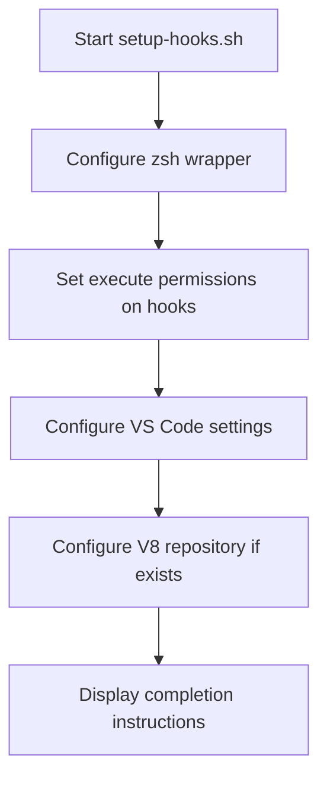

# scripts

# Scripts Module

The `scripts` module provides automation for Git workflow configuration and README maintenance. It contains two independent scripts that handle different aspects of the repository's development workflow.

## Module Overview

This module serves two primary purposes:
1. **Git Workflow Setup** (`setup-hooks.sh`): Configures local Git hooks and VS Code integration to automatically synchronize the Wiki parent repository when pushing from submodules
2. **README Automation** (`update-readme.mjs`): Automatically updates the README.md file with commit messages that follow a specific pattern

## setup-hooks.sh

### Purpose
This shell script initializes local Git configuration to ensure that when developers push changes from any Wiki submodule, the parent Wiki repository is automatically synchronized. It also configures VS Code to use the repository's custom Git wrapper.

### Key Components

#### Git Wrapper Configuration
The script creates a Git wrapper function in the user's `~/.zshrc` that intercepts all Git commands and routes them through the repository's custom wrapper script (`.githooks/git-wrapper.sh`). This ensures consistent behavior between terminal and VS Code operations.

```bash
git() {
  "$WRAPPER_SCRIPT" "$@"
}
```

#### VS Code Integration
The script automatically configures VS Code's `git.path` setting to point to the repository's Git wrapper. It supports multiple VS Code variants:
- VS Code (stable)
- VS Code Insiders
- VSCodium

The configuration is applied to platform-specific settings files:
- **macOS**: `~/Library/Application Support/Code/User/settings.json`
- **Linux**: `~/.config/Code/User/settings.json`

#### Special Repository Configuration
For the large V8 engine source repository (`JS/V8engine-source`), the script disables tag fetching to improve performance during pull operations:

```bash
git config remote.origin.tagOpt --no-tags
```

### Execution Flow



### Usage
Run once after cloning the repository:
```bash
sh scripts/setup-hooks.sh
```

After execution:
1. Restart your terminal or run `source ~/.zshrc`
2. Reload VS Code window (`Cmd+Shift+P` → Reload Window)
3. All subsequent `git push` operations from submodules will automatically sync the parent Wiki repository

## update-readme.mjs

### Purpose
This Node.js script automatically updates the repository's README.md file by extracting commit messages that follow a specific pattern and appending them as formatted links.

### Key Components

#### Commit Message Pattern Recognition
The script identifies commits with messages matching the pattern: `<type>[ptr]: <description>`

Supported commit types include:
- `feat[ptr]`: New features
- `fix[ptr]`: Bug fixes
- `chore[ptr]`: Maintenance tasks

Example commit message: `feat[ptr]: Add new documentation section`

#### Environment Variables
The script requires three environment variables:
- `COMMIT_SHA`: Current commit SHA
- `BEFORE_SHA`: Previous commit SHA (for range detection)
- `REPO_URL`: Repository URL for generating commit links

#### README Update Logic
When matching commits are found, the script:
1. Reads the current README.md
2. Generates formatted markdown links for each commit
3. Appends the new entries to the end of the file
4. Writes the updated content back to README.md

Generated format: `- [commit description](repo_url/commit/sha)`

### Execution Flow

```mermaid
graph TD
    A[Start update-readme.mjs] --> B[Read environment variables]
    B --> C[Get commit range]
    C --> D[Extract commits with [ptr] pattern]
    D --> E{Found matching commits?}
    E -->|Yes| F[Read README.md]
    F --> G[Generate markdown links]
    G --> H[Append to README.md]
    H --> I[Log success]
    E -->|No| J[Log no updates needed]
```

### Usage
This script is designed to run in CI/CD pipelines after successful pushes. It requires the environment variables to be set by the CI system.

## Integration with Codebase

### Git Hooks Integration
The `setup-hooks.sh` script configures the Git wrapper that works with the repository's post-push hook (`.githooks/submodule/post-push`). This hook is responsible for triggering the parent repository synchronization.

### README Maintenance
The `update-readme.mjs` script maintains a living document of significant changes by extracting structured commit messages. This creates an automated changelog within the README.

### Cross-Platform Support
Both scripts handle platform differences:
- `setup-hooks.sh`: Detects macOS vs Linux for VS Code configuration paths
- `update-readme.mjs`: Uses ES modules with proper `__dirname` handling for Node.js compatibility

## Development Notes

### Modifying the Scripts
When modifying these scripts:

1. **setup-hooks.sh**: 
   - Test on both macOS and Linux
   - Ensure backward compatibility with existing `~/.zshrc` configurations
   - Verify VS Code settings file paths for different distributions

2. **update-readme.mjs**:
   - Maintain the commit message pattern recognition
   - Ensure proper handling of environment variables
   - Test with various commit message formats

### Error Handling
Both scripts include error handling:
- `setup-hooks.sh`: Uses `set -e` for immediate exit on errors
- `update-readme.mjs`: Validates required environment variables and handles Git command failures

### Security Considerations
- The Git wrapper function in `~/.zshrc` executes scripts from the repository
- VS Code configuration modifies user settings files
- Both operations require appropriate user permissions