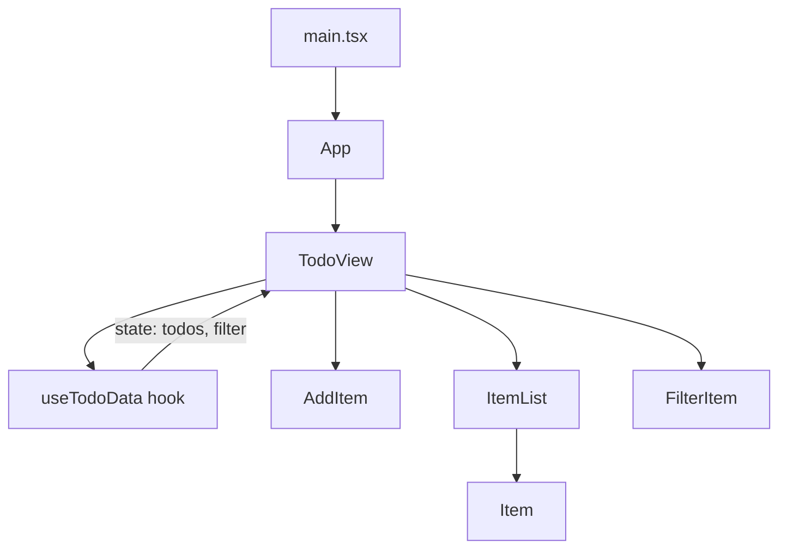

# TS

# TS Module

A TypeScript workspace containing two distinct projects: a **React todo application** built with Vite, and a **TypeScript sandbox** for exploring language features.

---

## Project Structure

```
TS/
├── ex-ts-vite-react/          # React + TypeScript + Vite todo app
│   ├── src/
│   │   ├── components/        # Reusable UI components
│   │   ├── hooks/             # Custom React hooks
│   │   ├── types/             # Shared TypeScript type definitions
│   │   ├── views/             # Page-level view components
│   │   ├── App.tsx            # Root component
│   │   └── main.tsx           # Application entry point
│   ├── eslint.config.js
│   ├── tsconfig.json          # Project references (app + node)
│   ├── tsconfig.app.json      # App source config
│   ├── tsconfig.node.json     # Vite config compilation
│   └── vite.config.ts
│
└── sandboxs/                  # TypeScript experimentation
    └── src/
        ├── types.ts           # Language feature examples
        ├── types.js           # Compiled output of types.ts
        ├── testClg.ts         # Minimal console test
        └── index.ts           # Entry point (imports + library demos)
```

---

## ex-ts-vite-react — Todo Application

A single-page todo list demonstrating React component composition, custom hooks, and TypeScript type safety with Vite as the build tool.

### Architecture



### Data Flow

The application follows a **top-down data flow** pattern. All state lives in the `useTodoData` hook, which is consumed by `TodoView`. The view passes data and callbacks down to child components as props.

**Adding a todo:**
1. User types into `AddItem`'s controlled `<input>` and submits the form
2. `AddItem` calls `onAdd(text)` (which is `addTodo` from the hook)
3. `addTodo` increments `lastTodoID` and appends a new `todoItem` to state
4. `TodoView` re-renders, passing updated `filterTodos()` to `ItemList`

**Filtering:**
1. `FilterItem` renders a button for each entry in the `filters` const array
2. Clicking a button calls `setFilter` with the selected `Filter` value
3. `filterTodos()` in the hook applies the filter and returns the matching subset

### Type Definitions

**`src/types/todos.ts`** — The shared type contract for the entire app:

```typescript
export interface todoItem {
    id: number,
    text: string,
    done: boolean
}

export const filters = ['全部', '已完成', '未完成'] as const
export type Filter = typeof filters[number]  // "全部" | "已完成" | "未完成"
```

The `as const` assertion on `filters` is critical — it prevents TypeScript from widening the array to `string[]`, enabling the `Filter` union type to be derived from the literal values. This means the filter buttons and the `switch` statement in `filterTodos` are fully type-checked at compile time.

### Components

#### `AddItem`

A form component for creating new todos. Uses a **controlled input** pattern where React state (`text`) is the single source of truth for the input value.

```typescript
interface AddItemProps {
    onAdd: (text: string) => void,
    children?: string  // Button label text
}
```

The form submission is handled via `onSubmit` with `e.preventDefault()` to prevent page reload. The input resets to empty after submission.

#### `ItemList`

Renders a list of `Item` components. Accepts `todos`, `onDel`, and `onToggle` callbacks, plus optional `children` rendered above the list (used for the `<h2>` heading).

```typescript
interface ItemListProps {
    todos: todoItem[],
    children?: React.ReactNode,
    onDel: (id: number) => void,
    onToggle(id: number): void
}
```

Note the mixed function type syntax — `onDel` uses an arrow function type while `onToggle` uses a method signature. Both are valid TypeScript for describing callable props.

#### `Item`

A presentational component rendering a single todo. Demonstrates several React TypeScript patterns:

```typescript
interface ItemProps {
    todo: todoItem,
    children?: React.ReactNode,      // Slot for action buttons
    style?: React.CSSProperties      // Inline style typing
}
```

The `children` prop receives the toggle and delete buttons from `ItemList`, keeping `Item` itself focused on display. The `style` prop applies strikethrough when `todo.done` is true.

#### `FilterItem`

Renders filter buttons from the `filters` const array. The currently active filter gets the `active` CSS class (red, bold text via `FilterItem.css`).

```typescript
interface FilterItemProps {
    filter: Filter,
    setFilter(newFilter: Filter): void
}
```

### Custom Hook — `useTodoData`

Encapsulates all todo-related state and operations. Returns an object with state values and action functions:

| Export | Type | Purpose |
|--------|------|---------|
| `todos` | `todoItem[]` | Current todo list |
| `addTodo` | `(text: string) => void` | Creates a new todo with auto-incrementing ID |
| `deleteTodo` | `(id: number) => void` | Removes a todo by ID |
| `toggleTodo` | `(id: number) => void` | Flips the `done` flag |
| `filterTodos` | `() => todoItem[]` | Returns filtered todos based on current filter |
| `filter` | `Filter` | Current active filter |
| `setFilter` | `Dispatch<SetStateAction<Filter>>` | Updates the active filter |

**ID generation:** Uses a separate `lastTodoID` state counter rather than `todos.length`. This avoids ID collisions after deletions — a common pitfall when using array length as an ID source.

### Build & Development

The project uses two TypeScript configs referenced from `tsconfig.json`:

- **`tsconfig.app.json`** — Compiles `src/` with `strict: true`, `jsx: "react-jsx"`, `verbatimModuleSyntax: true`, targeting ES2022. The `verbatimModuleSyntax` flag enforces explicit `type` keyword on type-only imports (e.g., `import type { Filter }`).
- **`tsconfig.node.json`** — Compiles `vite.config.ts` targeting ES2023 with Node types.

**Scripts:**
- `npm run dev` — Starts Vite dev server with HMR
- `npm run build` — Runs `tsc -b` (project references build) then `vite build`
- `npm run lint` — ESLint with TypeScript and React hooks rules

**ESLint configuration** (`eslint.config.js`) uses the flat config format with:
- `typescript-eslint` recommended rules
- `eslint-plugin-react-hooks` for hooks linting
- `eslint-plugin-react-refresh` for Vite Fast Refresh compatibility

---

## sandboxs — TypeScript Language Exploration

A standalone Node.js project for experimenting with TypeScript features. Contains no framework — just raw TypeScript compiled to JavaScript.

### `src/types.ts` — Feature Reference

This file is a comprehensive walkthrough of TypeScript's type system, organized by topic:

**1. Literal Types** — Variables constrained to exact string values:
```typescript
let type2: "ceilf6"
type2 = "ceilf6"    // OK
// type2 = "ceilf7" // Error
```

**2. Union Types** — Combining multiple types with `|`:
```typescript
let type3: string | number | false
let sex: "male" | "female"
```

**3. Array Types** — Two equivalent syntaxes:
```typescript
let arrType: number[]
let arrType2: Array<number>
```

**4. Tuples** — Fixed-length arrays with typed positions:
```typescript
let pos: [number, string]
pos = [1, "2"]  // OK
// pos = ["1", 2] // Error
```

**5. Functions** — Parameter types, return types, rest parameters:
```typescript
function sum(a: number, b: number, c: string, ...args: number[]): string
```

**6. Generics** — Type-parameterized functions and interfaces, including:
- Basic generic functions (`fanXing<T>`)
- Generic interfaces (`fanXing2<T>`)
- Conditional type mapping (`Transform<T>`)
- Function overloads (`transform2`)
- Generic tuples (`tuple<T1, T2>`)
- Type guards with generics (`filterNumCallback` with `item is callbackT`)

**7. Object Literal Types** — Inline object type annotations with optional properties:
```typescript
let Obj: { id: number, name: string, sex?: 'male' | 'female' }
```

**8. Custom Types** — `type` aliases vs `interface`:
- `type` — Can represent any valid type (unions, primitives, objects)
- `interface` — Object-oriented, supports method signatures and optional members

**9. Intersection Types** — Combining types with `&`:
```typescript
type a = a1 & a2  // Must satisfy both a1 and a2
type t = number & string  // Results in `never`
```

**10. Type Assertions** — `as` casts and non-null assertions (`!`):
```typescript
(val as string).split(' ')
maybeVal!.split(' ')
```

**11. Optional Chaining** — Safe property access:
```typescript
objIns.id?.toFixed(2)
```

### `src/types.js` — Compiled Output

The JavaScript output of `types.ts`, demonstrating what TypeScript erases at compile time. All type annotations are stripped, leaving plain JavaScript. This file serves as a reference for understanding the compilation boundary.

### `src/index.ts` — Library Type Integration

Demonstrates how TypeScript handles types from external libraries:

```typescript
import axios from 'axios'       // Has built-in .d.ts declarations
import lodash from 'lodash'     // Requires @types/lodash
import path from 'node:path'    // Requires @types/node
```

Libraries without bundled type declarations need `@types/*` packages installed as devDependencies.

### Build Configuration

The `tsconfig.json` is configured for Node.js output:

| Option | Value | Purpose |
|--------|-------|---------|
| `target` | `es2016` | Output JavaScript version |
| `module` | `nodenext` | Node.js ESM/CJS module resolution |
| `declaration` | `true` | Generate `.d.ts` files |
| `declarationDir` | `./types` | Output declarations to `types/` |
| `outDir` | `./dist` | Compiled JS output |
| `strict` | `true` | All strict checks enabled |
| `esModuleInterop` | `true` | CommonJS interop helpers |

**Scripts:**
- `npm start` — Runs with `nodemon` + `ts-node` for auto-restart on changes
- `npm run dev` — Runs with `ts-node-dev` for faster restarts
- `npm run build` — Compiles to `dist/` with declarations in `types/`

---

## Key Patterns & Conventions

### Type-Only Imports

Both projects use `verbatimModuleSyntax`, which requires explicit marking of type-only imports:

```typescript
import type { Filter, todoItem } from '../types/todos'  // Type-only
import { type Filter, filters } from '../types/todos'    // Mixed: type + value
```

Without the `type` keyword, the compiler will error because types are erased at runtime and cannot be imported as values.

### `as const` for Narrowing

Used in `filters` to produce a readonly tuple of literal strings rather than `string[]`. This enables deriving union types from runtime values:

```typescript
export const filters = ['全部', '已完成', '未完成'] as const
export type Filter = typeof filters[number]  // "全部" | "已完成" | "未完成"
```

### Controlled Components

`AddItem` demonstrates the controlled component pattern where the `<input>` value is bound to React state via `value={text}`, and updates flow through `onChange`. This ensures React is always the source of truth for form state.

### Component Composition via `children`

`ItemList` and `Item` accept `children` props typed as `React.ReactNode`, allowing parent components to inject content (headings, action buttons) without the child component needing to know about their specifics.