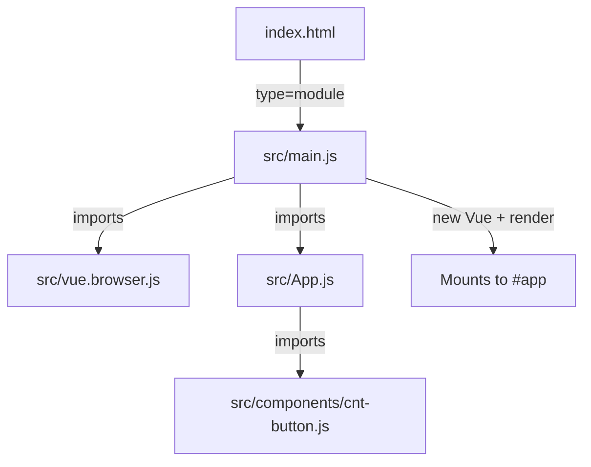
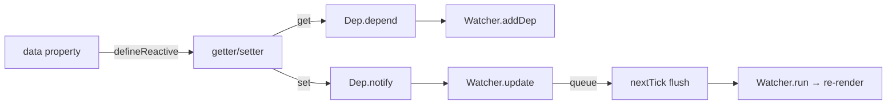

# Vue2 — pre

# Vue2 — pre

A collection of Vue 2 learning examples and reference implementations demonstrating core Vue 2 concepts: component architecture, computed properties, reactivity, and manual project engineering without a build toolchain.

## Module Structure

```
Vue2/pre/
├── CLI/demo/              # Vue CLI project with SFC components
├── computed.html          # Computed properties (browser-only)
├── computed.vue           # Computed properties (SFC version)
└── engineering/           # Manual Vue 2 setup using ES modules in the browser
```

## Sub-modules

### CLI/demo — Vue CLI Project

A standard Vue CLI scaffolded project demonstrating Single File Components (SFCs) with scoped styles, props validation, and asset handling.

**Key files:**

| File | Purpose |
|------|---------|
| `src/main.js` | Entry point — creates the root Vue instance and mounts `App` |
| `src/App.vue` | Root component importing and rendering `Avatar` |
| `src/components/Avatar.vue` | Reusable image component with typed props |
| `public/index.html` | HTML shell with `<div id="app">` mount target |

**Entry point (`src/main.js`):**

```js
import Vue from 'vue'
import App from './App.vue'

new Vue({
  render: h => h(App),
}).$mount('#app')
```

The `render` function uses `h` (alias for `$createElement`) to convert the `App` component into a virtual DOM node. This avoids bundling the template compiler at runtime — the comment in `App.vue` notes this explicitly:

> 到时候会直接把组件中的模板转换为render函数 => 运行高效的同时，打包文件中不需要带上vue的template compiler

**Avatar component (`src/components/Avatar.vue`):**

```js
props: {
  url: {
    type: String,
    required: true,
  },
  width: {
    type: Number,
    required: false,
    default: 60,
  },
  height: Number,
}
```

Demonstrates prop type validation, required flags, and default values. The parent (`App.vue`) passes numeric props via `v-bind`:

```html
<Avatar :width="66" :height="66" />
```

The `:width="66"` binding is necessary because without `v-bind`, the attribute value would be treated as a string `"66"` rather than the number `66`.

**Scoped styles:**

```html
<style lang="less" scoped>
.avatar-img {
  border-radius: 50%;
}
</style>
```

The `scoped` attribute applies a unique attribute selector (e.g., `[data-v-xxxx]`) to all CSS rules in the block, preventing class name collisions across components. This is analogous to CSS Modules.

**Build tooling:**

- `@vue/cli-service` ~4.5.8 — webpack-based build pipeline
- `@vue/cli-plugin-babel` — Babel transpilation with `@vue/cli-plugin-babel/preset`
- `@vue/cli-plugin-eslint` — linting via `eslint-plugin-vue`
- `less` / `less-loader` — Less CSS preprocessing
- `vue-template-compiler` — compiles `.vue` templates at build time

---

### computed.html / computed.vue — Computed Properties

Two equivalent demonstrations of Vue's computed property system — one as a standalone HTML file, one as an SFC.

**Core concepts demonstrated:**

1. **Caching vs. recalculation** — Computed properties (`com`) are cached based on reactive dependencies. Methods (`getCom()`) re-execute on every render.

```html
<!-- These three render the same cached value -->
<h1>{{ com }}</h1>
<h1>{{ com }}</h1>
<h1>{{ com }}</h1>

<!-- These three each call getCom() independently -->
<h1>{{ getCom() }}</h1>
<h1>{{ getCom() }}</h1>
<h1>{{ getCom() }}</h1>
```

2. **Getter/setter pattern** — Computed properties can define both `get` and `set`:

```js
computed: {
  com: {
    get() {
      return this.a + " " + this.b;
    },
    set(val) {
      const strs = val.split(" ");
      this.a = strs[0];
      this.b = strs[1];
    },
  },
}
```

Assigning to `com` triggers the setter, which updates the underlying data properties (`a`, `b`). The getter then re-evaluates because its dependencies changed.

3. **Dependency tracking** — The `count` property in `computed.html` demonstrates that changing unrelated data does not re-trigger a computed getter if that data isn't a dependency:

```html
<div>{{ count }}</div>
<button @click="count++">查看时间变化了吗</button>
```

Incrementing `count` does not cause `com` to re-evaluate because `count` is not accessed inside `com`'s getter.

---

### engineering — Manual Vue 2 Setup (No Build Tools)

A from-scratch Vue 2 application running directly in the browser using ES module `<script type="module">` imports. This sub-module strips away all tooling to expose how Vue works at a fundamental level.

**Architecture:**



**Entry point (`src/main.js`):**

```js
import Vue from './vue.browser.js'
import App from './App.js'

new Vue({
    render: (h) => h(App)
}).$mount('#app')
```

The browser-native ES module system resolves imports. The `type="module"` attribute on the script tag in `index.html` enables this — note that relative imports must include file extensions in this mode.

**Root component (`src/App.js`):**

```js
import CntButton from './components/cnt-button.js'

const template = `
<div>
  <h1> I\'m ceilf6 </h1>
  <cnt-button></cnt-button>
`

export default {
    components: { CntButton },
    template
}
```

Components are plain JavaScript objects with `template`, `components`, `data`, and `props` properties. The template uses kebab-case (`<cnt-button>`) because Vue's in-DOM template compilation requires it.

**CntButton component (`src/components/cnt-button.js`):**

```js
const CntButton = {
    data() {
        return {
            count: this.cnt ? this.cnt : 0,
        }
    },
    template: `<button @click="count++">点击了{{count}}次</button>`,
    props: ["cnt"]
}
```

Key patterns:
- **`data` as a function** — Returns a new object per component instance, ensuring instances don't share state. If `data` were a plain object, all instances would reference the same data.
- **Props access in `data`** — `this.cnt` is available inside `data()` because Vue initializes props before calling the `data` function. The template compiler also proxies `this` so props are accessible in templates via `{{ cnt }}`.

**Vue runtime (`src/vue.browser.js`):**

This is the full Vue 2.6.12 browser build (~120KB minified). It includes both the runtime and the template compiler, which is necessary because templates are compiled in the browser at runtime (no build step). Key internal systems visible in this file:

| System | Key Classes/Functions | Purpose |
|--------|----------------------|---------|
| **Reactivity** | `ct` (Dep), `bt` (Observer), `Ct` (defineReactive), `wt` (observe) | Dependency tracking via getter/setter interception |
| **Virtual DOM** | `dt` (VNode), `mt` (cloneVNode), `pt` (createEmptyVNode), `ht` (createTextVNode) | Lightweight node representation |
| **Watcher** | `rn` (Watcher) | Connects reactive data to side effects (render, computed, watch) |
| **Component lifecycle** | `qe` (callHook), `I` (hook names) | beforeCreate → created → beforeMount → mounted → ... |
| **Patch/diff** | `Pr` (patch function), `Yn` (sameVnode), `Qn` (createKeyToOldIdx) | DOM update algorithm |
| **Scheduler** | `qt` (nextTick), `nn` (flushSchedulerQueue) | Async batched updates |

**Reactivity flow:**



When a component renders, Vue's watcher calls the render function. Accessing reactive properties triggers their getters, which register the current watcher as a subscriber via `Dep.depend()`. When a property is set, `Dep.notify()` triggers all subscribed watchers to re-queue and re-render.

**Component initialization sequence** (from `_init`):

1. Merge options (`jt` / `mergeOptions`)
2. Initialize lifecycle (`$parent`, `$children`, `$root`)
3. Initialize events (`$on`, `$emit`)
4. Initialize render (`$createElement`, `$slots`)
5. Call `beforeCreate` hook
6. Initialize injections (`inject`)
7. Initialize state (`props` → `methods` → `data` → `computed` → `watch`)
8. Initialize provide
9. Call `created` hook
10. If `el` option exists, call `$mount`

---

## How the Sub-modules Connect

All three sub-modules demonstrate the same Vue 2 core concepts at different abstraction levels:

| Concept | CLI/demo | computed.* | engineering |
|---------|----------|------------|-------------|
| Component definition | `.vue` SFC | Options object | JS module with template string |
| Template compilation | Build-time (webpack) | Runtime (browser) | Runtime (browser) |
| Props | Typed object with defaults | N/A | Array shorthand |
| Computed properties | N/A | Getter/setter demo | N/A |
| Reactivity | Implicit via SFC | Explicit dependency demo | Full source in vue.browser.js |
| Build tooling | Vue CLI + webpack | None (HTML) or SFC | None (ES modules) |

The `engineering` sub-module is the most instructive for understanding internals — it ships the complete Vue 2 source and runs without any build step, making it possible to set breakpoints directly in Vue's reactivity system, virtual DOM diffing, and component lifecycle management.