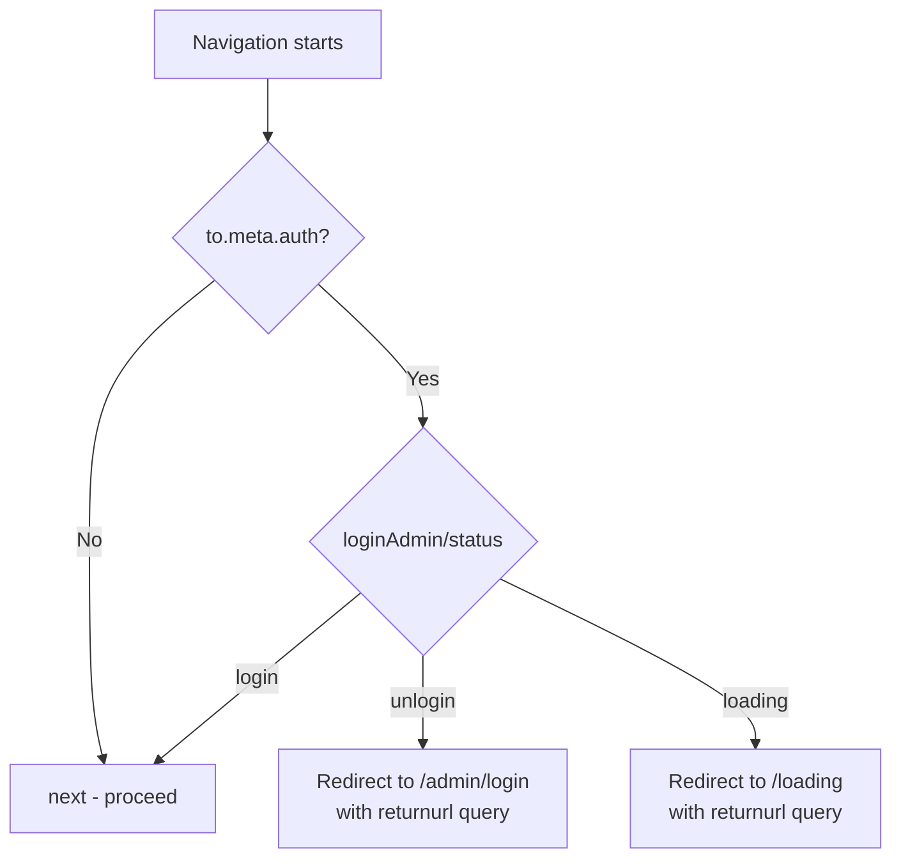
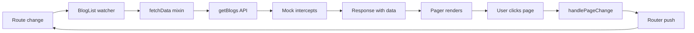

# Vue2 — sandboxs

# Vue2 Sandboxs

A Vue 2 learning and prototyping sandbox built with Vue CLI. It serves as both a component library playground and a functional blog application with admin authentication, demonstrating core Vue 2 patterns including component composition, custom directives, Vuex state management, Vue Router with navigation guards, and API mocking.

## Project Structure

```
src/
├── api/              # HTTP client and API modules
├── assets/           # Static assets (images, SVGs)
├── components/       # Reusable UI components
├── directives/       # Custom Vue directives (v-loading, v-lazy)
├── mixins/           # Shared component logic
├── mock/             # Mock.js API interceptors
├── router/           # Vue Router configuration and route guards
├── store/            # Vuex store modules
├── styles/           # Global styles, variables, and mixins
├── utils/            # Utility functions
├── views/            # Page-level route components
├── test/             # Standalone test/demo components
├── App.vue           # Root component
├── main.js           # Application entry point
└── eventBus.js       # Global event bus
```

## Application Entry and Bootstrap

`main.js` orchestrates the application startup in this order:

1. **Mock setup** — conditionally imports `./mock` in development to intercept XHR requests before any API calls are made.
2. **Global styles** — imports `global.less` for base resets and typography.
3. **Router** — imports the configured Vue Router instance.
4. **Global toast** — attaches `toast` to `Vue.prototype.$toast` so all components can call `this.$toast(...)`.
5. **Global directives** — registers `v-loading` and `v-lazy` before the Vue instance is created.
6. **Vuex store** — imports and registers the store; dispatches `loginAdmin/whoAmI` to restore login state from localStorage.
7. **Vue instance** — mounts `App.vue` to `#app`.

```js
// main.js — key registration order
Vue.directive("loading", vLoading)
Vue.directive('lazy', vLazy)
store.dispatch("loginAdmin/whoAmI")

new Vue({ store, router, render: h => h(App) }).$mount('#app')
```

The `public/index.html` uses conditional templating to load Vue, Vuex, Vue Router, and Axios from CDN in production only, keeping the development environment using bundled versions (required for Vue DevTools).

## Root Component (`App.vue`)

The root layout uses `ThreeColumnLayout` with a fixed-position sidebar (`SiteAside`) on the left and a `<RouterView />` in the main content area. The sidebar is 250px wide.

## Components

All components are exported from `src/components/index.js` for convenient barrel imports:

```js
import { Icon, Pager, Loading, SiteAside } from "@/components";
```

### Icon

Renders iconfont icons by mapping semantic type names to CSS class names. The icon font is loaded from Alibaba's CDN (`at.alicdn.com`).

**Props:**
| Prop | Type | Required | Description |
|------|------|----------|-------------|
| `type` | String | Yes | Semantic icon name (e.g., `"home"`, `"github"`, `"empty"`) |

The `types` export provides the full list of available icon names for iteration (used in the test view).

### Pager

A pagination component that calculates visible page numbers based on the current page, total items, limit, and visible number window.

**Props:**
| Prop | Type | Default | Description |
|------|------|---------|-------------|
| `current` | Number | `1` | Current active page |
| `total` | Number | `0` | Total number of items |
| `limit` | Number | `10` | Items per page |
| `visibleNumber` | Number | `10` | Max visible page buttons |

**Events:**
- `pageChange(newPage)` — emitted when the user clicks a page number or navigation arrow. The component clamps the value to valid bounds before emitting.

The component hides itself when `totalPageNumber <= 1`. It computes `visibleMin` and `visibleMax` to create a sliding window of page numbers centered around the current page.

### Loading

Displays a centered loading spinner (SVG). The image URL is imported as a webpack module so the asset path is correctly resolved at build time.

### Empty

Shows an empty-state message with the `empty` icon. Used when data lists have no items.

**Props:**
| Prop | Type | Default | Description |
|------|------|---------|-------------|
| `text` | String | `"无数据"` | Display message |

### Avatar

Renders a circular avatar image.

**Props:**
| Prop | Type | Default | Description |
|------|------|---------|-------------|
| `url` | String | *(required)* | Image URL |
| `size` | Number | `150` | Diameter in pixels |

### Modal

A basic fixed-position modal with a content slot and confirm/close buttons. This is a minimal skeleton — the buttons are not wired to events.

### Layout

A three-section layout with named slots: `header`, default (main content), and `footer`.

### ThreeColumnLayout

A flexbox layout with three columns: `left`, default (main), and `right`. The left and right columns size to their content (`flex: 0 0 auto`), while the main column fills remaining space (`flex: 1 1 auto`). All columns have `overflow: hidden`.

### SiteAside

A composite sidebar component combining `Avatar`, `Menu`, and `Contact`. It renders a dark-themed navigation panel with the site owner's avatar, navigation links, and contact information (GitHub, email, QQ, WeChat).

**Sub-components:**
- **Menu** — renders `RouterLink` items for Home, Blog, About, Message, and Admin routes. Uses `active-class="selected"` with `exact` prop control per item to handle nested route matching correctly.
- **Contact** — displays contact links with hover-triggered popup images for QQ and WeChat QR codes.

### TreeListMenu

A recursive tree menu component. It renders a nested `<ul>` structure where each item can have `children`, forming an arbitrarily deep tree.

**Props:**
| Prop | Type | Default | Description |
|------|------|---------|-------------|
| `list` | Array | `[]` | Tree data. Each node: `{ name: String, aside?: String, isSelected?: Boolean, children?: Array }` |

The component declares `name: "TreeListMenu"` to enable self-referencing in its template. A recursive `isTreeArray` validator ensures the data structure integrity. Click events bubble up through `$emit("click", item)`.

### AdminName

Displays the current admin's login status by reading from the Vuex `loginAdmin` module. Shows one of three states:
- **loading** — displays "loading..."
- **login** — shows the admin name and a logout link
- **unlogin** — shows a login link

### LoadingButton

Demonstrates three patterns for parent-child async communication:

1. **Emit with callback** — `$emit("buttonClicked", count, callback)`
2. **Promise via `$listeners`** — parent returns a Promise from the event handler
3. **Props function** — parent passes a handler via `:click` prop that returns a Promise

The component manages its own loading state and disables the button during async operations.

## Custom Directives

### `v-loading`

Toggles a loading spinner overlay on the bound element.

```js
// Usage
<h1 v-loading="isLoading">Content</h1>
```

When `binding.value` is truthy, appends an `` element with `data-role="loading"` to the element. When falsy, removes it. The directive uses CSS modules (`loading.module.less`) for scoped styling with the `.self-center()` mixin.

### `v-lazy`

Implements lazy loading for images. Images are only loaded when they enter the viewport.

```js
// Usage

```

**How it works:**
1. On `inserted`, registers the image element and its source URL in a module-level `imgs` array.
2. Sets a default placeholder image (`defaultImg.gif`) immediately.
3. Listens for `mainScroll` events on the event bus (debounced at 30ms).
4. On each scroll event, checks each registered image's `getBoundingClientRect()` against the viewport height.
5. When an image enters the viewport, creates a new `Image` object, loads the real source, and swaps it in on `onload`.
6. On `unbind`, removes the image from the tracking array.

The directive depends on the `mainScroll` mixin being active in a parent component to emit scroll events.

## Mixins

### `fetchData(defaultDataValue)`

A factory function that returns a mixin object. It provides automatic data fetching on component creation.

```js
// Usage in a component
mixins: [fetchData({})],

methods: {
  async fetchData() {
    return await getBlogs(this.page, this.limit);
  }
}
```

The mixin:
- Adds `isLoading` (Boolean) and `data` (initialized to `defaultDataValue`) to the component's data.
- In `created`, calls the component's `fetchData()` method, assigns the result to `this.data`, and sets `isLoading = false`.

The consuming component **must** define a `fetchData` method.

### `mainScroll(refValue)`

Provides scroll event propagation through the event bus for a referenced container element.

```js
// Usage
mixins: [mainScroll("mainContainer")]
```

- On `mounted`: listens for `setMainScroll` events to programmatically set scroll position; attaches a native `scroll` listener that emits `mainScroll` with the element reference.
- On `beforeDestroy`: cleans up both listeners and emits a final `mainScroll` event.

This mixin is the counterpart to the `v-lazy` directive — it drives the scroll-based lazy loading.

## Event Bus (`eventBus.js`)

A Vue instance used as a global event bus, also attached to `Vue.prototype.$bus` for component access via `this.$bus`.

```js
// Emit from anywhere
eventBus.$emit("mainScroll", scrollElement);

// Listen in a component
this.$bus.$on("mainScroll", handler);
this.$bus.$off("mainScroll", handler);
```

The primary use case is coordinating scroll events between the `mainScroll` mixin and the `v-lazy` directive.

## State Management (Vuex)

### Root Store (`store/index.js`)

Contains a simple counter module for demonstration with synchronous mutations (`increase`, `decrease`, `power`) and async actions (`asyncIncrease`, `asyncDecrease`, `asyncPower`) that use a `delay` utility.

Strict mode is enabled — state mutations outside mutation handlers will throw errors.

### `loginAdmin` Module (`store/loginAdmin.js`)

A namespaced Vuex module managing admin authentication state.

**State:**
- `loading` (Boolean) — whether an auth request is in flight
- `admin` (Object|null) — the logged-in user object

**Getters:**
- `status` — returns `"loading"`, `"login"`, or `"unlogin"` based on state

**Actions:**
- `whoAmI` — restores login state from localStorage (simulating JWT token validation)
- `login(loginId, loginPwd)` — authenticates credentials, stores user in localStorage
- `loginOut` — clears localStorage and resets admin state

The admin API (`src/api/admin.js`) uses `delay()` to simulate network latency and hardcoded credentials (`ceilf6` / `666666`).

## Routing

### Route Configuration (`router/routes.js`)

Routes use lazy loading via `syncGetComp()`, which wraps dynamic `import()` with NProgress loading indicators and an artificial 2-second delay in development.

```js
{ name: "Home", path: "/", component: syncGetComp(() => import("@/views/Home")) }
```

**Route hierarchy:**

| Name | Path | Auth | Description |
|------|------|------|-------------|
| Home | `/` | No | Landing page with test demos |
| About | `/about` | No | About page with Vuex counter demo |
| Blog | `/article` | No | Blog list (all categories) |
| CategoryBlog | `/article/cate/:categoryId` | No | Blog list filtered by category |
| Message | `/message` | No | Message board |
| Admin | `/admin` | No | Admin layout wrapper |
| AdminHome | `/admin/home` | No | Admin home |
| AdminLogin | `/admin/login` | No | Login form |
| AdminAction | `/admin/action` | **Yes** | Protected admin actions |
| Loading | `/loading` | No | Auth loading/waiting page |
| notFound | `*` | No | 404 page |

### Navigation Guards

A global `beforeEach` guard checks `to.meta.auth`:



The `/loading` view watches the Vuex `loginAdmin/status` getter. When status changes from `"loading"`, it redirects to the original `returnurl` (or `/admin/home` as fallback).

## API Layer

### Request Client (`api/request.js`)

An Axios instance with a response interceptor that:
1. Extracts `resp.data` (the business payload).
2. Checks `resData.code !== 0` — on failure, shows a toast error and returns `null`.
3. On success, returns `resData.data` (unwrapping two levels of `data`).

### Blog API (`api/blog.js`)

- `getBlogs(page, limit, categoryid)` — fetches paginated blog posts
- `getBlogCategories()` — fetches blog category list

### Mock Layer (`mock/`)

Uses Mock.js to intercept XHR requests in development:

- **`/api/blogtype`** — returns 10–20 random categories
- **`/api/blog`** — returns paginated blog data with random titles, descriptions, thumbnails, and metadata. Parses query parameters to respect `page` and `limit`.
- **`/ceilf6/Wiki/branch-and-tag-count`** — returns mock GitHub API data for testing

Mock is configured with a 1000–2000ms random delay to simulate network conditions.

## Utilities

### `toast(options)`

Programmatically creates and displays a toast notification.

```js
toast({
  content: "Operation successful",
  type: "success",       // "info" | "success" | "warn" | "error"
  duration: 3000,
  container: element,    // defaults to document.body
  callback: () => {}     // called after removal
});
```

**Implementation details:**
1. Creates a `<div>` with the appropriate CSS module classes.
2. Uses `getComponentRootDom(Icon, { type })` to render an Icon component to a DOM element and embeds its `outerHTML`.
3. If the container isn't `document.body` and has `position: static`, sets it to `relative`.
4. Forces a reflow via `toast.clientHeight` before applying the visible state.
5. After `duration` ms, fades out and removes the element on `transitionend`.

### `getComponentRootDom(comp, props)`

Renders a Vue component to a detached DOM element and returns `vm.$el`. Used by `toast` to get the Icon's rendered HTML without mounting it to the document.

```js
const IconDOM = getComponentRootDom(Icon, { type: "success" });
// IconDOM is a real <i> element with the correct iconfont class
```

### `syncGetComp(getWay)`

Wraps a dynamic import function with NProgress loading bar and development delay:

```js
export default function syncGetComp(getWay) {
  return async () => {
    start();                                    // NProgress.start()
    if (process.env.NODE_ENV === 'development') await delay(2000);
    const comp = await getWay();                // actual dynamic import
    done();                                     // NProgress.done()
    return comp;
  };
}
```

### `debounce(fn, duration)`

Standard debounce implementation. Used by the `v-lazy` directive to throttle scroll handling.

### `delay(duration)`

Returns a Promise that resolves after `duration` ms. Used throughout for simulating async operations.

### `formatDate(timestamp)`

Converts a timestamp to `YYYY-MM-DD` format.

## Styling System

### Variables (`styles/var.less`)

Centralized color palette:

| Variable | Value | Usage |
|----------|-------|-------|
| `@danger` | `#cc3600` | Errors, destructive actions |
| `@primary` | `#6b9eee` | Links, primary actions |
| `@words` | `#373737` | Body text |
| `@lightWords` | `#999` | Secondary text |
| `@warn` | `#dc6a12` | Warnings |
| `@success` | `#7ebf50` | Success states |
| `@gray` | `#b4b8bc` | Borders, muted elements |
| `@dark` | `#202020` | Dark backgrounds |

### Mixins (`styles/mixin.less`)

- `.self-center(@pos: absolute)` — centers an element with `position`, `left: 50%`, `top: 50%`, `transform: translate(-50%, -50%)`
- `.self-fill(@pos: absolute)` — makes an element fill its container completely

## Build Configuration

### `vue.config.js`

Configures webpack dev server proxies:
- `/ceilf6` → `https://github.com` (for GitHub API testing without CORS)
- `/api/image` → `http://dummyimage.com` (for placeholder images)

### `webpack.config.js`

In production, configures externals to exclude Vue, Vuex, Vue Router, and Axios from the bundle (they're loaded from CDN). In development, enables `BundleAnalyzerPlugin` for bundle size analysis.

### `package.json` Scripts

Individual component test scripts use `vue serve` to run standalone test views:

```bash
npm run test:Pager          # vue serve ./src/components/Pager/test.vue
npm run test:Modal          # vue serve ./src/components/Modal/test.vue
npm run test:Icon           # vue serve ./src/components/Icon/test.vue
npm run test:toast          # vue serve ./test/toast/index.vue
npm run test:vLoading       # vue serve ./src/directives/loading/test.vue
npm run test:Lifecycle      # vue serve ./test/lifecycle/Lifecycle.vue
# ... and more
```

## Blog Application Flow

The blog feature demonstrates a complete data-fetching and routing pattern:



1. `BlogList` uses the `fetchData` mixin and `mainScroll` mixin.
2. Route parameters (`categoryId`, `page`, `limit`) are computed from `this.$route`.
3. A `$route` watcher re-fetches data when navigation occurs.
4. `BlogCategory` fetches categories once on creation and renders a `TreeListMenu`. Clicking a category navigates to the filtered route.
5. `BlogList` uses `v-lazy` on thumbnail images, driven by the `mainScroll` mixin's scroll events.
6. The `Empty` component displays when no blog posts match the current filters.