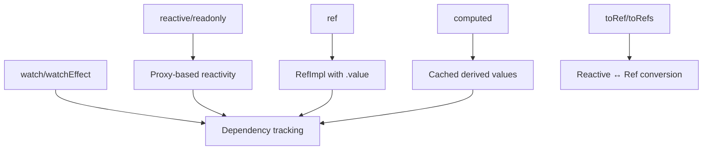

# Vue3 — reactivity-API

# Vue 3 Reactivity API Module

This module demonstrates Vue 3's reactivity system through practical examples. It showcases core reactivity primitives (`reactive`, `ref`, `readonly`), computed properties, watchers, and transformation utilities.

## Core Concepts

### Reactive Objects

`reactive()` creates a deep reactive proxy of an object. Changes to properties trigger updates in any dependent computations or watchers.

```javascript
const state = reactive({ a: 1, b: 2 })
state.a = 10 // triggers reactivity
```

### Readonly Proxies

`readonly()` creates a proxy that prevents direct mutation. This is useful for exposing state while controlling updates through specific methods.

```javascript
const userOrigin = reactive({})
const user = readonly(userOrigin) // user.name = 'test' will warn in dev mode
```

### Refs

`ref()` wraps a value in a reactive container with a `.value` property. It works for both primitive values and objects.

```javascript
const count = ref(0)
count.value++ // triggers reactivity

const obj = ref({ a: 1 })
obj.value.a = 2 // deep reactivity
```

## Key Patterns

### Vuex-like State Management

The `likeVuex.js` pattern demonstrates controlled state updates by exposing only setter functions:

```javascript
export default function useUser() {
    const userOrigin = reactive({})
    const user = readonly(userOrigin)
    
    const setUserName = (name) => {
        userOrigin.name = name // mutation happens internally
    }
    
    return { user, setUserName }
}
```

This ensures state can only be modified through defined APIs, similar to Vuex mutations.

### Debounced Updates

`useDebounce.js` shows how to implement debounced state updates:

```javascript
export default function useDebounce(obj, duration) {
    const valueOrigin = reactive(obj)
    const value = readonly(valueOrigin)
    
    const setValue = (newValue) => {
        clearTimeout(timer)
        timer = setTimeout(() => {
            Object.entries(newValue).forEach(([key, val]) => {
                valueOrigin[key] = val
            })
        }, duration)
    }
    
    return { value, setValue }
}
```

## Computed Properties

`computed()` creates cached derived values that only recompute when dependencies change:

```javascript
const org = reactive({ a: 100, b: 250 })
const sum = computed(() => org.a + org.b)

console.log(sum.value) // 350, computed function runs
console.log(sum.value) // 350, cached
org.a = 250
console.log(sum.value) // 500, recomputed
```

## Watchers

### watchEffect

Automatically tracks dependencies and runs immediately, then re-runs when dependencies change:

```javascript
const stop = watchEffect(() => {
    console.log(state.a, count.value) // tracks both
})

state.a++ // triggers re-run
count.value++ // triggers re-run
stop() // stops watching
```

### watch

More explicit dependency declaration with access to old and new values:

```javascript
watch([() => state.a, count], ([newA, newCount], [oldA, oldCount]) => {
    console.log('changed')
})
```

**Execution timing**: Both `watch` and `watchEffect` callbacks are batched and executed asynchronously in microtasks. Multiple synchronous changes trigger only one callback.

## Transformation Utilities

### Converting Between Refs and Reactive Objects

```javascript
// Reactive to Refs
const state = reactive({ foo: 1, bar: 2 })
const fooRef = toRef(state, 'foo') // creates a ref linked to state.foo
const refs = toRefs(state) // { foo: ref, bar: ref }

// Ref to Value
const value = unref(refObj) // refObj.value if ref, else refObj
const isRefValue = isRef(refObj) // true
```

### Composition Function Best Practices

Return refs from composition functions to maintain reactivity when destructuring:

```javascript
function usePos() {
    const pos = reactive({ x: 0, y: 0 })
    return toRefs(pos) // { x: ref, y: ref }
}

// In setup:
const { x, y } = usePos() // both remain reactive
```

## Architecture Overview



## Key Implementation Details

1. **Reactive Proxies**: `reactive()` returns a `Proxy` that intercepts property access (`get`) and mutation (`set`) to track dependencies and trigger updates.

2. **Readonly Proxies**: `readonly()` uses a specialized handler that warns on mutation attempts in development mode.

3. **Ref Implementation**: The `RefImpl` class uses property descriptors to make `.value` reactive, with internal `dep` for dependency tracking.

4. **Batching**: Vue batches synchronous updates and flushes them asynchronously to avoid unnecessary re-renders.

## Usage Examples

### Basic Reactivity
```javascript
const state = reactive({ count: 0 })
watchEffect(() => console.log(state.count))
state.count++ // logs 1
```

### Controlled State Updates
```javascript
const { user, setUserName } = useUser()
setUserName('Alice') // updates user.name
```

### Debounced Input
```javascript
const { value, setValue } = useDebounce({ text: '' }, 300)
// setValue({ text: 'new' }) updates after 300ms of inactivity
```

### Computed with Caching
```javascript
const items = ref([1, 2, 3])
const sum = computed(() => items.value.reduce((a, b) => a + b, 0))
```

## Integration Notes

This module is designed as a standalone demonstration but follows Vue 3's official reactivity API. The patterns shown can be directly applied in Vue 3 applications using the Composition API.

The examples use Vite for development but the reactivity concepts are framework-agnostic and can be used with any Vue 3 project setup.